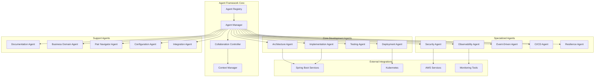

# Positivity Agent Structure Design

## Overview

The durion-positivity-backend Agent Structure System is a comprehensive framework that provides specialized AI agents for Spring Boot microservices development, testing, deployment, and operations. The system is designed to support a distributed POS system with 23+ microservices deployed on Kubernetes, providing domain-specific guidance while maintaining consistency across all services.

The design follows a modular, extensible architecture that allows for easy addition of new agents while ensuring seamless collaboration between existing agents. The system emphasizes practical guidance delivery, performance optimization, and production-ready patterns for enterprise Moqui applications with modern frontend integration.

**Core Design Principles:**

- **Story-Driven Development**: Automated detection and analysis of [STORY] issues from durion-positivity-backend repository with module-based build execution (REQ-018)
- **Component-Based Architecture**: Build is based on maven and springboot modules. Currently all modules are in the same repository.
- **Frozen Agent Responsibilities**: All agents follow explicit contracts (REQ-016) with single purpose, clear inputs/outputs, defined stop conditions, read/write permissions, and escalation rules
- **Loop-Breaker Patterns**: All agents enforce iteration limits (default 10), recurring pattern detection, human escalation conditions, and context summarization (REQ-017)
- **Context Integrity Management**: Agents maintain session context, re-anchor to permanent files on conflict, and document architectural decisions (REQ-019)
- **GitHub-First Automation**: Webhook-driven issue detection with Redis-backed build queues and agent registry
- **Performance-First**: All agent responses delivered within specified timeframes (2-5 seconds for 95% of requests)
- **Security-by-Design**: JWT integration, secure API communication, and comprehensive access control
- **Code Generation Standards**: All code generation uses Java 21 as target version for microservices compatibility
- **Agent Implementation Location**: All agent framework implementation classes located in `positivity/pos-agent-framework/src/main/java`, test classes in `positivity/pos-agent-framework/src/test/java/`

## Architecture

### High-Level Architecture



### Layered Architecture

The system follows a three-tier architecture:

1. **Presentation Layer**: Agent interfaces and collaboration protocols
2. **Business Logic Layer**: Agent implementations and domain expertise
3. **Data Layer**: Context management, knowledge bases, and integration adapters

### Agent Collaboration Model

Agents operate in three collaboration modes:

1. **Independent Mode**: Single agent provides specialized guidance
2. **Collaborative Mode**: Multiple agents work together on complex tasks
3. **Pair Programming Mode**: Primary agent paired with navigator for quality assurance

## Agent Contracts and Responsibilities (REQ-016)

Every agent in the system must implement a formal contract that specifies:

### Contract Elements

#### 1. Single Explicit Purpose
- Each agent has one primary responsibility
- All operations must align with that responsibility
- Operations outside scope trigger human escalation

#### 2. Input/Output Specifications
- **Inputs**: Explicitly defined input types, formats, and constraints
- **Outputs**: Expected response types, formats, and validation rules
- **Stop Conditions**: Specific conditions that terminate processing

#### 3. Permission Boundaries (Contractual)
- **What it MAY change**: 
  - Specific file paths and directories
  - Configuration values within scope
  - Build artifacts and temporary files
- **What it MAY read**: 
  - Input parameters and context
  - GitHub issues and repository state
  - Configuration and environment variables
- **What it MUST never do**:
  - Delete source files or core components
  - Modify protected configuration files
  - Execute commands outside its domain
  - Access secrets without authorization

#### 4. Escalation Triggers
- Ambiguous or missing required inputs
- Constraints that conflict with recommendations
- Repeated failures in resolution attempts
- Resource exhaustion or timeout conditions

### Story Processing Agent Contract Example

```
Agent: StoryProcessingAgent
Purpose: Read [STORY] labeled GitHub issues and execute build steps

Inputs:
  - GitHub repository URL (string)
  - Issue ID (integer)
  - Module name (string, validated)

Outputs:
  - Build status (SUCCESS | FAILURE)
  - Test results (JSON)
  - Build artifacts (file paths)

CAN change:
  - Build output directories
  - Issue status and comments
  - Temporary build artifacts

CAN read:
  - Issue content (title, description, comments)
  - pom.xml and build configs
  - Environment variables

MUST NEVER:
  - Delete source code
  - Modify repository structure
  - Execute arbitrary shell commands
  - Access private secrets

Stop conditions:
  - Build succeeds or fails definitively
  - Max 5 build attempts reached
  - Required dependencies unavailable
  - Human escalation triggered
```

## Loop-Breaker Patterns and Iteration Control (REQ-017)

All agents implement mandatory loop-breaker patterns to prevent infinite iteration:

### Iteration Management

#### Per-Execution Iteration Counter
- Initialized at 0 before execution begins
- Incremented on each processing step
- Checked against maximum before each iteration
- Logged with complete execution trace

#### Maximum Iteration Limits
- **Default**: 10 iterations per execution
- **Configurable**: Per agent type via configuration
- **Enforcement**: Automatic stop and escalation at limit

#### Hard Stop Protocol
When maximum iterations reached:
1. All processing ceases immediately
2. Complete execution history is logged
3. Human escalation triggered with context
4. Execution trace includes:
   - Total iterations (N/MAX)
   - All decisions made
   - Current state
   - Recommended next steps

### Recurring Pattern Detection

#### Pattern Recognition
- **Threshold**: Same state/action repeated > 2 consecutive times
- **Detection**: Automatic on each iteration
- **Action**: Immediate escalation to human

#### Examples
- Build fails for same reason → escalate
- Dependency conflict unresolved → escalate
- Test fails on same assertion → escalate

### Human Escalation Protocol

#### Escalation Triggers
1. Iteration limit reached
2. Recurring pattern detected
3. Ambiguous conditions (missing inputs)
4. Resource exhaustion (timeout, memory)
5. Conflicting constraints

#### Escalation Format
```
Reason: [specific condition]
Iterations Used: N/MAX
Current State: [complete context]

Clarifying Questions:
  1. [Specific question 1]
  2. [Specific question 2]
  
Recommendation:
  [Specific recommended action]
```

### Context Size Management

#### Context Limits
- **Threshold**: 50KB per request (configurable)
- **Monitoring**: Tracked during execution
- **Action**: Summarization when exceeded

#### Summarization Strategy
1. **Preserve critical information**: Decisions, constraints, blockers
2. **Summarize non-critical**: Exploration paths, alternatives
3. **Create summary**: 95% information retention of critical context
4. **Continue execution**: With summarized context

## Story-Driven Development and Issue Processing (REQ-018)

Agents process [STORY] labeled GitHub issues from durion-positivity-backend repository:

### Story Processing Workflow

#### 1. Story Detection
- Repository: https://github.com/louisburroughs/durion-positivity-backend.git
- Labels: `[STORY]` AND open AND no assignee
- Detection: Webhook-triggered (real-time)

#### 2. Story Analysis
- Read issue title, description, comments
- Extract module requirements
- Identify acceptance criteria
- Determine build steps needed

#### 3. Module-Based Build Execution
- **Build**: `mvn clean install` for affected module
- **Test**: Run module-specific test suites
- **Integration**: Validate dependent services
- **Artifacts**: Generate and archive outputs

#### 4. Failure Handling
- Log failures with complete diagnostics
- Attempt resolution (max 3 attempts)
- Escalate to human with specific details
- Preserve all diagnostic output

#### 5. Completion Reporting
- Document build steps executed
- Record test results and coverage
- Update issue with completion status
- Provide human-readable summary

### Story Dependencies
- **Sequential processing**: Prerequisites complete first
- **Blocking detection**: Dependent stories wait
- **Circular dependencies**: Escalate immediately

## Agent Context Integrity and Session Management (REQ-019)

Agents maintain context integrity across sessions with clear conflict resolution:

### Session Context Management

#### Session Initialization
1. Check for `.ai/session.md` in workspace
2. If recent (current session): Use session context
3. If missing or stale: Re-anchor to permanent files

#### Permanent Files (Authoritative)
- Source code
- `.ai/context.md`
- `.ai/glossary.md`
- GitHub issues

#### Session Context (Temporary)
- Current task objective
- Architectural decisions
- Discovered patterns
- Open questions

### Decision Recording

Record decisions in `.ai/session.md`:
```
## Decision: [Title]
- **Timestamp**: [ISO 8601]
- **Rationale**: [Why]
- **Context**: [Circumstances]
- **Implications**: [Effects]
```

### Conflict Resolution

#### When Contradictions Exist
1. **Trust permanent files** (source code, context.md, glossary.md)
2. **Update session.md** to reflect authoritative state
3. **Log contradiction** for investigation

#### Context Insufficiency
- **Detection**: Required inputs not available
- **Action**: SAY "Context insufficient – re-anchor needed"
- **Stop processing** and request clarification
- **DO NOT GUESS**

## Components and Interfaces

### Core Framework Components

#### Agent Registry
- **Purpose**: Central registry for all available agents
- **Responsibilities**:
  - Agent discovery and registration
  - Capability mapping and routing
  - Agent lifecycle management
  - Health monitoring and failover

#### Agent Manager
- **Purpose**: Orchestrates agent interactions and resource allocation
- **Responsibilities**:
  - Request routing and load balancing
  - Agent instantiation and pooling
  - Performance monitoring and optimization
  - Error handling and recovery

#### Collaboration Controller
- **Purpose**: Manages multi-agent collaboration and conflict resolution
- **Responsibilities**:
  - Collaboration workflow orchestration
  - Conflict detection and resolution
  - Consensus building and decision making
  - Quality assurance coordination

#### Context Manager
- **Purpose**: Maintains context across agent interactions
- **Responsibilities**:
  - Session context storage and retrieval
  - Context sharing between agents
  - Context validation and integrity
  - Temporary context cleanup

### Agent Interface Specifications

#### Base Agent Interface

```java
public interface Agent {
    String getAgentId();
    String getAgentName();
    Set<String> getCapabilities();
    AgentResponse processRequest(AgentRequest request);
    boolean canHandle(AgentRequest request);
    AgentHealth getHealth();
}
```

#### Specialized Agent Interfaces

```java
public interface ArchitectureAgent extends Agent {
    DomainBoundaryValidation validateDomainBoundaries(ServiceDefinition service);
    ArchitecturalDecision reviewArchitecturalDecision(DecisionRequest request);
    IntegrationPattern recommendIntegrationPattern(IntegrationContext context);
}

public interface ImplementationAgent extends Agent {
    SpringBootGuidance provideSpringBootGuidance(ImplementationContext context);
    ServiceBoundaryValidation validateServiceBoundaries(ServiceImplementation service);
    APIDesignGuidance provideAPIDesignGuidance(APIContext context);
}

public interface PairNavigatorAgent extends Agent {
    LoopDetectionResult detectImplementationLoops(ImplementationContext context);
    ArchitecturalDriftResult detectArchitecturalDrift(ArchitecturalContext context);
    SimplificationGuidance provideScopeCreepGuidance(ScopeContext context);
}
```

## Data Models

### Core Data Models

#### Agent Request Model

```java
public class AgentRequest {
    private String requestId;
    private String requestType;
    private String sourceAgent;
    private Map<String, Object> parameters;
    private RequestContext context;
    private Priority priority;
    private Timestamp timestamp;
}
```

#### Agent Response Model

```java
public class AgentResponse {
    private String responseId;
    private String requestId;
    private String respondingAgent;
    private ResponseStatus status;
    private Object payload;
    private List<String> recommendations;
    private Map<String, Object> metadata;
    private Timestamp timestamp;
}
```

#### Context Models

```java
public class ImplementationContext {
    private String serviceId;
    private String microserviceName;
    private TechnologyStack technologyStack;
    private List<Dependency> dependencies;
    private Map<String, Object> configuration;
    private List<String> constraints;
}

public class ArchitecturalContext {
    private String systemId;
    private List<ServiceDefinition> services;
    private List<IntegrationPoint> integrations;
    private ArchitecturalPrinciples principles;
    private List<QualityAttribute> qualityAttributes;
}
```

### Domain-Specific Models

#### Spring Boot Service Model

```java
public class SpringBootService {
    private String serviceName;
    private String version;
    private List<String> profiles;
    private DatabaseConfiguration database;
    private SecurityConfiguration security;
    private ObservabilityConfiguration observability;
    private List<Dependency> dependencies;
}
```

#### Microservice Integration Model

```java
public class MicroserviceIntegration {
    private String sourceService;
    private String targetService;
    private IntegrationType type; // REST, Event, Message
    private SecurityRequirements security;
    private PerformanceRequirements performance;
    private ResiliencePatterns resilience;
}
```

## Correctness Properties

*A property is a characteristic or behavior that should hold true across all valid executions of a system—essentially, a formal statement about what the system should do. Properties serve as the bridge between human-readable specifications and machine-verifiable correctness guarantees.*

### Property 1: Agent Domain Coverage
*For any* development request within the POS system domain, the Agent Structure System should provide at least one specialized agent capable of handling that request type
**Validates: Requirements REQ-001.1**

### Property 2: Domain-Specific Guidance Quality
*For any* agent consultation request, the provided guidance should be specific to Spring Boot microservices patterns and AWS deployment practices
**Validates: Requirements REQ-001.2**

### Property 3: Agent Collaboration Consistency
*For any* multi-agent collaboration scenario, all participating agents should provide consistent, non-conflicting guidance
**Validates: Requirements REQ-001.3**

### Property 4: Data Store Guidance Appropriateness
*For any* data access implementation request, the guidance should reference appropriate PostgreSQL or ElastiCache patterns based on the use case
**Validates: Requirements REQ-001.4, REQ-002.3**

### Property 5: Spring Boot Pattern Provision
*For any* microservice implementation request, the Implementation Agent should provide Spring Boot-specific development patterns
**Validates: Requirements REQ-002.1**

### Property 6: Service Boundary Validation
*For any* business logic implementation, the Implementation Agent should enforce proper service boundary validation
**Validates: Requirements REQ-002.4**

### Property 7: Domain Boundary Enforcement
*For any* architectural decision, the Architecture Agent should enforce domain-driven design principles and prevent boundary violations
**Validates: Requirements REQ-005.1**

### Property 8: API Gateway Integration Consistency
*For any* service integration design, the Integration Agent should ensure consistent API Gateway, SNS/SQS messaging, and event-driven architecture usage
**Validates: Requirements REQ-005.2, REQ-006.2**

### Property 9: Security Compliance Validation
*For any* authentication or API security implementation, the Security Agent should ensure JWT, Spring Security, and OWASP compliance
**Validates: Requirements REQ-007.1, REQ-007.2**

### Property 10: Observability Instrumentation Completeness
*For any* microservice instrumentation request, the Observability Agent should ensure comprehensive OpenTelemetry integration and RED metrics implementation
**Validates: Requirements REQ-008.1, REQ-008.2**

### Property 11: Documentation Synchronization
*For any* code or API change, the Documentation Agent should ensure corresponding documentation updates and synchronization
**Validates: Requirements REQ-009.3**

### Property 12: POS Domain Pattern Adherence
*For any* business process modeling request, the Business Domain Agent should ensure adherence to POS domain patterns and business rule validation
**Validates: Requirements REQ-010.1, REQ-010.4**

### Property 13: Pair Programming Loop Detection
*For any* implementation progress that stalls or exhibits repetitive patterns, the Pair Navigator Agent should detect loops and provide mandatory stop-phrase interruptions
**Validates: Requirements REQ-011.2, REQ-011.4**

### Property 14: Event Schema Consistency
*For any* event-driven integration design, the Event-Driven Architecture Agent should ensure consistent event schemas and idempotent processing patterns
**Validates: Requirements REQ-012.1, REQ-012.2**

### Property 15: CI/CD Security Integration
*For any* pipeline configuration, the CI/CD Pipeline Agent should ensure security scanning, testing automation, and deployment security validation
**Validates: Requirements REQ-013.2, REQ-013.4**

### Property 16: Frozen Agent Responsibility Enforcement
*For any* agent execution, the agent SHALL operate only within its contractual permissions with 100% enforcement, preventing operations outside its defined scope
**Validates: Requirements REQ-016.1, REQ-016.3**

### Property 17: Loop-Breaker Iteration Limits
*For any* agent execution, the agent SHALL enforce maximum iteration limits (default 10) with automatic stop and human escalation, preventing infinite loops
**Validates: Requirements REQ-017.2, REQ-017.3, REQ-017.6**

### Property 18: Story-Driven Build Execution
*For any* [STORY] labeled GitHub issue from durion-positivity-backend, the agent SHALL process the issue, extract module requirements, and execute module-specific build steps with appropriate failure handling
**Validates: Requirements REQ-018.1, REQ-018.4, REQ-018.5**

### Property 19: Context Integrity and Session Management
*For any* agent session, the agent SHALL maintain context integrity by re-anchoring to permanent files on conflict and requesting clarification when context is insufficient
**Validates: Requirements REQ-019.1, REQ-019.4, REQ-019.5**

## Error Handling

### Error Classification

1. **Agent Unavailable**: Target agent is not responding or healthy
2. **Invalid Request**: Request format or parameters are invalid
3. **Context Insufficient**: Required context information is missing
4. **Capability Mismatch**: Request exceeds agent capabilities
5. **Collaboration Conflict**: Multiple agents provide conflicting guidance
6. **Resource Exhaustion**: System resources are insufficient for request processing

### Error Handling Strategies

#### Graceful Degradation
- **Fallback Agents**: Secondary agents for critical capabilities
- **Reduced Functionality**: Provide basic guidance when specialized agents unavailable
- **Cached Responses**: Use previously successful responses for similar requests

#### Automatic Recovery
- **Health Monitoring**: Continuous agent health checks and automatic restart
- **Circuit Breakers**: Prevent cascading failures between agents
- **Retry Logic**: Exponential backoff for transient failures

#### Error Reporting
- **Structured Logging**: Comprehensive error logging with correlation IDs
- **Metrics Collection**: Error rate and type metrics for monitoring
- **Alert Integration**: Integration with monitoring systems for critical errors

## Testing Strategy

### Unit Testing Approach

**Framework**: JUnit 5 with Mockito for mocking dependencies

**Coverage Areas**:
- Individual agent logic and decision-making algorithms
- Request/response processing and validation
- Error handling and edge cases
- Context management and state transitions

**Test Structure**:
```java
@ExtendWith(MockitoExtension.class)
class ImplementationAgentTest {
    @Mock private SpringBootPatternProvider patternProvider;
    @Mock private ServiceBoundaryValidator boundaryValidator;
    
    @InjectMocks private ImplementationAgent implementationAgent;
    
    @Test
    void shouldProvideSpringBootGuidanceForValidRequest() {
        // Test implementation
    }
}
```

### Property-Based Testing Approach

**Framework**: jqwik for Java property-based testing with minimum 100 iterations per property

**Property Test Implementation**:
Each correctness property will be implemented as a separate property-based test with explicit tagging:

```java
@Property
@Label("Feature: agent-structure, Property 1: Agent domain coverage")
void agentDomainCoverageProperty(@ForAll("developmentRequests") DevelopmentRequest request) {
    // Property implementation
    AgentResponse response = agentRegistry.handleRequest(request);
    assertThat(response.getStatus()).isEqualTo(ResponseStatus.SUCCESS);
    assertThat(response.getRespondingAgent()).isNotNull();
}
```

**Property Test Configuration**:
- Minimum 100 iterations per property test
- Custom generators for domain-specific test data
- Shrinking enabled for failure case minimization
- Explicit property numbering and requirement traceability

### Integration Testing

**Scope**: Multi-agent collaboration scenarios and external system integration

**Test Categories**:
- Agent collaboration workflows
- Context sharing and consistency
- External service integration (Spring Boot services, Kubernetes, AWS)
- Performance and scalability validation

### Contract Testing

**Framework**: Spring Cloud Contract for service interaction validation

**Coverage**:
- Agent interface contracts
- External service integration contracts
- Event schema validation for event-driven agents

## Performance Optimization

### Caching Strategy

#### Agent Response Caching
- **Cache Layer**: Redis-based distributed cache
- **Cache Keys**: Request fingerprint + context hash
- **TTL Strategy**: Variable TTL based on request type and volatility
- **Invalidation**: Context-aware cache invalidation

#### Knowledge Base Caching
- **Pattern Cache**: Frequently accessed patterns and best practices
- **Decision Cache**: Architectural decisions and rationales
- **Configuration Cache**: Common configuration templates

### Load Balancing

#### Agent Pool Management
- **Pool Sizing**: Dynamic pool sizing based on demand
- **Load Distribution**: Round-robin with health-aware routing
- **Resource Isolation**: Separate pools for different agent types

#### Request Prioritization
- **Priority Queues**: Separate queues for different priority levels
- **SLA Management**: Response time guarantees based on priority
- **Resource Allocation**: Priority-based resource allocation

### Performance Monitoring

#### Metrics Collection
- **Response Times**: P50, P95, P99 response time percentiles
- **Throughput**: Requests per second by agent type
- **Error Rates**: Error rates by agent and error type
- **Resource Utilization**: CPU, memory, and network utilization

#### Performance Alerting
- **SLA Violations**: Alerts for response time SLA breaches
- **Error Rate Spikes**: Alerts for abnormal error rate increases
- **Resource Exhaustion**: Alerts for resource utilization thresholds

## Security Considerations

### Authentication and Authorization

#### Agent Authentication
- **Service-to-Service**: JWT-based authentication between agents
- **API Security**: OAuth 2.0 for external API access
- **Certificate Management**: Mutual TLS for secure communication

#### Authorization Model
- **Role-Based Access**: Agent capabilities mapped to roles
- **Request Authorization**: Fine-grained authorization for sensitive operations
- **Audit Logging**: Comprehensive audit trail for all agent interactions

### Data Protection

#### Sensitive Data Handling
- **Data Classification**: Classification of sensitive vs. non-sensitive data
- **Encryption**: Encryption at rest and in transit for sensitive data
- **Data Masking**: Automatic masking of sensitive data in logs and responses

#### Secrets Management
- **AWS Secrets Manager**: Integration for secure secret storage
- **Secret Rotation**: Automatic rotation of credentials and certificates
- **Access Control**: Strict access control for secret retrieval

### Security Monitoring

#### Threat Detection
- **Anomaly Detection**: ML-based anomaly detection for unusual patterns
- **Intrusion Detection**: Detection of unauthorized access attempts
- **Behavioral Analysis**: Analysis of agent behavior for security threats

#### Incident Response
- **Automated Response**: Automated response to detected security threats
- **Incident Logging**: Comprehensive logging of security incidents
- **Forensic Capabilities**: Data retention and analysis for forensic investigation

## Deployment Architecture

### Container Strategy

#### Docker Configuration
- **Base Images**: Distroless images for security and size optimization
- **Multi-Stage Builds**: Optimized build process with minimal runtime images
- **Health Checks**: Comprehensive health check endpoints for container orchestration

#### Kubernetes Deployment
- **Namespace Isolation**: Separate namespaces for different environments
- **Resource Limits**: CPU and memory limits for predictable performance
- **Auto-Scaling**: Horizontal Pod Autoscaler based on CPU and custom metrics

### Service Mesh Integration

#### Istio Configuration
- **Traffic Management**: Intelligent routing and load balancing
- **Security Policies**: Mutual TLS and authorization policies
- **Observability**: Distributed tracing and metrics collection

### High Availability

#### Redundancy Strategy
- **Multi-Zone Deployment**: Deployment across multiple availability zones
- **Agent Replication**: Multiple instances of critical agents
- **Data Replication**: Replicated storage for context and knowledge bases

#### Disaster Recovery
- **Backup Strategy**: Regular backups of agent configurations and knowledge bases
- **Recovery Procedures**: Automated recovery procedures for different failure scenarios
- **RTO/RPO Targets**: Recovery Time Objective of 30 seconds, Recovery Point Objective of 5 minutes

## Monitoring and Observability

### Metrics Strategy

#### Application Metrics
- **Business Metrics**: Agent utilization, guidance quality scores, user satisfaction
- **Technical Metrics**: Response times, error rates, throughput, resource utilization
- **Custom Metrics**: Domain-specific metrics for specialized agents

#### Infrastructure Metrics
- **Container Metrics**: CPU, memory, network, and storage utilization
- **Kubernetes Metrics**: Pod status, node health, cluster resource utilization
- **Network Metrics**: Service-to-service communication patterns and performance

### Logging Strategy

#### Structured Logging
- **Log Format**: JSON-structured logs with consistent schema
- **Correlation IDs**: Request correlation across agent interactions
- **Log Levels**: Appropriate log levels for different types of events

#### Log Aggregation
- **ELK Stack**: Elasticsearch, Logstash, and Kibana for log aggregation and analysis
- **Log Retention**: Configurable retention policies based on log type and compliance requirements
- **Search Capabilities**: Full-text search and filtering capabilities for troubleshooting

### Distributed Tracing

#### OpenTelemetry Integration
- **Trace Collection**: Comprehensive trace collection across all agent interactions
- **Span Attributes**: Rich span attributes for detailed analysis
- **Sampling Strategy**: Intelligent sampling to balance observability and performance

#### Jaeger Configuration
- **Trace Storage**: Scalable trace storage with configurable retention
- **Trace Analysis**: Advanced trace analysis and visualization capabilities
- **Performance Insights**: Performance bottleneck identification and optimization recommendations

## Integration Patterns

### Spring Boot Service Integration

#### Service Discovery
- **Eureka Integration**: Service registration and discovery for Spring Boot services
- **Health Checks**: Integration with Spring Boot Actuator health endpoints
- **Load Balancing**: Client-side load balancing with Ribbon or Spring Cloud LoadBalancer

#### Configuration Management
- **Spring Cloud Config**: Centralized configuration management for all services
- **Environment Profiles**: Environment-specific configuration profiles
- **Dynamic Refresh**: Runtime configuration refresh without service restart

### AWS Services Integration

#### Compute Services
- **ECS Integration**: Container orchestration with Amazon ECS
- **Lambda Integration**: Serverless function integration for lightweight agents
- **Auto Scaling**: Integration with AWS Auto Scaling for dynamic capacity management

#### Data Services
- **RDS Integration**: Managed PostgreSQL database integration
- **ElastiCache Integration**: Redis cluster integration for caching
- **S3 Integration**: Object storage for knowledge bases and artifacts

#### Security Services
- **IAM Integration**: Role-based access control with AWS IAM
- **Secrets Manager**: Secure secret storage and retrieval
- **WAF Integration**: Web Application Firewall for API protection

### Event-Driven Integration

#### Message Brokers
- **Apache Kafka**: High-throughput event streaming for real-time agent communication
- **Amazon SNS/SQS**: Managed messaging services for reliable event delivery
- **RabbitMQ**: Message queuing for complex routing scenarios

#### Event Patterns
- **Event Sourcing**: Event-based state management for agent interactions
- **CQRS**: Command Query Responsibility Segregation for scalable read/write operations
- **Saga Pattern**: Distributed transaction management across multiple agents

## Scalability Considerations

### Horizontal Scaling

#### Agent Scaling
- **Stateless Design**: Stateless agent implementations for easy horizontal scaling
- **Load Distribution**: Intelligent load distribution across agent instances
- **Auto-Scaling**: Automatic scaling based on demand and performance metrics

#### Data Scaling
- **Database Sharding**: Horizontal database scaling for large datasets
- **Cache Scaling**: Distributed caching with Redis Cluster
- **Storage Scaling**: Scalable object storage for knowledge bases and artifacts

### Performance Optimization

#### Caching Strategy
- **Multi-Level Caching**: Application-level, distributed, and CDN caching
- **Cache Warming**: Proactive cache warming for frequently accessed data
- **Cache Invalidation**: Intelligent cache invalidation strategies

#### Database Optimization
- **Query Optimization**: Optimized database queries with proper indexing
- **Connection Pooling**: Efficient database connection management
- **Read Replicas**: Read replica scaling for read-heavy workloads

### Resource Management

#### Memory Management
- **Memory Profiling**: Regular memory profiling and optimization
- **Garbage Collection**: Optimized garbage collection settings for JVM-based agents
- **Memory Limits**: Appropriate memory limits and monitoring

#### CPU Optimization
- **Thread Pool Management**: Optimized thread pool configurations
- **Async Processing**: Asynchronous processing for I/O-bound operations
- **CPU Affinity**: CPU affinity optimization for performance-critical agents

## Future Extensibility

### Plugin Architecture

#### Agent Plugin System
- **Plugin Interface**: Standardized plugin interface for new agent types
- **Dynamic Loading**: Runtime plugin loading and unloading
- **Plugin Registry**: Central registry for available plugins and their capabilities

#### Extension Points
- **Custom Handlers**: Extension points for custom request handlers
- **Custom Validators**: Extension points for custom validation logic
- **Custom Integrations**: Extension points for custom external service integrations

### API Evolution

#### Versioning Strategy
- **Semantic Versioning**: Semantic versioning for API compatibility
- **Backward Compatibility**: Backward compatibility guarantees for stable APIs
- **Deprecation Policy**: Clear deprecation policy and migration paths

#### Schema Evolution
- **Schema Registry**: Centralized schema registry for data model evolution
- **Migration Tools**: Automated migration tools for schema changes
- **Compatibility Testing**: Automated compatibility testing for schema changes

### Technology Adaptation

#### Framework Updates
- **Spring Boot Updates**: Regular updates to latest Spring Boot versions
- **Kubernetes Updates**: Adaptation to new Kubernetes features and APIs
- **AWS Updates**: Integration with new AWS services and features

#### Emerging Technologies
- **AI/ML Integration**: Integration with machine learning platforms for intelligent guidance
- **Serverless Adoption**: Adoption of serverless technologies for lightweight agents
- **Edge Computing**: Edge deployment capabilities for distributed environments

**Document Version**: 2.0 (Enhanced with Agent Contracts, Loop-Breakers, and Story-Driven Execution)  
**Last Updated**: December 22, 2025  
**Document Status**: Complete - Ready for Implementation