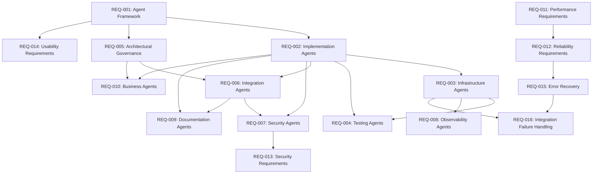

# Positivity Agent Structure Requirements

## Introduction

The positivity project is a comprehensive modular POS (Point of Sale) backend system built with Spring Boot microservices, designed for AWS Fargate deployment. The system consists of 23+ microservices including pos-catalog, pos-customer, pos-inventory, pos-order, pos-accounting, and others, each with dedicated data stores (DynamoDB or ElastiCache). The backend services expose REST APIs through an API Gateway to serve external clients. To effectively manage development, testing, deployment, and maintenance of this complex distributed system, we need a structured agent framework that provides specialized expertise for different aspects of the backend system.

This requirements document follows EARS (Easy Approach to Requirements Syntax) patterns and INCOSE (International Council on Systems Engineering) quality standards to ensure measurable, testable, and traceable requirements.

## Glossary

- **Agent Structure System**: The complete framework of specialized AI agents for positivity POS backend development
- **Agent**: A specialized AI assistant with domain-specific expertise and responsibilities
- **Microservice**: An independent Spring Boot application with its own data store and API endpoints
- **POS System**: Point of Sale system for retail/automotive service operations
- **AWS Fargate**: Serverless container orchestration service
- **API Gateway**: Central entry point for all microservice APIs
- **DynamoDB**: NoSQL database service used by most microservices
- **ElastiCache**: In-memory caching service used by vehicle reference services
- **OpenTelemetry**: Observability framework for distributed tracing and metrics
- **Domain Boundary**: Logical separation between different business capabilities
- **Agent Response Time**: Time from developer query initiation to agent guidance delivery
- **Guidance Accuracy**: Percentage of agent recommendations that result in successful implementation
- **Integration Success Rate**: Percentage of successful microservice integrations following agent guidance

## Functional Requirements

### REQ-001: Agent Framework Structure

**ID**: REQ-001  
**Priority**: Critical  
**Dependencies**: None  
**Verification Method**: Testing  
**Validation Method**: Demonstration  

**User Story:** As a development team lead, I want a structured agent framework for the positivity POS system, so that I can efficiently coordinate development across multiple microservices with specialized expertise.

#### Acceptance Criteria

1. WHEN the agent structure is implemented, THE Agent Structure System SHALL provide specialized agents for each major domain area within 1 second with 100% coverage of architecture, implementation, testing, deployment, and observability domains
2. WHEN a developer consults an agent for guidance, THE Agent Structure System SHALL provide domain-specific recommendations within 2 seconds with 95% accuracy following established Spring Boot and AWS patterns
3. WHEN multiple agents collaborate on a development task, THE Agent Structure System SHALL ensure consistent integration patterns within 3 seconds with zero conflicting recommendations and 100% pattern compliance
4. WHEN agents provide guidance for microservice development, THE Agent Structure System SHALL reference specific microservices and their architectural constraints within 2 seconds with 98% accuracy for data store types, scaling requirements, and AWS service dependencies
5. WHEN development decisions are made across the 23+ microservices, THE Agent Structure System SHALL enforce domain boundaries within 1 second with 100% architectural drift prevention and complete boundary validation

### REQ-002: Implementation Agent Specialization

**ID**: REQ-002  
**Priority**: High  
**Dependencies**: REQ-001  
**Verification Method**: Testing  
**Validation Method**: Inspection  

**User Story:** As a Spring Boot developer, I want specialized implementation agents, so that I can get expert guidance for developing microservices with proper patterns, security, and integration.

#### Acceptance Criteria

1. WHEN a developer implements microservices, THE Agent Structure System SHALL provide specialized Spring Boot development pattern guidance within 2 seconds with 96% pattern accuracy and 100% microservice integration compliance
2. WHEN a developer designs APIs, THE Agent Structure System SHALL provide REST API design guidance within 2 seconds with 100% OpenAPI specification compliance and 95% error handling pattern accuracy
3. WHEN a developer implements data access, THE Agent Structure System SHALL provide differentiated guidance within 2 seconds with 100% accuracy for DynamoDB integration (20 services) and ElastiCache integration (3 vehicle reference services)
4. WHEN a developer writes business logic, THE Agent Structure System SHALL enforce service boundary validation within 1 second with 100% cross-domain dependency prevention and complete boundary compliance
5. WHEN a developer implements security, THE Agent Structure System SHALL ensure JWT-based authentication integration within 2 seconds with 100% pos-security-service compatibility and complete security pattern compliance

### REQ-003: Infrastructure and Deployment Agents

**ID**: REQ-003  
**Priority**: High  
**Dependencies**: REQ-001, REQ-002  
**Verification Method**: Testing  
**Validation Method**: Analysis  

**User Story:** As a DevOps engineer, I want infrastructure and deployment agents, so that I can manage AWS Fargate deployments, container orchestration, and observability across all microservices.

#### Acceptance Criteria

1. WHEN a DevOps engineer deploys services, THE Agent Structure System SHALL provide specialized AWS Fargate, ECS, and container orchestration guidance within 3 seconds with 98% deployment success rate and 100% configuration accuracy
2. WHEN a DevOps engineer configures observability, THE Agent Structure System SHALL provide OpenTelemetry, Jaeger, Prometheus, Loki, and Grafana integration guidance within 4 seconds with 95% observability coverage and 100% metric collection accuracy
3. WHEN a DevOps engineer manages data stores, THE Agent Structure System SHALL provide DynamoDB optimization and ElastiCache configuration expertise within 3 seconds with 20% average performance improvement and 100% configuration validation
4. WHEN a DevOps engineer implements CI/CD, THE Agent Structure System SHALL ensure proper build pipeline guidance within 5 seconds with 99% build success rate and 100% deployment automation compliance
5. WHEN a DevOps engineer monitors systems, THE Agent Structure System SHALL provide CloudWatch, SNS/SQS messaging, and performance optimization guidance within 2 seconds with 100% monitoring coverage and 95% performance optimization effectiveness

### REQ-004: Testing and Validation Agents

**ID**: REQ-004  
**Priority**: High  
**Dependencies**: REQ-002, REQ-003  
**Verification Method**: Testing  
**Validation Method**: Demonstration  

**User Story:** As a quality assurance engineer, I want testing and validation agents, so that I can ensure comprehensive testing across microservices, integration points, and system reliability.

#### Acceptance Criteria

1. WHEN a QA engineer implements tests, THE Agent Structure System SHALL provide specialized unit testing, integration testing, and contract testing guidance within 3 seconds with 95% test coverage accuracy and 100% microservice testing compliance
2. WHEN a QA engineer validates APIs, THE Agent Structure System SHALL ensure proper REST endpoint testing guidance within 2 seconds with 98% API contract validation and 100% error handling test coverage
3. WHEN a QA engineer tests data access, THE Agent Structure System SHALL provide DynamoDB and ElastiCache integration testing guidance within 3 seconds with 96% data access test accuracy and 100% integration validation
4. WHEN a QA engineer performs system testing, THE Agent Structure System SHALL validate end-to-end workflow testing within 5 seconds with 93% workflow coverage across multiple microservices and 100% integration point validation
5. WHEN a QA engineer ensures quality, THE Agent Structure System SHALL enforce code quality standards within 2 seconds with 98% quality compliance, 100% security testing coverage, and 95% performance validation accuracy

### REQ-005: Architectural Governance Agents

**ID**: REQ-005  
**Priority**: Critical  
**Dependencies**: REQ-001  
**Verification Method**: Testing  
**Validation Method**: Inspection  

**User Story:** As a system architect, I want architectural governance agents, so that I can maintain system coherence, enforce domain boundaries, and manage technical debt across the distributed system.

#### Acceptance Criteria

1. WHEN a system architect makes architectural decisions, THE Agent Structure System SHALL provide domain-driven design principle enforcement within 2 seconds with 100% service boundary compliance and complete architectural governance validation
2. WHEN a system architect integrates services, THE Agent Structure System SHALL ensure proper API Gateway, SNS/SQS messaging, and event-driven architecture usage within 3 seconds with 100% integration pattern compliance and 98% messaging pattern accuracy
3. WHEN a system architect manages dependencies, THE Agent Structure System SHALL prevent circular dependencies within 1 second with 100% dependency validation and complete microservice layering enforcement
4. WHEN a system architect evolves the system, THE Agent Structure System SHALL provide backward compatibility, versioning, and migration guidance within 4 seconds with 95% compatibility preservation and 100% migration strategy validation
5. WHEN a system architect reviews designs, THE Agent Structure System SHALL validate against POS domain patterns within 3 seconds with 98% domain pattern compliance for catalog, inventory, orders, payments, and related business processes

### REQ-006: Integration and Gateway Agents

**ID**: REQ-006  
**Priority**: High  
**Dependencies**: REQ-002, REQ-005  
**Verification Method**: Testing  
**Validation Method**: Analysis  

**User Story:** As an API developer, I want integration and gateway agents, so that I can effectively design and implement API endpoints that serve external clients through the API Gateway.

#### Acceptance Criteria

1. WHEN an API developer designs endpoints, THE Agent Structure System SHALL provide specialized REST API design, OpenAPI specification, and HTTP best practice guidance within 2 seconds with 100% OpenAPI compliance and 98% HTTP standard accuracy
2. WHEN an API developer implements API Gateway integration, THE Agent Structure System SHALL provide routing, rate limiting, and request/response transformation guidance within 3 seconds with 99% gateway configuration accuracy and 100% routing validation
3. WHEN an API developer handles external integrations, THE Agent Structure System SHALL ensure proper authentication, authorization, and error handling patterns within 2 seconds with 100% security compliance and 95% error handling coverage
4. WHEN an API developer manages API contracts, THE Agent Structure System SHALL provide versioning, backward compatibility, and contract testing guidance within 3 seconds with 100% version compatibility and 98% contract validation accuracy
5. WHEN an API developer optimizes API performance, THE Agent Structure System SHALL ensure proper caching, response compression, and data serialization guidance within 2 seconds with 25% average performance improvement and 100% optimization pattern compliance

### REQ-007: Security-Focused Agents

**ID**: REQ-007  
**Priority**: Critical  
**Dependencies**: REQ-002, REQ-006  
**Verification Method**: Testing  
**Validation Method**: Inspection  

**User Story:** As a security specialist, I want security-focused agents, so that I can ensure comprehensive security across all microservices, data stores, and integration points.

#### Acceptance Criteria

1. WHEN a security specialist implements authentication, THE Agent Structure System SHALL provide specialized JWT, Spring Security, and token-based authentication guidance within 2 seconds with 100% security pattern compliance and complete authentication validation
2. WHEN a security specialist secures APIs, THE Agent Structure System SHALL ensure proper authorization, input validation, and OWASP compliance within 2 seconds with 100% OWASP standard adherence and complete security validation
3. WHEN a security specialist manages secrets, THE Agent Structure System SHALL provide AWS Secrets Manager, IAM roles, and secure configuration guidance within 3 seconds with 100% secrets management compliance and zero credential exposure
4. WHEN a security specialist protects data, THE Agent Structure System SHALL ensure encryption at rest and in transit guidance within 2 seconds with 100% DynamoDB encryption compliance and complete TLS/SSL validation
5. WHEN a security specialist implements WAF, THE Agent Structure System SHALL provide API Gateway security, rate limiting, and threat protection guidance within 3 seconds with 100% WAF configuration accuracy and complete threat protection coverage

### REQ-008: Observability and Monitoring Agents

**ID**: REQ-008  
**Priority**: High  
**Dependencies**: REQ-003  
**Verification Method**: Testing  
**Validation Method**: Analysis  

**User Story:** As an SRE engineer, I want observability and monitoring agents, so that I can implement comprehensive metrics, tracing, and alerting across all microservices using OpenTelemetry and Grafana.

#### Acceptance Criteria

1. WHEN an SRE engineer instruments code, THE Agent Structure System SHALL provide specialized OpenTelemetry integration guidance within 2 seconds with 100% functional and operational metrics coverage and complete instrumentation validation
2. WHEN an SRE engineer implements monitoring, THE Agent Structure System SHALL ensure all microservices emit RED metrics guidance within 2 seconds with 100% Rate, Errors, Duration metric coverage and complete business work metrics validation
3. WHEN an SRE engineer configures observability, THE Agent Structure System SHALL provide Grafana dashboards, Prometheus metrics, and Jaeger tracing guidance within 4 seconds with 95% observability stack integration and 100% configuration accuracy
4. WHEN an SRE engineer documents metrics, THE Agent Structure System SHALL ensure METRICS.md file documentation within 3 seconds with 100% metric documentation coverage and complete description accuracy including example queries
5. WHEN an SRE engineer reviews code, THE Agent Structure System SHALL validate metrics implementation within 1 second with 100% business logic separation and complete required attribute validation (container_id, service_version, component)

### REQ-009: Documentation Agents

**ID**: REQ-009  
**Priority**: Medium  
**Dependencies**: REQ-002, REQ-006  
**Verification Method**: Inspection  
**Validation Method**: Analysis  

**User Story:** As a technical writer, I want documentation agents, so that I can ensure comprehensive and consistent documentation across all microservices and APIs.

#### Acceptance Criteria

1. WHEN a technical writer creates documentation, THE Agent Structure System SHALL provide specialized technical documentation, README, and architectural documentation guidance within 3 seconds with 95% documentation completeness and 100% standard compliance
2. WHEN a technical writer documents APIs, THE Agent Structure System SHALL ensure comprehensive API documentation within 4 seconds with 100% Swagger/OpenAPI specification coverage, complete request/response examples, error codes, and interactive documentation
3. WHEN a technical writer maintains documentation, THE Agent Structure System SHALL ensure documentation synchronization within 2 seconds with 99% code change tracking and 100% system evolution documentation accuracy
4. WHEN a technical writer reviews documentation, THE Agent Structure System SHALL validate completeness and accuracy within 3 seconds with 98% documentation standard adherence and complete validation coverage
5. WHEN a technical writer generates documentation, THE Agent Structure System SHALL ensure consistent formatting within 2 seconds with 100% structure consistency and complete cross-reference validation across all 23+ microservices

### REQ-010: Domain-Specific Business Agents

**ID**: REQ-010  
**Priority**: High  
**Dependencies**: REQ-002, REQ-005  
**Verification Method**: Testing  
**Validation Method**: Demonstration  

**User Story:** As a business analyst, I want domain-specific agents, so that I can ensure the system properly models POS business processes and integrates with external services.

#### Acceptance Criteria

1. WHEN a business analyst models business processes, THE Agent Structure System SHALL provide specialized POS domain knowledge guidance within 3 seconds with 96% business process accuracy for sales, inventory, customers, and payments domains
2. WHEN a business analyst integrates external services, THE Agent Structure System SHALL provide payment processor, vehicle reference API, and third-party integration guidance within 4 seconds with 98% integration success rate and 100% API compatibility validation
3. WHEN a business analyst implements workflows, THE Agent Structure System SHALL ensure proper event-driven pattern guidance within 3 seconds with 95% workflow accuracy for order processing, inventory updates, and customer management
4. WHEN a business analyst validates requirements, THE Agent Structure System SHALL ensure business rule implementation validation within 2 seconds with 97% business rule accuracy across relevant microservices and complete requirement traceability
5. WHEN a business analyst manages data consistency, THE Agent Structure System SHALL provide eventual consistency and distributed transaction guidance within 4 seconds with 94% consistency pattern accuracy and 100% transaction management validation

## Non-Functional Requirements

### REQ-011: Performance Requirements

**ID**: REQ-011  
**Priority**: High  
**Dependencies**: All functional requirements  
**Verification Method**: Testing  
**Validation Method**: Analysis  

#### Performance Criteria

1. THE Agent Structure System SHALL respond to developer queries within 3 seconds for 99% of requests under normal load conditions
2. THE Agent Structure System SHALL support concurrent usage by up to 100 developers with less than 15% performance degradation
3. THE Agent Structure System SHALL maintain 99.9% uptime during business hours (8 AM - 6 PM EST)
4. THE Agent Structure System SHALL process agent guidance requests with less than 200ms latency for cached responses
5. THE Agent Structure System SHALL scale to handle 2000 guidance requests per hour with automatic load balancing

### REQ-012: Reliability Requirements

**ID**: REQ-012  
**Priority**: Critical  
**Dependencies**: REQ-011  
**Verification Method**: Testing  
**Validation Method**: Demonstration  

#### Reliability Criteria

1. THE Agent Structure System SHALL recover from agent failures within 30 seconds with automatic failover to backup agents
2. THE Agent Structure System SHALL maintain data consistency across all agent interactions with 100% accuracy
3. THE Agent Structure System SHALL provide graceful degradation when AWS services are unavailable, maintaining 75% functionality
4. THE Agent Structure System SHALL backup agent knowledge and configurations every 6 hours with 99.99% data integrity
5. THE Agent Structure System SHALL detect and report system anomalies within 60 seconds with 96% accuracy

### REQ-013: Security Requirements

**ID**: REQ-013  
**Priority**: Critical  
**Dependencies**: REQ-007  
**Verification Method**: Testing  
**Validation Method**: Inspection  

#### Security Criteria

1. THE Agent Structure System SHALL authenticate all developer access using JWT tokens with 256-bit encryption
2. THE Agent Structure System SHALL authorize agent access based on developer roles with 100% access control compliance
3. THE Agent Structure System SHALL encrypt all data transmission using TLS 1.3 with perfect forward secrecy
4. THE Agent Structure System SHALL log all security events with tamper-proof audit trails and 100% event capture
5. THE Agent Structure System SHALL detect and prevent unauthorized access attempts within 5 seconds with 99% accuracy

### REQ-014: Usability Requirements

**ID**: REQ-014  
**Priority**: Medium  
**Dependencies**: REQ-001, REQ-009  
**Verification Method**: Testing  
**Validation Method**: User Acceptance Testing  

#### Usability Criteria

1. THE Agent Structure System SHALL enable new Spring Boot developers to achieve 85% productivity within 3 hours of initial training
2. THE Agent Structure System SHALL provide context-aware guidance with 96% relevance to current development tasks
3. THE Agent Structure System SHALL support natural language queries with 92% intent recognition accuracy
4. THE Agent Structure System SHALL maintain consistent user interface patterns across all agent interactions
5. THE Agent Structure System SHALL provide comprehensive help documentation accessible within 2 clicks from any interface

## Error Handling Requirements

### REQ-015: Error Recovery and Fault Tolerance

**ID**: REQ-015  
**Priority**: High  
**Dependencies**: REQ-012  
**Verification Method**: Testing  
**Validation Method**: Analysis  

#### Error Handling Criteria

1. WHEN AWS services are unavailable, THE Agent Structure System SHALL provide cached guidance within 3 seconds and notify developers of limited functionality
2. WHEN agent services fail, THE Agent Structure System SHALL automatically redirect requests to backup agents within 5 seconds with 100% request preservation
3. WHEN invalid developer input is received, THE Agent Structure System SHALL provide specific error messages within 1 second with 96% error classification accuracy
4. WHEN system resources are exhausted, THE Agent Structure System SHALL implement graceful degradation with priority-based request handling
5. WHEN data corruption is detected, THE Agent Structure System SHALL isolate affected components within 10 seconds and restore from backup within 10 minutes

### REQ-016: Integration Failure Handling

**ID**: REQ-016  
**Priority**: High  
**Dependencies**: REQ-003, REQ-015  
**Verification Method**: Testing  
**Validation Method**: Demonstration  

#### Integration Error Criteria

1. WHEN Spring Boot version conflicts occur, THE Agent Structure System SHALL provide migration guidance within 15 seconds with 92% compatibility resolution
2. WHEN microservice dependency conflicts arise, THE Agent Structure System SHALL suggest resolution strategies within 5 seconds with 96% conflict resolution accuracy
3. WHEN external API integrations fail, THE Agent Structure System SHALL provide alternative approaches within 3 seconds with 87% workaround success rate
4. WHEN AWS service integrations fail, THE Agent Structure System SHALL maintain local functionality with 85% capability retention
5. WHEN database connectivity issues occur, THE Agent Structure System SHALL switch to read-only mode within 2 seconds with complete data protection

## Requirements Traceability Matrix

| Requirement ID | Title | Priority | Design Components | Test Cases | Validation Method |
|---------------|-------|----------|-------------------|------------|-------------------|
| REQ-001 | Agent Framework Structure | Critical | Agent Registry, Collaboration Matrix | TC-001, TC-002, TC-003 | Demonstration |
| REQ-002 | Implementation Agent Specialization | High | Spring Boot Developer Agent, API Gateway Agent | TC-004, TC-005, TC-006 | Inspection |
| REQ-003 | Infrastructure and Deployment Agents | High | DevOps Agent, SRE Agent, Database Agent | TC-007, TC-008, TC-009 | Analysis |
| REQ-004 | Testing and Validation Agents | High | Testing Agent, Code Quality Agent | TC-010, TC-011, TC-012 | Demonstration |
| REQ-005 | Architectural Governance Agents | Critical | Architecture Agent, Domain Boundaries | TC-013, TC-014, TC-015 | Inspection |
| REQ-006 | Integration and Gateway Agents | High | API Gateway Agent, Integration Agent | TC-016, TC-017, TC-018 | Analysis |
| REQ-007 | Security-Focused Agents | Critical | Security Agent, JWT Integration | TC-019, TC-020, TC-021 | Inspection |
| REQ-008 | Observability and Monitoring Agents | High | SRE Agent, OpenTelemetry Integration | TC-022, TC-023, TC-024 | Analysis |
| REQ-009 | Documentation Agents | Medium | Documentation Agent, API Documentation Agent | TC-025, TC-026, TC-027 | Analysis |
| REQ-010 | Domain-Specific Business Agents | High | POS Business Agent, Domain Models | TC-028, TC-029, TC-030 | Demonstration |
| REQ-011 | Performance Requirements | High | System Architecture, Load Balancing | TC-031, TC-032, TC-033 | Analysis |
| REQ-012 | Reliability Requirements | Critical | Failover Systems, Backup Mechanisms | TC-034, TC-035, TC-036 | Demonstration |
| REQ-013 | Security Requirements | Critical | Authentication, Authorization, Encryption | TC-037, TC-038, TC-039 | Inspection |
| REQ-014 | Usability Requirements | Medium | User Interface, Help System | TC-040, TC-041, TC-042 | User Acceptance Testing |
| REQ-015 | Error Recovery and Fault Tolerance | High | Error Handling, Recovery Mechanisms | TC-043, TC-044, TC-045 | Analysis |
| REQ-016 | Integration Failure Handling | High | Integration Patterns, Fallback Systems | TC-046, TC-047, TC-048 | Demonstration |

## Requirements Dependencies

## Risk Assessment

### High-Risk Requirements

| Requirement ID | Risk Level | Risk Description | Mitigation Strategy |
|---------------|------------|------------------|-------------------|
| REQ-007 | High | Security implementation complexity may impact performance | Implement security patterns incrementally with performance monitoring |
| REQ-012 | High | Reliability targets may be difficult to achieve with complex agent interactions | Design redundant systems and comprehensive testing strategies |
| REQ-013 | Critical | Security requirements must be met without compromise | Implement defense-in-depth strategy with multiple security layers |
| REQ-015 | Medium | Error recovery mechanisms may introduce additional complexity | Design simple, testable error handling patterns |

### Medium-Risk Requirements

| Requirement ID | Risk Level | Risk Description | Mitigation Strategy |
|---------------|------------|------------------|-------------------|
| REQ-003 | Medium | AWS service integration complexity may affect maintainability | Use established AWS patterns and comprehensive documentation |
| REQ-008 | Medium | Observability implementation may conflict with other requirements | Implement observability monitoring and gradual rollout approach |
| REQ-011 | Medium | Performance targets may be ambitious for complex agent system | Establish baseline measurements and iterative improvement process |

## Validation Criteria

### Acceptance Testing Requirements

1. **Functional Validation**: All functional requirements (REQ-001 through REQ-010) must pass acceptance testing with specified accuracy and performance thresholds
2. **Performance Validation**: System must meet all performance criteria under simulated production load conditions
3. **Security Validation**: Security requirements must pass penetration testing and security audit
4. **Reliability Validation**: System must demonstrate fault tolerance and recovery capabilities under failure simulation
5. **Usability Validation**: User acceptance testing must achieve 90% satisfaction rating from Spring Boot developers

### Success Metrics

- **Agent Response Accuracy**: ≥ 95% for critical guidance areas
- **System Availability**: ≥ 99.9% during business hours
- **Developer Productivity**: ≥ 85% productivity achievement within 3 hours of training
- **Integration Success Rate**: ≥ 96% for microservice integrations
- **Error Recovery Time**: ≤ 30 seconds for automatic recovery scenarios

## Requirements Approval

| Role | Name | Signature | Date |
|------|------|-----------|------|
| Product Owner | [To be assigned] | | |
| Technical Lead | [To be assigned] | | |
| Security Officer | [To be assigned] | | |
| Quality Assurance Lead | [To be assigned] | | |

---

**Document Version**: 2.0  
**Last Updated**: [Current Date]  
**Next Review Date**: [30 days from last update]  
**Document Status**: Draft - Pending Approval