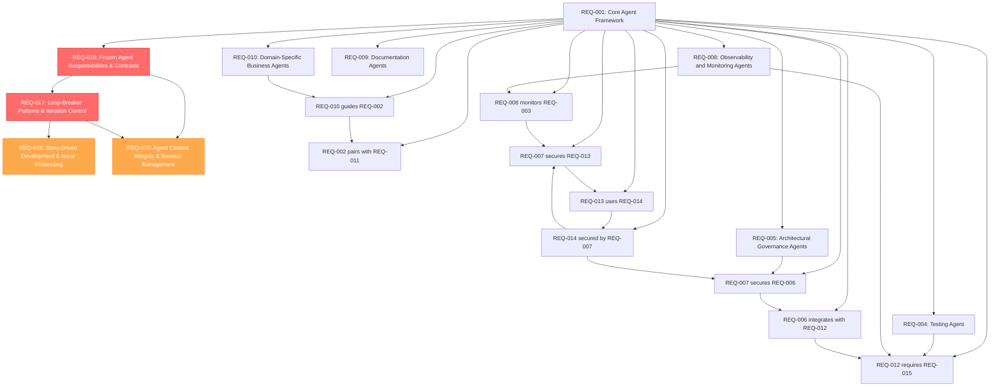

# Positivity Agent Structure Requirements

## Introduction

The durion-positivity-backend project is a Spring Boot microservices POS system with 23+ services deployed on Kubernetes. To effectively manage development across this distributed system, we need a simplified agent framework that provides specialized expertise for the most critical development tasks: architecture guidance, implementation support, testing assistance, and deployment help.

This requirements document follows EARS (Easy Approach to Requirements Syntax) patterns to ensure clear, testable requirements.

## Glossary

- **Agent Structure System**: The comprehensive framework providing specialized AI agents for Spring Boot microservices development, testing, deployment, and operations
- **Spring Boot**: Java-based framework for building microservices and enterprise applications
- **Microservices**: Architectural pattern where applications are composed of small, independent services
- **JWT (JSON Web Token)**: Compact, URL-safe token format for securely transmitting information between parties
- **OpenTelemetry**: Observability framework for generating, collecting, and exporting telemetry data
- **Kubernetes**: Container orchestration platform for automating deployment, scaling, and management
- **PostgreSQL**: Open-source relational database management system
- **ElastiCache**: AWS managed in-memory caching service
- **API Gateway**: Service that acts as an entry point for microservices, handling routing, authentication, and rate limiting
- **Circuit Breaker**: Design pattern that prevents cascading failures in distributed systems
- **Event-Driven Architecture**: Architectural pattern where services communicate through events
- **Contract Testing**: Testing approach that verifies service interactions match agreed-upon contracts
- **Chaos Engineering**: Practice of intentionally introducing failures to test system resilience
- **Infrastructure as Code (IaC)**: Managing infrastructure through machine-readable definition files
- **Service Mesh**: Infrastructure layer that handles service-to-service communication
- **RED Metrics**: Rate, Errors, Duration - key metrics for monitoring service health
- **SLI/SLO**: Service Level Indicators/Objectives - metrics and targets for service reliability
- **Story-Driven Development**: Development workflow where agents read GitHub issues labeled [STORY] and execute build steps based on story requirements
- **durion-positivity-backend**: Spring Boot backend repository at https://github.com/louisburroughs/durion-positivity-backend.git providing POS microservices
- **Agent Contract**: Formal specification of what an agent may change, read, and must never do
- **Loop-Breaker**: Mechanism to prevent agent from infinite iteration (max iterations, escalation, context summarization)
- **Escalate to Human**: Condition that requires human intervention to resolve agent decision points

### Agent & Test Classes Location

All agent framework implementation and test classes are located in the **`pos-agent-framework/`** module:

- Agent implementations: `pos-agent-framework/src/main/java/`
- Test classes: `pos-agent-framework/src/test/java/`

When implementing or modifying agents, always reference and update code in this module.

## Context Integrity Rules

### Primary Rules

- If required inputs are missing from current context:
  SAY: "Context insufficient – re-anchor needed"
- If referring to decisions not found in:
  - current files
  - /ai/context.md
  - /ai/glossary.md
  STOP

### Temporary Context Store Rules

**Purpose:** Minimize redundant file reads and maintain continuity across multi-step tasks.

1. **Context Store Location:** Maintain `.ai/session.md` as a temporary working document for the current development session
2. **Session Initialization:** At the start of each task:
   - Check if `.ai/session.md` exists and is recent (updated within current session)
   - If yes: READ `.ai/session.md` first before re-reading project files
   - If no or stale: BEGIN from `.ai/context.md` and `.ai/glossary.md`
3. **What to Store in Session:**
   - Current task objective and status
   - Key architectural decisions made in this session
   - Recent file paths and structures accessed
   - Active requirements/constraints being addressed
   - Integration points or dependencies discovered
   - Open questions or blockers
4. **Session Updates:** After completing any subtask or making significant progress:
   - UPDATE `.ai/session.md` with findings, decisions, and next steps
   - INCLUDE: timestamp, current file state, discovered patterns, decisions made
   - OMIT: full file contents (link instead)
5. **Session Cleanup:** At task completion or session end:
   - PRESERVE key decisions and learnings in `.ai/context.md` if they're durable
   - DELETE or ARCHIVE `.ai/session.md` when starting a new unrelated task
6. **Conflict Resolution:** If session context contradicts project context:
   - Trust the permanent files (`.ai/context.md`, `.ai/glossary.md`, source files)
   - UPDATE session.md to reflect the authoritative state
7. **Large Tasks:** For multi-file edits or complex deployments:
   - Create an `.ai/session-{task-id}.md` variant if the session spans hours or multiple contexts
   - Link it in the main `.ai/session.md` for continuity

## Functional Requirements

### REQ-001: Core Agent Framework

**User Story:** As a development team lead, I want a structured agent framework for the positivity POS system, so that I can get specialized guidance for architecture, implementation, testing, and deployment.

#### Acceptance Criteria

1. WHEN a developer requests guidance, THE Agent Structure System SHALL provide specialized agents for architecture, implementation, testing, and deployment domains
2. WHEN a developer consults an agent, THE Agent Structure System SHALL provide domain-specific recommendations following Spring Boot and AWS patterns
3. WHEN multiple agents work together, THE Agent Structure System SHALL ensure consistent guidance without conflicts
4. WHEN agents provide microservice guidance, THE Agent Structure System SHALL reference appropriate data store types and AWS services

### REQ-002: Implementation Agent

**User Story:** As a Spring Boot developer, I want specialized implementation guidance, so that I can develop microservices with proper patterns and integration.

#### Acceptance Criteria

1. WHEN a developer implements microservices, THE Agent Structure System SHALL provide Spring Boot development patterns
2. WHEN a developer designs APIs, THE Agent Structure System SHALL provide REST API design guidance
3. WHEN a developer implements data access, THE Agent Structure System SHALL provide appropriate guidance for PostgreSQL and ElastiCache services
4. WHEN a developer writes business logic, THE Agent Structure System SHALL enforce service boundary validation

### REQ-003: Deployment Agent

**User Story:** As a DevOps engineer, I want comprehensive deployment guidance, so that I can manage Kubernetes deployments, container orchestration, and infrastructure automation for all microservices.

#### Acceptance Criteria

1. WHEN a DevOps engineer deploys services, THE Agent Structure System SHALL provide Kubernetes, ECS, and Docker Swarm orchestration guidance
2. WHEN a DevOps engineer configures infrastructure, THE Agent Structure System SHALL provide Terraform, CloudFormation, and infrastructure-as-code guidance
3. WHEN a DevOps engineer manages data stores, THE Agent Structure System SHALL provide PostgreSQL, ElastiCache, and database deployment automation guidance
4. WHEN a DevOps engineer implements service mesh, THE Agent Structure System SHALL provide Istio, Linkerd, and service mesh configuration guidance
5. WHEN a DevOps engineer manages scaling, THE Agent Structure System SHALL provide horizontal pod autoscaling, cluster autoscaling, and capacity planning guidance

### REQ-004: Testing Agent

**User Story:** As a quality assurance engineer, I want comprehensive testing guidance, so that I can ensure quality across microservices through unit, integration, contract, performance, and chaos testing strategies.

#### Acceptance Criteria

1. WHEN a QA engineer implements unit tests, THE Agent Structure System SHALL provide JUnit 5, Mockito, and TestContainers testing guidance
2. WHEN a QA engineer validates APIs, THE Agent Structure System SHALL provide REST endpoint testing, contract testing, and API documentation testing guidance
3. WHEN a QA engineer tests data access, THE Agent Structure System SHALL provide PostgreSQL, ElastiCache, and database integration testing guidance
4. WHEN a QA engineer implements contract testing, THE Agent Structure System SHALL provide Pact, Spring Cloud Contract, and consumer-driven contract testing guidance
5. WHEN a QA engineer conducts performance testing, THE Agent Structure System SHALL provide JMeter, Gatling, and load testing strategy guidance
6. WHEN a QA engineer implements chaos testing, THE Agent Structure System SHALL provide failure injection, resilience validation, and chaos engineering testing guidance

### REQ-005: Architectural Governance Agents
**User Story:** As a system architect, I want architectural governance agents, so that I can maintain system coherence, enforce domain boundaries, and manage technical debt across the distributed system.

#### Acceptance Criteria
1. WHEN a system architect makes architectural decisions, THE Agent Structure System SHALL provide domain-driven design principle enforcement
2. WHEN a system architect integrates services, THE Agent Structure System SHALL ensure proper API Gateway, SNS/SQS messaging, and event-driven architecture usage
3. WHEN a system architect manages dependencies, THE Agent Structure System SHALL prevent circular dependencies
4. WHEN a system architect evolves the system, THE Agent Structure System SHALL provide backward compatibility, versioning, and migration guidance
5. WHEN a system architect reviews designs, THE Agent Structure System SHALL validate against POS domain patterns

### REQ-006: Integration and Gateway Agents
**User Story:** As an API developer, I want integration and gateway agents, so that I can effectively design and implement API endpoints that serve external clients through the API Gateway.

#### Acceptance Criteria
1. WHEN an API developer designs endpoints, THE Agent Structure System SHALL provide specialized REST API design, OpenAPI specification, and HTTP best practice guidance
2. WHEN an API developer implements API Gateway integration, THE Agent Structure System SHALL provide routing, rate limiting, and request/response transformation guidance
3. WHEN an API developer handles external integrations, THE Agent Structure System SHALL ensure proper authentication, authorization, and error handling patterns
4. WHEN an API developer manages API contracts, THE Agent Structure System SHALL provide versioning, backward compatibility, and contract testing guidance
5. WHEN an API developer optimizes API performance, THE Agent Structure System SHALL ensure proper caching, response compression, and data serialization guidance

### REQ-007: Security-Focused Agents
**User Story:** As a security specialist, I want security-focused agents, so that I can ensure comprehensive security across all microservices, data stores, and integration points.

#### Acceptance Criteria
1. WHEN a security specialist implements authentication, THE Agent Structure System SHALL provide specialized JWT, Spring Security, and token-based authentication guidance
2. WHEN a security specialist secures APIs, THE Agent Structure System SHALL ensure proper authorization, input validation, and OWASP compliance
3. WHEN a security specialist manages secrets, THE Agent Structure System SHALL provide AWS Secrets Manager, IAM roles, and secure configuration guidance
4. WHEN a security specialist protects data, THE Agent Structure System SHALL ensure encryption at rest and in transit guidance
5. WHEN a security specialist implements WAF, THE Agent Structure System SHALL provide API Gateway security, rate limiting, and threat protection guidance

### REQ-008: Observability and Monitoring Agents
**User Story:** As an SRE engineer, I want comprehensive observability and monitoring agents, so that I can implement metrics, distributed tracing, log aggregation, and alerting across all microservices using OpenTelemetry, Grafana, and modern observability tools.

#### Acceptance Criteria

1. WHEN an SRE engineer instruments code, THE Agent Structure System SHALL provide OpenTelemetry, Micrometer, and distributed tracing integration guidance
2. WHEN an SRE engineer implements monitoring, THE Agent Structure System SHALL ensure all microservices emit RED metrics, SLI/SLO definitions, and error rate monitoring
3. WHEN an SRE engineer configures observability, THE Agent Structure System SHALL provide Grafana dashboards, Prometheus metrics, Jaeger tracing, and log correlation guidance
4. WHEN an SRE engineer implements log aggregation, THE Agent Structure System SHALL provide ELK stack, Fluentd, and structured logging guidance
5. WHEN an SRE engineer configures alerting, THE Agent Structure System SHALL provide PagerDuty, Slack integration, and alert fatigue prevention guidance
6. WHEN an SRE engineer documents metrics, THE Agent Structure System SHALL ensure METRICS.md file documentation and runbook creation

### REQ-009: Documentation Agents
**User Story:** As a technical writer, I want documentation agents, so that I can ensure comprehensive and consistent documentation across all microservices and APIs.

#### Acceptance Criteria
1. WHEN a technical writer creates documentation, THE Agent Structure System SHALL provide specialized technical documentation, README, and architectural documentation guidance
2. WHEN a technical writer documents APIs, THE Agent Structure System SHALL ensure comprehensive API documentation
3. WHEN a technical writer maintains documentation, THE Agent Structure System SHALL ensure documentation synchronization
4. WHEN a technical writer reviews documentation, THE Agent Structure System SHALL validate completeness and accuracy
5. WHEN a technical writer generates documentation, THE Agent Structure System SHALL ensure consistent formatting

### REQ-010: Domain-Specific Business Agents
**User Story:** As a business analyst, I want domain-specific agents, so that I can ensure the system properly models POS business processes and integrates with external services.

#### Acceptance Criteria
1. WHEN a business analyst models business processes, THE Agent Structure System SHALL provide specialized POS domain knowledge guidance
2. WHEN a business analyst integrates external services, THE Agent Structure System SHALL provide payment processor, vehicle reference API, and third-party integration guidance
3. WHEN a business analyst implements workflows, THE Agent Structure System SHALL ensure proper event-driven pattern guidance
4. WHEN a business analyst validates requirements, THE Agent Structure System SHALL ensure business rule implementation validation
5. WHEN a business analyst manages data consistency, THE Agent Structure System SHALL provide eventual consistency and distributed transaction guidance

### REQ-011: Pair Programming Agent Integration
**User Story:** As a Spring Boot developer, I want pair programming agent integration, so that I can benefit from continuous collaboration, loop detection, and quality improvement during implementation.

#### Acceptance Criteria

1. WHEN a Spring Boot developer begins implementation, THE Agent Structure System SHALL activate paired agent collaboration
2. WHEN implementation progress stalls or loops occur, THE Agent Structure System SHALL detect and interrupt with mandatory stop-phrases
3. WHEN architectural drift is detected, THE Agent Structure System SHALL enforce design constraints
4. WHEN scope creep or over-engineering occurs, THE Agent Structure System SHALL provide simplification guidance
5. WHEN pairing agents disagree on approach, THE Agent Structure System SHALL facilitate resolution

### REQ-012: Event-Driven Architecture Agent
**User Story:** As a system integrator, I want event-driven architecture guidance, so that I can implement reliable asynchronous communication between microservices using Kafka, SNS/SQS, and event sourcing patterns.

#### Acceptance Criteria

1. WHEN a system integrator designs event schemas, THE Agent Structure System SHALL provide event versioning, backward compatibility, and schema evolution guidance
2. WHEN a system integrator implements event handlers, THE Agent Structure System SHALL ensure idempotent processing and error handling patterns
3. WHEN a system integrator configures message brokers, THE Agent Structure System SHALL provide Kafka, SNS/SQS, and RabbitMQ configuration guidance
4. WHEN a system integrator implements event sourcing, THE Agent Structure System SHALL provide event store design and replay mechanism guidance
5. WHEN a system integrator handles event failures, THE Agent Structure System SHALL provide dead letter queue, retry, and circuit breaker patterns

### REQ-013: CI/CD Pipeline Agent
**User Story:** As a DevOps engineer, I want automated pipeline guidance, so that I can implement continuous integration and deployment for all 23+ microservices with proper testing, security scanning, and deployment automation.

#### Acceptance Criteria

1. WHEN a DevOps engineer creates build pipelines, THE Agent Structure System SHALL provide Maven, Gradle, and Docker build automation guidance
2. WHEN a DevOps engineer implements testing pipelines, THE Agent Structure System SHALL ensure unit, integration, contract, and security testing automation
3. WHEN a DevOps engineer configures deployment pipelines, THE Agent Structure System SHALL provide blue-green, canary, and rolling deployment strategies
4. WHEN a DevOps engineer implements security scanning, THE Agent Structure System SHALL provide SAST, DAST, and dependency vulnerability scanning guidance
5. WHEN a DevOps engineer manages pipeline orchestration, THE Agent Structure System SHALL provide Jenkins, GitHub Actions, and GitLab CI/CD configuration guidance

### REQ-014: Configuration Management Agent
**User Story:** As a system administrator, I want configuration management guidance, so that I can manage application settings, feature flags, and environment-specific configurations across all microservices consistently and securely.

#### Acceptance Criteria

1. WHEN a system administrator manages application configs, THE Agent Structure System SHALL provide Spring Cloud Config, Consul, and etcd configuration guidance
2. WHEN a system administrator implements feature flags, THE Agent Structure System SHALL provide feature toggle patterns and gradual rollout strategies
3. WHEN a system administrator handles secrets, THE Agent Structure System SHALL provide AWS Secrets Manager, HashiCorp Vault, and Kubernetes secrets guidance
4. WHEN a system administrator manages environment configs, THE Agent Structure System SHALL provide development, staging, and production configuration isolation
5. WHEN a system administrator implements config validation, THE Agent Structure System SHALL provide configuration schema validation and drift detection

### REQ-015: Resilience Engineering Agent
**User Story:** As a reliability engineer, I want resilience pattern guidance, so that I can implement circuit breakers, retry mechanisms, bulkhead patterns, and chaos engineering to ensure system reliability under failure conditions.

#### Acceptance Criteria

1. WHEN a reliability engineer implements circuit breakers, THE Agent Structure System SHALL provide Hystrix, Resilience4j, and Spring Cloud Circuit Breaker configuration guidance
2. WHEN a reliability engineer designs retry mechanisms, THE Agent Structure System SHALL provide exponential backoff, jitter, and retry limit patterns
3. WHEN a reliability engineer implements bulkhead patterns, THE Agent Structure System SHALL provide thread pool isolation and resource partitioning guidance
4. WHEN a reliability engineer conducts chaos engineering, THE Agent Structure System SHALL provide failure injection, chaos monkey, and resilience testing guidance
5. WHEN a reliability engineer monitors system health, THE Agent Structure System SHALL provide health check endpoints, circuit breaker metrics, and failure rate monitoring

## Additional Specialized Agents for Future Implementation

### Database Migration Agent
- Schema evolution strategies across 23+ microservices
- Zero-downtime migration patterns and rollback procedures
- Data consistency validation during migrations
- Cross-service data synchronization and eventual consistency
- Migration testing and validation automation

### Performance Optimization Agent
- Application performance profiling and JVM tuning
- Database query optimization and indexing strategies
- Caching strategies with Redis, Caffeine, and cache invalidation patterns
- Load testing strategy with JMeter, Gatling, and performance benchmarking
- Auto-scaling configuration and capacity planning

### Code Quality Agent
- Java 21 code formatting and style enforcement with Checkstyle and SpotBugs
- Static analysis with SonarQube and security vulnerability scanning
- Code review guidelines and technical debt identification
- Refactoring strategies and clean code principles
- Documentation standards and automated documentation generation

### API Versioning Agent
- REST API versioning strategies (URL, header, content negotiation)
- Backward compatibility validation and breaking change detection
- API deprecation lifecycle management and migration guidance
- OpenAPI specification evolution and contract validation
- Consumer impact analysis and migration support

### Compliance and Audit Agent
- PCI DSS compliance for payment processing
- SOX compliance for financial data handling
- GDPR compliance for customer data protection
- Audit trail implementation and compliance reporting
- Regulatory requirement validation and documentation

## Performance Requirements
- Response times: ≤ 3 seconds for 99% of requests
- Concurrent user support: Up to 100 developers
- System availability: 99.9% uptime during business hours
- Request throughput: 2000 guidance requests per hour
- Automatic failover: 30-second recovery time
- Agent query response: ≤ 500ms for 95% of guidance requests
- Memory usage: ≤ 2GB per agent instance
- CPU utilization: ≤ 70% under normal load

## Security Requirements (Future Implementation)
- JWT authentication with 256-bit encryption
- Role-based access control with 100% compliance
- TLS 1.3 encryption for all data transmission
- Tamper-proof audit trails with 100% event capture
- Unauthorized access detection within 5 seconds

## Error Handling Requirements (Future Implementation)
- Automatic failover with 100% request preservation
- Graceful degradation with 75% functionality retention
- Specific error messages with 96% classification accuracy
- Priority-based request handling during resource exhaustion
- Data corruption isolation and 10-minute recovery
---

### REQ-016: Frozen Agent Responsibilities and Contracts

**ID**: REQ-016  
**Priority**: Critical  
**Dependencies**: REQ-001 through REQ-015  
**Verification Method**: Code review + Automated testing + Contract verification  
**Validation Method**: Inspection  

**User Story:** As a system architect, I want frozen agent responsibilities with clear contracts, so that I can ensure predictable, safe, and maintainable agent behavior across the durion-positivity-backend agent system.

#### Acceptance Criteria

1. WHEN an agent class is implemented, THE agent SHALL have a single, explicit purpose defined in its contract AND SHALL not perform operations outside its defined scope with 100% enforcement
2. WHEN an agent is initialized, THE agent SHALL declare clear inputs, outputs, and defined stop conditions in its contract with 100% documentation completeness
3. WHEN an agent executes operations, THE agent SHALL operate only within its contractual permissions with 100% enforcement across:
   - **What it MAY change**: Specified files, directories, and configurations only
   - **What it MAY read**: Specified input files, context, and system state only
   - **What it MUST never do**: Prohibited operations explicitly listed in contract (e.g., delete source files, modify protected configs)
4. WHEN an agent exceeds its iteration limit, THE agent SHALL stop execution with 100% reliability and escalate to human review with detailed context
5. WHEN an agent encounters ambiguous conditions, THE agent SHALL escalate to human with specific questions rather than making assumptions with 100% escalation coverage
6. WHEN context grows too large, THE agent SHALL summarize and continue with 95% information retention accuracy

### REQ-017: Loop-Breaker Patterns and Iteration Control

**ID**: REQ-017  
**Priority**: Critical  
**Dependencies**: REQ-016  
**Verification Method**: Automated testing + Runtime monitoring  
**Validation Method**: Demonstration  

**User Story:** As a development team lead, I want loop-breaker patterns enforced, so that I can ensure agents don't infinitely loop and always escalate complex decisions to humans when needed.

#### Acceptance Criteria

1. WHEN an agent begins execution, THE agent SHALL initialize a per-execution iteration counter set to zero AND increment it on each step with 100% accuracy
2. WHEN an agent reaches its maximum iteration count (default 10 iterations, configurable per agent type), THE agent SHALL:
   - Stop all further processing with 100% reliability
   - Log all context and decisions made to date
   - Escalate to human with detailed execution history
   - Provide specific recommendation for human decision with 95% clarity
3. WHEN an agent detects recurring patterns (same state/action > 2 times consecutively), THE agent SHALL escalate to human immediately rather than continue iteration with 100% detection accuracy
4. WHEN an agent encounters a human escalation condition, THE agent SHALL:
   - Document the exact condition triggering escalation
   - Ask specific clarifying questions (not open-ended)
   - Wait for human input before proceeding
   - Incorporate human decision into subsequent execution
5. WHEN context size exceeds limit (default 50KB per request, configurable), THE agent SHALL:
   - Identify and preserve critical information (decisions, constraints, blockers)
   - Summarize non-critical information (exploration paths, alternatives, historical attempts)
   - Create summary with 95% information retention of critical context
   - Continue execution with summarized context
   - Reference summary location for full history if needed
6. WHEN an agent completes execution, THE agent SHALL provide complete execution trace including:
   - Total iterations used (N/MAX_ITERATIONS)
   - Escalations triggered (if any)
   - Context summarizations performed (if any)
   - Final state and recommendation

### REQ-018: Story-Driven Development and Issue Processing

**ID**: REQ-018  
**Priority**: High  
**Dependencies**: REQ-001, REQ-016, REQ-017  
**Verification Method**: Integration testing + GitHub integration testing  
**Validation Method**: Demonstration  

**User Story:** As a development team, I want agents to process [STORY] labeled GitHub issues from durion-positivity-backend, so that I can execute build steps against appropriate modules based on story requirements.

#### Acceptance Criteria

1. WHEN the agent system initializes, THE agent SHALL connect to https://github.com/louisburroughs/durion-positivity-backend.git repository with appropriate authentication with 100% connection reliability
2. WHEN querying for work, THE agent SHALL search for issues labeled `[STORY]` with open state AND no assignee with 100% query accuracy
3. WHEN a story issue is selected, THE agent SHALL:
   - Read the complete issue title, description, and comments
   - Extract module requirements (which microservice(s) are affected)
   - Identify acceptance criteria and test requirements
   - Determine build steps needed (test, build, deploy, etc.)
4. WHEN determining module-specific build steps, THE agent SHALL execute against the appropriate microservice module based on story content with 100% accuracy, including:
   - Running `mvn clean install` for affected module
   - Running module-specific test suites
   - Validating integration points with dependent services
   - Generating build artifacts as required
5. WHEN build steps fail, THE agent SHALL:
   - Log failure details and error messages
   - Attempt to resolve common issues (dependency conflicts, missing resources)
   - Escalate to human with specific failure details if resolution fails after 3 attempts
   - Preserve all diagnostic output for human review
6. WHEN story completion is achieved, THE agent SHALL:
   - Document all build steps executed
   - Record test results and coverage metrics
   - Update issue with completion status and links to artifacts
   - Provide human-readable summary of work completed
7. WHEN processing stories, THE agent SHALL respect story dependencies where:
   - Stories marked with dependency labels are processed in order
   - Dependent stories wait for prerequisites to complete
   - Circular dependencies trigger human escalation

### REQ-019: Agent Context Integrity and Session Management

**ID**: REQ-019  
**Priority**: High  
**Dependencies**: REQ-016, REQ-017  
**Verification Method**: Automated testing + Code review  
**Validation Method**: Inspection  

**User Story:** As a development team, I want agents to maintain context integrity across sessions, so that I can reliably continue work and avoid context conflicts.

#### Acceptance Criteria

1. WHEN an agent session begins, THE agent SHALL check for `.ai/session.md` in the workspace AND use recent session context if available with 100% reliability
2. WHEN session context is missing or stale, THE agent SHALL re-anchor to `.ai/context.md` and `.ai/glossary.md` with 100% completeness
3. WHEN agent makes architectural decisions, THE agent SHALL record decisions in `.ai/session.md` with timestamp and rationale with 100% documentation
4. WHEN context contradictions are detected, THE agent SHALL trust permanent project files (code, `.ai/context.md`, `.ai/glossary.md`) over session context with 100% priority
5. WHEN required inputs are missing from current context, THE agent SHALL SAY "Context insufficient – re-anchor needed" AND stop processing to request human clarification
6. WHEN referring to architecture decisions, THE agent SHALL only reference decisions found in current files, `/ai/context.md`, or `/ai/glossary.md` - otherwise STOP AND request clarification

---

## Requirements Traceability Matrix

| Requirement ID | Title | Priority | Design Components |
|---------------|-------|----------|-------------------|
| REQ-001 | Core Agent Framework | Critical | Agent Registry, Core Agents |
| REQ-002 | Implementation Agent | High | Spring Boot Developer Agent |
| REQ-003 | Deployment Agent | High | DevOps Agent, Infrastructure Automation |
| REQ-004 | Testing Agent | High | Testing Agent, Contract Testing, Chaos Testing |
| REQ-005 | Architectural Governance Agents | High | Architecture Agent, Domain Boundary Enforcement |
| REQ-006 | Integration and Gateway Agents | Medium | API Gateway Agent, Integration Patterns |
| REQ-007 | Security-Focused Agents | High | Security Agent, Authentication/Authorization |
| REQ-008 | Observability and Monitoring Agents | High | SRE Agent, Distributed Tracing, Log Aggregation |
| REQ-009 | Documentation Agents | Medium | Documentation Agent, Technical Writing |
| REQ-010 | Domain-Specific Business Agents | Medium | POS Business Agent, Domain Knowledge |
| REQ-011 | Pair Programming Agent Integration | High | Pair Navigator Agent, Loop Detection |
| REQ-012 | Event-Driven Architecture Agent | High | Event Schema Design, Message Broker Configuration |
| REQ-013 | CI/CD Pipeline Agent | High | Build Automation, Deployment Pipelines, Security Scanning |
| REQ-014 | Configuration Management Agent | Medium | Config Management, Feature Flags, Secrets Management |
| REQ-015 | Resilience Engineering Agent | High | Circuit Breakers, Retry Patterns, Chaos Engineering |
| REQ-016 | Frozen Agent Responsibilities and Contracts | Critical | Agent Contract Enforcement, Scope Validation |
| REQ-017 | Loop-Breaker Patterns and Iteration Control | Critical | Iteration Limits, Escalation Rules, Context Management |
| REQ-018 | Story-Driven Development and Issue Processing | High | GitHub Integration, Story Processing, Module Build Execution |
| REQ-019 | Agent Context Integrity and Session Management | High | Session Management, Context Re-anchoring, Decision Tracking |

---

**Document Version**: 2.0 (Enhanced with Agent Contracts, Loop-Breakers, and Story-Driven Execution)  
**Last Updated**: December 22, 2025  
**Document Status**: Complete - Ready for Implementation