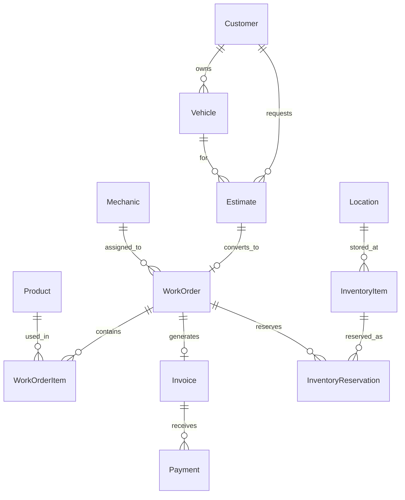

# Positivity POS Backend System Design Document

## Overview

This design document outlines the technical architecture for the Positivity POS Backend System, a comprehensive Point of Sale backend system built with Spring Boot microservices architecture. The system is designed for AWS Fargate deployment and provides business logic and data persistence services for tire service management operations. The system consists of 23+ microservices that serve the durion-moqui-frontend frontend through REST APIs via an API Gateway.

The design follows microservice architecture principles with clear service boundaries, uses DynamoDB for transactional data and ElastiCache for reference data caching, and implements comprehensive observability through OpenTelemetry integration.

## Architecture

### Microservice Architecture

The system is organized into domain-specific microservices, each with dedicated responsibilities and data stores:

#### 1. Catalog Domain Services
- **pos-catalog**: Product catalog management, specifications, and categorization
- **pos-price**: Pricing calculations, customer-specific pricing, and discount management
- **Data Store**: DynamoDB tables for products, categories, pricing rules
- **Key APIs**: Product search, pricing calculation, catalog management

#### 2. Customer Domain Services  
- **pos-customer**: Customer information management and lookup
- **pos-people**: Person and contact information management
- **Data Store**: DynamoDB tables for customers, contacts, preferences
- **Key APIs**: Customer lookup, profile management, service history

#### 3. Vehicle Domain Services
- **pos-vehicle-inventory**: Vehicle inventory and availability tracking
- **pos-vehicle-reference-carapi**: CarAPI integration for vehicle specifications
- **pos-vehicle-reference-nhtsa**: NHTSA integration for vehicle data
- **pos-vehicle-fitment**: Vehicle-part compatibility and fitment data
- **Data Store**: DynamoDB (inventory), ElastiCache (reference data)
- **Key APIs**: Vehicle lookup, VIN validation, fitment verification

#### 4. Work Management Domain Services
- **pos-work-order**: Work order lifecycle management and status tracking
- **pos-inquiry**: Estimate creation and management
- **Data Store**: DynamoDB tables for work orders, estimates, status history
- **Key APIs**: Work order management, estimate processing, status updates

#### 5. Inventory Domain Services
- **pos-inventory**: Parts inventory management and availability
- **Data Store**: DynamoDB tables for inventory items, transactions, reservations
- **Key APIs**: Inventory lookup, reservation management, stock updates

#### 6. Financial Domain Services
- **pos-invoice**: Invoice generation and management
- **pos-accounting**: Accounts receivable and payment processing
- **Data Store**: DynamoDB tables for invoices, payments, account balances
- **Key APIs**: Invoice generation, payment processing, financial reporting

#### 7. Infrastructure Services
- **pos-api-gateway**: Central API routing and request management
- **pos-security-service**: Authentication, authorization, and JWT token management
- **pos-service-discovery**: Service registration and discovery
- **pos-event-receiver**: Event processing and message handling
- **pos-events**: Event publishing and subscription management
- **Data Store**: DynamoDB (security), In-memory (discovery)
- **Key APIs**: Authentication, service discovery, event processing

#### 8. Support Services
- **pos-location**: Location and facility management
- **pos-shop-manager**: Shop operations and resource management
- **pos-image**: Image storage and management
- **Data Store**: DynamoDB tables, S3 (images)
- **Key APIs**: Location management, resource allocation, image handling

## Components and Interfaces

### Core Service Interfaces

#### 1. Catalog Services
```java
// Product Catalog Service
@RestController
@RequestMapping("/api/v1/catalog")
public class CatalogController {
    @GetMapping("/products/search")
    public ResponseEntity<ProductSearchResponse> searchProducts(
        @RequestParam String query,
        @RequestParam(required = false) String category,
        @RequestParam(defaultValue = "0") int page,
        @RequestParam(defaultValue = "20") int size
    );
    
    @GetMapping("/products/{productId}")
    public ResponseEntity<ProductDetail> getProduct(@PathVariable String productId);
    
    @PostMapping("/products")
    public ResponseEntity<Product> createProduct(@Valid @RequestBody CreateProductRequest request);
}

// Pricing Service
@RestController
@RequestMapping("/api/v1/pricing")
public class PricingController {
    @PostMapping("/calculate")
    public ResponseEntity<PricingResponse> calculatePrice(
        @Valid @RequestBody PricingRequest request
    );
    
    @GetMapping("/customer/{customerId}/pricing")
    public ResponseEntity<CustomerPricingResponse> getCustomerPricing(
        @PathVariable String customerId
    );
}
```

#### 2. Customer Services
```java
// Customer Service
@RestController
@RequestMapping("/api/v1/customers")
public class CustomerController {
    @GetMapping("/search")
    public ResponseEntity<CustomerSearchResponse> searchCustomers(
        @RequestParam(required = false) String phone,
        @RequestParam(required = false) String name,
        @RequestParam(required = false) String vehicleInfo
    );
    
    @PostMapping
    public ResponseEntity<Customer> createCustomer(@Valid @RequestBody CreateCustomerRequest request);
    
    @PutMapping("/{customerId}")
    public ResponseEntity<Customer> updateCustomer(
        @PathVariable String customerId,
        @Valid @RequestBody UpdateCustomerRequest request
    );
    
    @GetMapping("/{customerId}/service-history")
    public ResponseEntity<ServiceHistoryResponse> getServiceHistory(@PathVariable String customerId);
}
```

#### 3. Work Management Services
```java
// Estimate Service
@RestController
@RequestMapping("/api/v1/estimates")
public class EstimateController {
    @PostMapping
    public ResponseEntity<Estimate> createEstimate(@Valid @RequestBody CreateEstimateRequest request);
    
    @PostMapping("/{estimateId}/approve")
    public ResponseEntity<WorkOrder> approveEstimate(@PathVariable String estimateId);
    
    @GetMapping("/{estimateId}")
    public ResponseEntity<EstimateDetail> getEstimate(@PathVariable String estimateId);
}

// Work Order Service
@RestController
@RequestMapping("/api/v1/work-orders")
public class WorkOrderController {
    @PostMapping("/{workOrderId}/assign")
    public ResponseEntity<WorkOrder> assignWorkOrder(
        @PathVariable String workOrderId,
        @Valid @RequestBody AssignWorkOrderRequest request
    );
    
    @PutMapping("/{workOrderId}/status")
    public ResponseEntity<WorkOrder> updateStatus(
        @PathVariable String workOrderId,
        @Valid @RequestBody UpdateStatusRequest request
    );
    
    @GetMapping("/mechanic/{mechanicId}")
    public ResponseEntity<List<WorkOrder>> getMechanicWorkOrders(@PathVariable String mechanicId);
}
```

#### 4. Inventory Services
```java
// Inventory Service
@RestController
@RequestMapping("/api/v1/inventory")
public class InventoryController {
    @GetMapping("/availability")
    public ResponseEntity<InventoryAvailabilityResponse> checkAvailability(
        @RequestParam String productId,
        @RequestParam String locationId,
        @RequestParam int quantity
    );
    
    @PostMapping("/reserve")
    public ResponseEntity<ReservationResponse> reserveInventory(
        @Valid @RequestBody ReserveInventoryRequest request
    );
    
    @PostMapping("/receive")
    public ResponseEntity<ReceiveInventoryResponse> receiveInventory(
        @Valid @RequestBody ReceiveInventoryRequest request
    );
}
```

### Data Models

#### Core Entity Relationships


#### Key Data Models
```java
// Customer Domain
@Entity
@Table(name = "customers")
public class Customer {
    @Id
    private String customerId;
    private String firstName;
    private String lastName;
    private String phoneNumber;
    private String email;
    private CustomerType customerType;
    private LocalDateTime createdAt;
    private LocalDateTime updatedAt;
}

@Entity
@Table(name = "vehicles")
public class Vehicle {
    @Id
    private String vehicleId;
    private String customerId;
    private String vin;
    private String make;
    private String model;
    private Integer year;
    private String licensePlate;
    private LocalDateTime createdAt;
}

// Work Management Domain
@Entity
@Table(name = "estimates")
public class Estimate {
    @Id
    private String estimateId;
    private String customerId;
    private String vehicleId;
    private EstimateStatus status;
    private BigDecimal totalAmount;
    private LocalDateTime createdAt;
    private LocalDateTime expiresAt;
}

@Entity
@Table(name = "work_orders")
public class WorkOrder {
    @Id
    private String workOrderId;
    private String estimateId;
    private String mechanicId;
    private String bayId;
    private WorkOrderStatus status;
    private LocalDateTime scheduledDate;
    private LocalDateTime completedDate;
}

// Inventory Domain
@Entity
@Table(name = "inventory_items")
public class InventoryItem {
    @Id
    private String inventoryItemId;
    private String productId;
    private String locationId;
    private Integer quantityOnHand;
    private Integer quantityReserved;
    private BigDecimal unitCost;
    private LocalDateTime lastUpdated;
}
```

## Correctness Properties

*A property is a characteristic or behavior that should hold true across all valid executions of a system-essentially, a formal statement about what the system should do. Properties serve as the bridge between human-readable specifications and machine-verifiable correctness guarantees.*

Based on the prework analysis, the following correctness properties have been identified to validate the Positivity POS Backend System:

### Property Reflection

After reviewing all properties identified in the prework, several areas of consolidation were identified:
- Properties about data validation and integrity can be combined where they cover similar patterns
- Properties about pricing calculations can be unified under comprehensive pricing validation
- Properties about status management and workflow can be consolidated into state management properties
- Properties about cross-service communication can be combined under integration consistency

### Core Properties

**Property 1: Product catalog consistency**
*For any* product search or retrieval operation, the system should return complete product information with accurate specifications, categories, and availability data
**Validates: Requirements 1.1, 1.4**

**Property 2: Pricing calculation accuracy**
*For any* pricing request, the system should calculate consistent and accurate pricing based on customer type, date, applicable discounts, and business rules
**Validates: Requirements 1.2, 1.5, 3.1**

**Property 3: Customer data integrity**
*For any* customer information operation (create, update, lookup), the system should maintain data integrity, validation, and complete audit trails
**Validates: Requirements 2.1, 2.2, 2.5**

**Property 4: Vehicle integration consistency**
*For any* vehicle information operation, the system should integrate with external reference services and maintain accurate VIN validation and specifications
**Validates: Requirements 2.3, 2.4**

**Property 5: Estimate-to-work-order conversion integrity**
*For any* approved estimate, the conversion to work order should preserve all line items, pricing, and customer/vehicle associations
**Validates: Requirements 3.2, 3.5**

**Property 6: Work order state management**
*For any* work order status update, the system should validate state transitions, maintain history, and trigger appropriate notifications and integrations
**Validates: Requirements 4.3, 5.2, 5.5**

**Property 7: Inventory reservation integrity**
*For any* inventory operation, the system should prevent overselling, maintain reservation integrity, and provide accurate availability information
**Validates: Requirements 6.1, 6.2, 6.3**

**Property 8: Invoice generation completeness**
*For any* completed work order, the generated invoice should include accurate line items, pricing calculations, tax calculations, and complete customer billing information
**Validates: Requirements 7.1, 7.3**

**Property 9: Security and authentication consistency**
*For any* authentication or authorization operation, the system should validate credentials, issue proper JWT tokens, and enforce role-based access control consistently
**Validates: Requirements 8.1, 8.2, 8.4**

**Property 10: Observability and metrics completeness**
*For any* system operation, the system should emit appropriate OpenTelemetry metrics, business metrics, and distributed tracing information
**Validates: Requirements 9.1, 9.2, 9.3**

**Property 11: API contract compliance**
*For any* API endpoint, the system should follow OpenAPI specifications, provide consistent error handling, and maintain backward compatibility
**Validates: Requirements 10.1, 10.3, 10.4**

**Property 12: Data consistency across services**
*For any* cross-service data operation, the system should maintain eventual consistency, referential integrity, and proper event-driven communication
**Validates: Requirements 11.2, 11.4, 12.1**

**Property 13: Microservice boundary enforcement**
*For any* service interaction, the system should respect service boundaries, prevent direct database access across services, and implement proper resilience patterns
**Validates: Requirements 12.2, 12.4**

## Error Handling

### Service-Level Error Handling
- **Authentication Errors**: Invalid credentials, expired tokens, insufficient permissions
- **Validation Errors**: Invalid input data, missing required fields, business rule violations
- **Integration Errors**: External service failures, timeout handling, circuit breaker activation
- **Data Errors**: Constraint violations, referential integrity issues, concurrent modification conflicts

### Cross-Service Error Handling
- **Communication Failures**: Service unavailability, network timeouts, message delivery failures
- **Consistency Errors**: Eventual consistency delays, compensation transaction failures
- **Resource Errors**: Inventory shortages, capacity constraints, resource conflicts

### Infrastructure Error Handling
- **AWS Service Errors**: DynamoDB throttling, ElastiCache failures, SNS/SQS issues
- **Container Errors**: Service startup failures, health check failures, resource exhaustion
- **Security Errors**: Rate limiting, WAF blocking, certificate issues

## Testing Strategy

### Dual Testing Approach

The Positivity POS Backend System will be validated using both unit testing and property-based testing approaches:

**Unit Testing**:
- Service-level testing for each microservice with specific scenarios
- API endpoint testing with known request/response pairs
- Data access layer testing with mock data and edge cases
- Integration testing for external service interactions

**Property-Based Testing**:
- Universal properties that should hold across all business operations
- Cross-service consistency validation with random data scenarios
- Performance characteristics under various load conditions
- Security pattern compliance across all endpoints

**Property-Based Testing Framework**: 
The implementation will use **QuickCheck for Java** (or **jqwik**) as the property-based testing library, configured to run a minimum of 100 iterations per property test.

**Property Test Tagging**:
Each property-based test will be tagged with comments explicitly referencing the correctness property from this design document using the format: `**Feature: positivity-pos-backend, Property {number}: {property_text}**`

### Microservice Testing Strategy

**Service Testing**:
- Individual microservice testing with embedded test containers
- Contract testing between services using Pact or similar frameworks
- API gateway integration testing with routing and authentication
- Event-driven communication testing with SNS/SQS

**Data Testing**:
- DynamoDB integration testing with LocalStack or DynamoDB Local
- ElastiCache integration testing with embedded Redis
- Data consistency testing across service boundaries
- Migration testing for schema evolution

**Infrastructure Testing**:
- AWS service integration testing with LocalStack
- Container orchestration testing with test environments
- Observability testing with OpenTelemetry and test collectors
- Security testing with authentication and authorization scenarios

### Validation Criteria

**Functional Validation**:
- All business requirements implemented with acceptance criteria met
- Cross-service workflows operate correctly with proper error handling
- Data integrity maintained throughout all operations
- External service integrations handle failures gracefully

**Technical Validation**:
- Microservice architecture follows Spring Boot and AWS best practices
- Security requirements implemented with JWT and encryption
- Performance targets met under expected load with proper caching
- Observability provides comprehensive system visibility

**Operational Validation**:
- Services can be deployed independently with zero downtime
- Monitoring and alerting provide actionable insights
- Disaster recovery procedures tested and documented
- Scaling decisions supported by metrics and automation