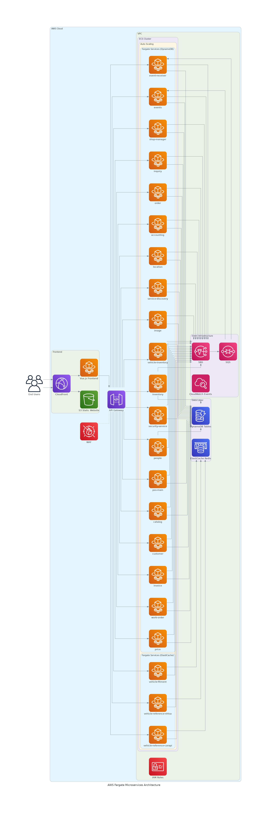

## Architecture Overview

The diagram illustrates:

1. Frontend Layer
   • Vue.js frontend running in a container
   • CloudFront distribution for content delivery
   • S3 for static assets

2. API Gateway Layer
   • API Gateway with WAF protection
   • Routes requests to appropriate microservices

3. Microservices Layer (AWS Fargate)
   • All Spring Boot modules running as containerized services
   • Auto-scaling configuration for each service
   • Services grouped by data store type:
     • DynamoDB-backed services: pos-main, catalog, customer, invoice, work-order, price, shop-manager, inquiry, order, accounting, events, event-receiver, image, vehicle-inventory, inventory, security-service, people, location, service-discovery
     • ElastiCache-backed services: vehicle-fitment, vehicle-reference-nhtsa, vehicle-reference-carapi

4. Data Layer
   • DynamoDB tables for most services
   • ElastiCache Redis clusters for vehicle reference services

5. Event Infrastructure
   • [SNS/SQS](MESSAGING.md) for event-driven communication between services
   • CloudWatch for monitoring and event triggering

6. Security
   • IAM roles for service permissions
   • WAF for API protection ([see network details](NETWORK.md))

The diagram shows how each component connects and highlights the scalability of the Fargate containers. Each microservice has its own data store, and all services are accessible through the API Gateway, which serves as the entry point for the Vue.js frontend.

