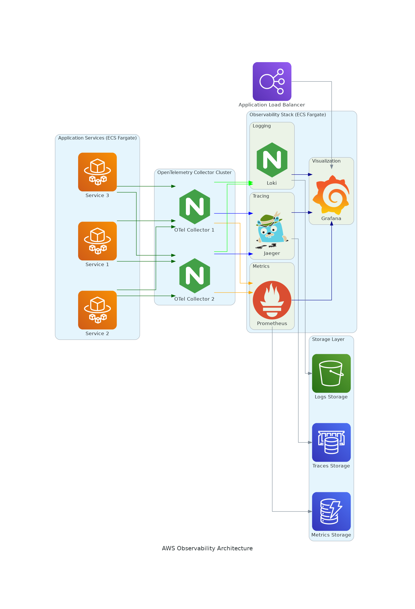

Designing an Open Source application for observability using OpenTelemetry with hundreds of Spring Boot microservices in Docker containers involves a layered approach. The core idea is to leverage OpenTelemetry's standardized instrumentation and collection capabilities, centralize data, and provide flexible backend storage and visualization.

Here's an Open Source application design:

## Architecture Overview

At a high level, the architecture would look like this:

1.  **Instrumented Spring Boot Microservices (Clients):** Hundreds of Spring Boot microservices, each running in its own Docker container, generate telemetry data (traces, metrics, logs).
2.  **OpenTelemetry Collector (Gateway):** A cluster of OpenTelemetry Collectors acts as a central gateway, receiving telemetry from all microservices, processing it, and forwarding it to the backend.
3.  **Observability Backend (Storage & Analysis):** Open-source tools for storing, querying, and visualizing traces, metrics, and logs. This is where the collected telemetry data resides for analysis.

```mermaid
graph TD
    subgraph Microservices Layer
        A[Spring Boot Service 1] --> B(Docker Container)
        C[Spring Boot Service 2] --> D(Docker Container)
        E[Spring Boot Service N] --> F(Docker Container)
    end

    B -- OTLP --> G(OpenTelemetry Collector Cluster)
    D -- OTLP --> G
    F -- OTLP --> G

    G -- Export --> H[Metrics Backend (e.g., Prometheus)]
    G -- Export --> I[Traces Backend (e.g., Jaeger/Tempo)]
    G -- Export --> J[Logs Backend (e.g., Loki/OpenSearch)]

    H -- Query --> K[Grafana (Metrics Dashboard)]
    I -- Query --> L[Grafana/Jaeger UI (Traces Visualization)]
    J -- Query --> M[Grafana/Kibana (Logs Search)]

    subgraph User Interface
        K --> User
        L --> User
        M --> User
    end
```

## Detailed Component Breakdown

### 1. Spring Boot Microservices (Clients)

* **Instrumentation:**
    * **OpenTelemetry Java Agent:** The most common and recommended approach for Spring Boot. This Java agent can be attached to the JVM at startup (`-javaagent:path/to/opentelemetry-javaagent.jar`) and provides automatic instrumentation for popular libraries and frameworks used by Spring Boot (e.g., Spring Web, JDBC, HTTP clients, Kafka, etc.). This minimizes code changes.
    * **Micrometer Tracing with OpenTelemetry Exporter:** Spring Boot 3 has adopted Micrometer Tracing as its observability abstraction. By including `micrometer-tracing-bridge-otel` and `opentelemetry-exporter-otlp`, Spring Boot applications can automatically generate OpenTelemetry-compliant traces and metrics. This is often used in conjunction with the Java agent for more comprehensive coverage.
    * **Manual Instrumentation (Optional):** For specific business logic or custom operations not covered by auto-instrumentation, developers can use the OpenTelemetry API to manually create spans, add attributes, and record metrics.
* **Log Correlation:**
    * Use a logging framework like Logback or Log4j2.
    * Configure the logging framework to include `traceId` and `spanId` (automatically propagated by OpenTelemetry) in log messages, ideally in JSON format. This allows for correlation of logs with traces.
* **Docker Containerization:**
    * Each Spring Boot microservice is packaged into a Docker image.
    * The Dockerfile for each service will include the OpenTelemetry Java Agent (if used) and ensure that the application is configured to send telemetry data to the OpenTelemetry Collector.
    * Example Dockerfile snippet for Java Agent:
        ```dockerfile
        FROM openjdk:17-jdk-slim
        WORKDIR /app
        COPY target/your-app.jar /app/your-app.jar
        COPY opentelemetry-javaagent.jar /app/opentelemetry-javaagent.jar
        CMD ["java", "-javaagent:/app/opentelemetry-javaagent.jar", "-jar", "/app/your-app.jar"]
        ```
* **Configuration (e.g., `application.yml` or Environment Variables):**
    * `otel.service.name`: Unique name for each microservice.
    * `otel.resource.attributes`: Additional attributes to identify the service (e.g., environment, version).
    * `otel.exporter.otlp.endpoint`: The endpoint of the OpenTelemetry Collector (e.g., `http://otel-collector:4317` for gRPC or `http://otel-collector:4318` for HTTP).
    * `otel.traces.sampler.arg`: Sampling probability (e.g., `1.0` for full sampling in development, `0.1` for 10% sampling in production).

### 2. OpenTelemetry Collector Cluster (Gateway)

* **Deployment:** Deploy as a scalable cluster (e.g., using Kubernetes StatefulSets or a Docker Compose setup with multiple replicas) to handle the load from hundreds of microservices.
* **Configuration (`otel-collector-config.yaml`):**
    * **Receivers:**
        * `otlp:` Configured to receive OpenTelemetry Protocol (OTLP) data via gRPC (port 4317) and HTTP (port 4318). This is the standard protocol for OpenTelemetry.
        * Potentially other receivers if you have legacy systems (e.g., `jaeger`, `zipkin`, `prometheus`).
    * **Processors:**
        * `batch:` Batches telemetry data to improve export efficiency. Crucial for high-volume scenarios.
        * `memory_limiter:` Prevents the collector from consuming excessive memory.
        * `queued_retry:` Provides resilience by queuing data and retrying exports if the backend is temporarily unavailable.
        * `attributes:` Enrich data with common attributes (e.g., `cluster_name`, `datacenter`).
        * `resource:` Add or modify resource attributes (e.g., host information).
        * `tail_sampling:` Implement advanced sampling strategies (e.g., always sample errors, or sample a fixed percentage of traces).
        * `filter:` Filter out sensitive data or unnecessary telemetry.
    * **Exporters:**
        * **Traces:**
            * `jaeger:` Export traces to Jaeger (e.g., `jaeger:14250` for gRPC).
            * `otlp:` Export traces to a different OTLP-compliant backend if desired.
        * **Metrics:**
            * `prometheus:` Exposes a Prometheus scrape endpoint for the collector itself, and can forward metrics to Prometheus.
            * `otlp:` Export metrics to an OTLP-compliant metrics store.
        * **Logs:**
            * `loki:` Export logs to Loki.
            * `otlp:` Export logs to an OTLP-compliant log store.
    * **Pipelines:** Define pipelines for `traces`, `metrics`, and `logs`, specifying which receivers, processors, and exporters to use for each signal type.

* **Docker Image:** Use the `otel/opentelemetry-collector-contrib` Docker image, which includes a wide range of receivers, processors, and exporters.
* **Scaling:** Use a container orchestration platform like Kubernetes to automatically scale the Collector cluster based on incoming telemetry load.

### 3. Observability Backend (Storage & Analysis)

This layer provides the persistent storage, querying capabilities, and visualization for your telemetry data. All components here are open-source.

* **Traces:**
    * **Jaeger:**
        * **Components:** `jaeger-collector`, `jaeger-query`, `jaeger-agent`, `jaeger-all-in-one` (for small setups), and a storage backend (e.g., Cassandra, Elasticsearch, or Badger for ephemeral).
        * **Purpose:** Stores and visualizes distributed traces, allowing you to see the full path of a request through your microservices. Provides dependency graphs and flame graphs for troubleshooting.
        * **Deployment:** Typically deployed as Docker containers or Kubernetes deployments.
* **Metrics:**
    * **Prometheus:**
        * **Components:** `prometheus-server` (for scraping and storage), `alertmanager` (for alerting), `node-exporter` (for host metrics).
        * **Purpose:** Pull-based metrics system. The OpenTelemetry Collector can expose a Prometheus-compatible endpoint, or you can configure Prometheus to scrape the Collector directly. Stores time-series data for quantitative analysis.
        * **Deployment:** Docker container.
* **Logs:**
    * **Loki:**
        * **Components:** `loki` (main server), `promtail` (agent for collecting logs).
        * **Purpose:** Log aggregation system designed for cost-effective log storage and querying. It indexes log metadata (labels) rather than full log content, making it efficient for large volumes.
        * **Deployment:** Docker container. Alternatively, **OpenSearch / Elasticsearch + Kibana** can be used for more full-text search capabilities, but might be more resource-intensive for hundreds of services.
* **Visualization & Dashboards:**
    * **Grafana:**
        * **Purpose:** A powerful open-source platform for data visualization and monitoring. It can connect to Jaeger (for traces), Prometheus (for metrics), and Loki (for logs) to create unified dashboards.
        * **Dashboards:** Create custom dashboards to monitor service health, performance, error rates, resource utilization, and to drill down from high-level metrics to specific traces and logs.
        * **Alerting:** Configure alerts based on metric thresholds or log patterns.
        * **Deployment:** Docker container.

## Deployment Strategy (Example with Docker Compose or Kubernetes)

For hundreds of microservices, Kubernetes is the ideal deployment platform for scalability, resilience, and management.

**Simplified Docker Compose (for demonstration/small scale):**

```yaml
version: '3.8'

services:
  # OpenTelemetry Collector
  otel-collector:
    image: otel/opentelemetry-collector-contrib:latest
    command: ["--config=/etc/otel-collector-config.yaml"]
    volumes:
      - ./otel-collector-config.yaml:/etc/otel-collector-config.yaml
    ports:
      - "4317:4317" # OTLP gRPC receiver
      - "4318:4318" # OTLP HTTP receiver
      - "8888:8888" # Collector metrics endpoint
    networks:
      - app-network

  # Jaeger
  jaeger:
    image: jaegertracing/all-in-one:latest
    ports:
      - "16686:16686" # Jaeger UI
      - "14250:14250" # gRPC collector
      - "14268:14268" # HTTP collector
    environment:
      - COLLECTOR_OTLP_ENABLED=true
    networks:
      - app-network

  # Prometheus
  prometheus:
    image: prom/prometheus:latest
    volumes:
      - ./prometheus.yaml:/etc/prometheus/prometheus.yml
    ports:
      - "9090:9090" # Prometheus UI
    command:
      - --config.file=/etc/prometheus/prometheus.yml
      - --storage.tsdb.path=/prometheus
    networks:
      - app-network

  # Grafana
  grafana:
    image: grafana/grafana:latest
    ports:
      - "3000:3000" # Grafana UI
    environment:
      - GF_SECURITY_ADMIN_USER=admin
      - GF_SECURITY_ADMIN_PASSWORD=admin
    volumes:
      - grafana-data:/var/lib/grafana
    networks:
      - app-network

  # Example Spring Boot Microservice
  microservice-alpha:
    build:
      context: ./microservice-alpha
      dockerfile: Dockerfile
    environment:
      - OTEL_SERVICE_NAME=microservice-alpha
      - OTEL_EXPORTER_OTLP_ENDPOINT=http://otel-collector:4317
    # Mount the OpenTelemetry Java Agent if not bundled in Dockerfile
    # volumes:
    #   - ./opentelemetry-javaagent.jar:/app/opentelemetry-javaagent.jar
    # command: ["java", "-javaagent:/app/opentelemetry-javaagent.jar", "-jar", "/app/your-app.jar"]
    ports:
      - "8080:8080"
    networks:
      - app-network

networks:
  app-network:
    driver: bridge

volumes:
  grafana-data:
```

**`otel-collector-config.yaml` example:**

```yaml
receivers:
  otlp:
    protocols:
      grpc:
      http:

processors:
  memory_limiter:
    limit_mib: 200
    spike_limit_mib: 50
    check_interval: 5s
  batch:
    send_batch_size: 1000
    timeout: 10s
  attributes/add_service_env:
    actions:
      - key: service.env
        value: production
        action: insert

exporters:
  jaeger:
    endpoint: jaeger:14250
    tls:
      insecure: true
  prometheus:
    endpoint: 0.0.0.0:8889 # For Prometheus to scrape Collector's metrics
  loki:
    endpoint: http://loki:3100/loki/api/v1/push
    labels:
      resource:
        host.name:
        service.name:
      attributes:
        log.severity:

service:
  pipelines:
    traces:
      receivers: [otlp]
      processors: [memory_limiter, batch]
      exporters: [jaeger]
    metrics:
      receivers: [otlp]
      processors: [memory_limiter, batch]
      exporters: [prometheus] # or an OTLP metrics exporter
    logs:
      receivers: [otlp]
      processors: [memory_limiter, batch, attributes/add_service_env]
      exporters: [loki] # or an OTLP logs exporter
```

**`prometheus.yaml` example (to scrape the collector):**

```yaml
global:
  scrape_interval: 15s

scrape_configs:
  - job_name: 'opentelemetry-collector'
    static_configs:
      - targets: ['otel-collector:8888']
```

## Key Open Source Principles in the Design

* **Vendor Neutrality:** OpenTelemetry ensures that you are not locked into a specific vendor for your observability backend. You can swap out Jaeger, Prometheus, or Loki for other compatible open-source or commercial tools without re-instrumenting your applications.
* **Standardization:** OpenTelemetry provides a standardized API, SDKs, and data protocols (OTLP) for collecting and exporting telemetry data across different languages and environments. This greatly simplifies instrumentation and integration.
* **Community Driven:** OpenTelemetry is a Cloud Native Computing Foundation (CNCF) project with a vibrant community, ensuring ongoing development, support, and a rich ecosystem of integrations.
* **Modular and Extensible:** The OpenTelemetry Collector's modular design (receivers, processors, exporters, extensions) allows for highly customizable data pipelines to meet specific observability needs.
* **Cost-Effective:** By leveraging open-source tools, you can reduce licensing costs associated with commercial APM solutions. While operational costs for managing the infrastructure exist, open-source provides flexibility and control.

This design provides a robust, scalable, and flexible observability solution for a microservices architecture built with Spring Boot and Docker, all leveraging the power of Open Source software and the OpenTelemetry standard.



The image shows a comprehensive AWS Observability Architecture 
diagram with the following 
components:

## Application Layer
• **Application Services (ECS Fargate)**: Contains three microservices (Service 1, Service 2, and Service 3) running in AWS Fargate containers

## Data Collection Layer
• **OpenTelemetry Collector Cluster**: Contains two OpenTelemetry collectors (OTel Collector 1 and OTel Collector 2) that receive telemetry data from the application services
• The collectors are represented with the OpenTelemetry logo (green hexagon with "N")
• Green arrows indicate log data flow, blue arrows indicate trace data flow, and orange arrows indicate metrics data flow

## Observability Stack (ECS Fargate)
• **Logging**: Loki for log aggregation and management
• **Tracing**: Jaeger for distributed tracing visualization
• **Metrics**: Prometheus for metrics collection and alerting
• **Visualization**: Grafana dashboard that integrates with all three data sources

## Storage Layer
• **Logs Storage**: S3-compatible storage for log data (represented by the S3 bucket icon)
• **Traces Storage**: ElastiCache-compatible storage for trace data
• **Metrics Storage**: DynamoDB-compatible storage for metrics data

## Network Layer
• **Application Load Balancer**: Provides external access to the Grafana dashboard

The diagram effectively illustrates the complete observability pipeline:
1. Application services generate telemetry data
2. OpenTelemetry collectors receive, process, and route the data
3. Specialized backends (Loki, Jaeger, Prometheus) store and process specific types of telemetry
4. Each backend uses appropriate storage solutions
5. Grafana provides unified visualization of all telemetry data

This architecture provides a comprehensive observability solution with distributed tracing, metrics monitoring, and log aggregation, all running in containers on AWS Fargate for scalability and ease of
management.