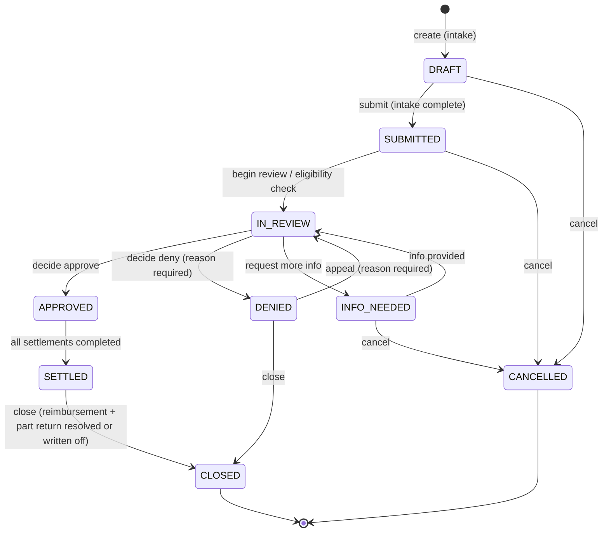

# PRD — `pos-warranty`: Warranty Claims Module

- **Status:** Approved for design; implementation not started
- **Resolves:** [#786](https://github.com/louisburroughs/durion-positivity-backend/issues/786) (Warranty / claim capability — no owning service exists), `pos-mcp-server/docs/BACKLOG.md` BL-1
- **Owner:** product / louisburroughs
- **Date:** 2026-07-15

## 1. Summary

A new deployed microservice, **`pos-warranty`** (package `com.positivity.warranty`, Eureka name
`WARRANTY`), owning the full warranty-claim domain: vendor warranty policies, claim intake and
adjudication, customer settlement, vendor reimbursement tracking, and defective-part return (RMA).

Warranty covers **all parts and services** — tires, parts, and dealer-performed labor — not just
tires. No other service owns any of this today: "warranty" exists only as free-text strings on
`pos-catalog` `ProductEntity.warranty` / `manufacturerWarranty`, inventory returns are
return-unused-parts-to-stock, and invoice refunds are payment-level. This module fills the gap
identified in #786.

### Scope decisions (confirmed 2026-07-15)

| Decision | Choice |
|---|---|
| Claim types | All four: manufacturer/vendor defect, dealer workmanship/labor, road-hazard programs, extended/3rd-party plans |
| Settlement paths | All four: replacement workorder, invoice credit, refund, computed prorated credit |
| Policy model | Structured terms; module auto-checks eligibility and **suggests** an outcome; a human always makes the final call |
| Reimbursement | Warranty owns the claim-side lifecycle and emits events for `pos-accounting`; no direct GL/AP writes |
| Part return to vendor (RMA) | In scope |
| Photo evidence | In scope (URL-reference pattern, matching `WorkorderPart.photoEvidenceUrl`) |

## 2. Goals and design principles

The overriding goal is to **simplify the process for the tire dealer and the customer**, while
following industry practice for independent tire dealers:

1. **One intake flow.** Counter staff pick the customer/vehicle, and the module finds the original
   sale by searching invoices and workorders — no hunting for paper receipts. Walk-in claims with
   no locatable sale are still supported (manual origin entry).
2. **Settle the customer first, chase the vendor after.** This is standard practice at good
   dealers: the customer is made whole at the counter (replacement, credit, or refund) the moment
   the dealer approves the claim. Vendor reimbursement is a back-office concern that runs
   asynchronously and never blocks the customer.
3. **Suggest, don't dictate.** The module computes eligibility and proration from structured
   policy terms and pre-fills the outcome; staff confirm or override (with a reason). No brittle
   auto-adjudication, no math done by hand at the counter.
4. **Simple statuses for the counter, detail for the back office.** The claim itself has a small,
   customer-explainable state machine. Reimbursement and part-return each have their own child
   lifecycle so the main claim status never becomes a 15-state monster.
5. **Full audit trail.** Every status change, decision, override, and computed proration input is
   recorded — vendor charge-backs and audits are a fact of life in warranty programs.

### Non-goals (v1)

- Direct EDI/portal integration with manufacturer claim systems (claims are submitted manually;
  the module records the vendor's claim reference number).
- Customer self-service portal.
- Automated GL posting (accounting consumes events; warranty writes nothing to `pos-accounting`).
- National-account / fleet billing programs.
- Warranty *sales* (selling road-hazard or extended plans happens on the order/invoice as a normal
  line item; this module records the resulting coverage as a `WarrantyRegistration`).

## 3. Domain model

Own schema (`warranty`), UUID v7 primary keys, no cross-service foreign keys — other services are
referenced by UUID plus denormalized snapshots captured at claim time (prices, VIN, odometer,
descriptions), so a claim remains self-explanatory even if upstream data changes.

```
WarrantyProvider 1──* WarrantyPolicy 1──* WarrantyRegistration
                                   │
WarrantyClaim *──1 WarrantyPolicy (optional)
WarrantyClaim 1──* WarrantyClaimLine
WarrantyClaim 1──* ClaimSettlement
WarrantyClaim 1──* VendorReimbursement
WarrantyClaimLine 1──0..1 PartReturn
WarrantyClaim 1──* ClaimStatusHistory / ClaimNote
```

### 3.1 `WarrantyProvider` — who pays

| Field | Notes |
|---|---|
| `id`, `name`, `status` | |
| `providerType` | `MANUFACTURER`, `DISTRIBUTOR_PROGRAM`, `THIRD_PARTY_ADMIN`, `DEALER` (self — used for workmanship and dealer-funded road hazard) |
| `apVendorId` | Optional UUID → `pos-accounting` `ap_vendor.vendorId`; lets accounting match incoming vendor credits to claims |
| `manufacturerId` | Optional UUID → `pos-catalog` `ProductEntity.manufacturerId`; lets policy lookup match by product manufacturer |
| `claimSubmissionMethod`, `portalUrl`, contact fields | Free-form operational info for the back office |

### 3.2 `WarrantyPolicy` — structured coverage terms

One row per distinct program (e.g. "Michelin passenger replacement — workmanship & materials",
"Store road hazard 3yr", "Dealer 12mo/12k labor warranty").

| Field | Notes |
|---|---|
| `providerId`, `name`, `coverageType` | `coverageType` = claim type: `MANUFACTURER_DEFECT`, `DEALER_WORKMANSHIP`, `ROAD_HAZARD`, `EXTENDED_PLAN` |
| `appliesTo` | Matching scope: explicit `productEntityId` list, catalog category, `manufacturerId`/brand, or `ALL`. Evaluated by the policy-lookup endpoint |
| `effectiveFrom` / `effectiveTo` | Policy must be in effect on the **original sale date** |
| `durationMonths` | Time limit from sale date (null = unlimited) |
| `mileageLimit` | Miles from sale odometer (null = n/a) |
| `treadPullPointThirtySeconds` | Tires: coverage ends at this remaining depth (industry default 2/32") |
| `laborCovered`, `laborHoursCap`, `laborRateCap` | Whether/how much install labor the provider reimburses |
| `prorationMethod` | `NONE` (free replacement), `TREAD_DEPTH`, `MILEAGE`, `TIME` |
| `requiresPartReturn` | Provider demands the defective part back (drives RMA) |
| `requiresPhotoEvidence` | Intake enforces at least one photo before submission |
| `transferable` | Coverage survives vehicle/owner change |
| `termsText`, `documentUrls` | Human-readable fine print + links to the provider's policy docs |

### 3.3 `WarrantyRegistration` — sold/instantiated coverage

For coverage that is **purchased or contract-bound** (road hazard add-ons, extended plans),
created when the sale happens (v1: manually or via a small API the order/invoice flow can call;
event-driven auto-creation is a follow-up). Manufacturer warranties are implicit and need no
registration.

Fields: `policyId`, `customerId`, `vehicleId`, `sourceInvoiceId`/`sourceInvoiceLineId`,
`contractNumber`, `purchaseDate`, `expiresAt`, `status` (`ACTIVE`, `EXPIRED`, `CANCELLED`,
`EXHAUSTED`).

### 3.4 `WarrantyClaim` — the aggregate root

| Group | Fields |
|---|---|
| Identity | `id` (UUIDv7), `claimCode` (business id, see §4), `claimType`, `status` (§5), `locationId` |
| Parties | `customerId`; `vehicleId` + snapshot `vin`, `odometerAtClaim`, `odometerUnit` (read from `pos-vehicle-inventory` at intake and frozen) |
| Origin | `originWorkorderId`, `originInvoiceId`, `originSaleDate` — nullable for walk-ins with no locatable sale (`originUnverified = true`) |
| Coverage | `providerId`, `policyId`, `registrationId` (all nullable until adjudication) |
| Failure | `failureDescription`, `failureDate`, `photoEvidenceUrls` (JSONB array of URL strings) |
| Adjudication | `eligibilityResult` (`ELIGIBLE` / `INELIGIBLE` / `INDETERMINATE`), `eligibilityReasons` (JSONB), `suggestedOutcome`, `decision`, `decisionReason`, `decidedBy`, `decidedAt`, `overrodeSuggestion` (bool) |
| Audit | `createdBy/At`, `updatedAt`, `@Version` |

### 3.5 `WarrantyClaimLine` — one per failed part or service

Uses the provenance pattern from `SalesOrderLine` (`sourceType` / `sourceId` / `sourceLineId`) to
point at the originating invoice or workorder line.

Fields: `sourceType` (`INVOICE_LINE`, `WORKORDER_PART`, `WORKORDER_SERVICE`, `MANUAL`),
`sourceId`, `sourceLineId`; `productEntityId`, `sku`, `description` (snapshot), `serialNumber`,
`dotNumber` (tires), `quantity`, `originalUnitPrice`; tire measurements `originalTreadDepth`,
`measuredTreadDepth` (in 32nds); `prorationPct` + `prorationInputs` (JSONB — every number that fed
the computation, for audit); `amountRequested`, `amountApproved`; `lineDisposition`.

### 3.6 `ClaimSettlement` — how the customer was made whole

A claim can have more than one (e.g. prorated credit **and** a replacement workorder).

| Field | Notes |
|---|---|
| `settlementType` | `REPLACEMENT_WORKORDER`, `INVOICE_CREDIT`, `REFUND`, `PRORATED_CREDIT`, `GOODWILL`, `NO_ACTION` |
| `replacementWorkorderId` | Link only — staff create the replacement workorder through the normal flow and attach it here; `pos-workorder` stays unaware of warranty (loose coupling) |
| `invoiceId`, `invoiceAdjustmentId` | Set when warranty calls `pos-invoice` to create an `InvoiceAdjustment` |
| `refundRecordId` | Set when warranty calls `pos-invoice` to initiate a refund (`RefundRecord`) |
| `coveredAmount`, `customerAmount` | Split between what coverage pays and what the customer still owes (proration remainder, new-tire upcharge, disposal fees) |
| `status` | `PENDING`, `COMPLETED`, `FAILED` |

### 3.7 `VendorReimbursement` — back-office money lifecycle

One per claim per provider (normally one). States: `NOT_SUBMITTED → SUBMITTED → APPROVED |
PARTIALLY_APPROVED | DENIED`, then `CREDIT_RECEIVED` or `WRITTEN_OFF`. Fields:
`amountRequested`, `amountApproved`, `vendorClaimReference` (the manufacturer's claim number),
`submittedAt/By`, `resolvedAt`, `creditReference`, `creditReceivedAt`, `notes`. `DEALER`-type
providers skip reimbursement entirely (`NOT_APPLICABLE`).

Every transition emits an outbox event (§9) that `pos-accounting` can consume to match expected
vendor credits against `ap_vendor` activity. Warranty never writes to accounting.

### 3.8 `PartReturn` — defective-part RMA

Created when the governing policy has `requiresPartReturn` or staff choose to return the part.

Fields: `claimLineId`, `rmaNumber` (vendor-issued), `disposition`
(`HOLD_FOR_INSPECTION`, `RETURN_TO_VENDOR`, `SCRAP_AUTHORIZED`, `CUSTOMER_RETAINED`), `status`
(`AWAITING_PART → ON_HOLD → SHIPPED → RECEIVED_BY_VENDOR | SCRAPPED | CLOSED`), `carrier`,
`trackingNumber`, `shippedAt`, `holdLocationNote`.

Emits `warranty.part-return.*` events so `pos-inventory` can (in a follow-up) place the defective
unit in a quarantine/hold location; v1 keeps the physical hold shelf a manual process with the
`PartReturn` record as the system of record.

### 3.9 `ClaimStatusHistory` / `ClaimNote`

Append-only status transitions (`fromStatus`, `toStatus`, `actor`, `reason`, timestamp) and
free-form staff notes.

## 4. Claim-code schema

`WC-{yyyy}-{seq}` — e.g. `WC-2026-000123`.

- `WC` fixed prefix, `yyyy` claim-creation year, `seq` zero-padded 6-digit sequence that resets
  yearly (Postgres sequence per year, allocated at claim creation).
- Human-readable and phone-friendly — this is what the customer writes down and what appears on
  paperwork submitted to vendors. UUIDv7 stays the primary key; `claimCode` is a unique business
  identifier and search key.
- Resolves the OPEN "Claim code" entry in `rag/glossary-identifiers.md`.

## 5. Claim state machine

Deliberately small — every state is explainable to a customer at the counter. Reimbursement (§3.7)
and part return (§3.8) run their own child lifecycles and do **not** appear here.



Rules:

- `APPROVED` requires a decision actor and, if it contradicts the computed suggestion, an override
  reason (`overrodeSuggestion = true`).
- `SETTLED` means the **customer** is done. Open reimbursements or part returns keep the claim out
  of `CLOSED` but never out of `SETTLED` — settle-customer-first, enforced by the state machine.
- `CLOSED` requires every `VendorReimbursement` in a terminal state (`CREDIT_RECEIVED`,
  `WRITTEN_OFF`, `NOT_APPLICABLE`, `DENIED`) and every `PartReturn` terminal.
- Transitions are validated server-side; illegal transitions return the standard `ApiError`
  envelope with `nextAction` listing the legal moves.

## 6. Eligibility suggestion and proration

`EligibilityService.evaluate(claim)` runs on demand (and automatically at submit):

1. Find candidate policies via `appliesTo` matching (product → brand/manufacturer → category →
   ALL, most specific wins) where the policy was in effect on `originSaleDate`.
2. Check each structured term against claim facts, producing a per-term pass/fail list
   (`eligibilityReasons`): within `durationMonths` of sale? odometer delta ≤ `mileageLimit`?
   `measuredTreadDepth` > `treadPullPointThirtySeconds`? active registration for
   registration-bound coverage? origin verified?
3. Output `ELIGIBLE` / `INELIGIBLE` / `INDETERMINATE` (missing facts, e.g. no tread reading yet)
   plus a `suggestedOutcome` with computed amounts.

**Proration** (per claim line, method from policy):

| Method | Credit fraction |
|---|---|
| `NONE` | 100% (free replacement) |
| `TREAD_DEPTH` | `(measuredDepth − pullPoint) / (originalDepth − pullPoint)` — the tire-industry standard: remaining usable tread over original usable tread |
| `MILEAGE` | `(mileageLimit − milesDriven) / mileageLimit` |
| `TIME` | `(durationMonths − monthsElapsed) / durationMonths` |

Credit = fraction × `originalUnitPrice` × quantity, clamped to [0, original price]. All inputs are
frozen into `prorationInputs` on the line. Staff can override the computed amount; the override
and reason are audited.

## 7. Primary user flow (counter)

1. **Start claim** — pick customer + vehicle (typeahead against `pos-customer` /
   `pos-vehicle-inventory`; VIN + current odometer pulled and snapshotted).
2. **Find the sale** — module queries invoices/workorders for that customer/vehicle filtered by
   SKU/product (`candidate-lines`, §8); clerk picks the line(s) being claimed. Walk-in fallback:
   manual entry, claim flagged `originUnverified`.
3. **Describe failure** — description, failure date, photos (URLs), tread depths for tires.
4. **Submit** — eligibility runs, suggestion appears (eligible/not, per-term reasons, computed
   proration, suggested settlement).
5. **Decide** — authorized staff approve/deny (override allowed with reason).
6. **Settle** — clerk executes the chosen settlement(s): warranty creates the invoice
   adjustment/refund via `pos-invoice`, or the clerk links the replacement workorder. Customer
   leaves whole. Claim → `SETTLED`.
7. **Back office** — reimbursement submitted to vendor (reference recorded), defective part put on
   the hold shelf / shipped per RMA. When both resolve, claim → `CLOSED`.

## 8. API surface (v1)

Gateway: `X-API-Version: 1`, external path `/warranty/...` → `lb://WARRANTY /v1/warranty/...`.
Thin controllers, `@PreAuthorize` per endpoint, `@EmitEvent` on all state-changing endpoints.

| Endpoint | Purpose | Permission |
|---|---|---|
| `GET/POST/PUT /v1/warranty/providers` (+`/{id}`) | Provider CRUD | `warranty:provider:view` / `warranty:provider:manage` |
| `GET/POST/PUT /v1/warranty/policies` (+`/{id}`) | Policy CRUD | `warranty:policy:view` / `warranty:policy:manage` |
| `GET /v1/warranty/policies/applicable?productEntityId=&manufacturerId=&saleDate=&coverageType=` | Policies that would cover a product | `warranty:policy:view` |
| `GET/POST/PUT /v1/warranty/registrations` (+ lookup by customer/vehicle) | Sold-coverage records | `warranty:registration:view` / `warranty:registration:manage` |
| `POST /v1/warranty/claims` | Create draft claim | `warranty:claim:create` |
| `GET /v1/warranty/claims/{id}`, `GET /v1/warranty/claims?customerId=&vehicleId=&status=&claimCode=&locationId=` | Read/search | `warranty:claim:view` |
| `GET /v1/warranty/claims/candidate-lines?customerId=&vehicleId=&sku=&productEntityId=` | Cross-service search of invoices + workorders for origin-line matching | `warranty:claim:view` |
| `PUT /v1/warranty/claims/{id}` , line add/remove, photo add/remove | Edit while `DRAFT`/`INFO_NEEDED` | `warranty:claim:create` |
| `POST /v1/warranty/claims/{id}/submit` | Intake complete; runs eligibility | `warranty:claim:submit` |
| `POST /v1/warranty/claims/{id}/eligibility` | (Re)compute suggestion on demand | `warranty:claim:view` |
| `POST /v1/warranty/claims/{id}/decision` | Approve/deny/request-info (+ override reason) | `warranty:claim:decide` |
| `POST /v1/warranty/claims/{id}/settlements` | Execute a settlement (calls `pos-invoice` where applicable) | `warranty:claim:settle` |
| `POST /v1/warranty/claims/{id}/cancel` / `/close` | Terminal moves | `warranty:claim:cancel` / `warranty:claim:close` |
| `POST /v1/warranty/claims/{id}/notes` | Staff notes | `warranty:claim:create` |
| `POST /v1/warranty/claims/{id}/reimbursement/submit`, `PUT .../reimbursement` | Record vendor submission / status updates | `warranty:reimbursement:manage` |
| `GET /v1/warranty/reimbursements?status=&providerId=` | Back-office worklist (open credits) | `warranty:reimbursement:view` |
| `POST /v1/warranty/claims/{id}/part-returns`, `PUT /v1/warranty/part-returns/{id}` | RMA lifecycle | `warranty:part-return:manage` |
| `GET /v1/warranty/part-returns?status=` | Hold-shelf / shipping worklist | `warranty:part-return:view` |

Errors use the standard `ApiError` envelope (`docs/ERROR_ENVELOPE.md`); state-machine violations
populate `nextAction`.

## 9. Permissions, events, and integration contracts

### 9.1 `permissions.yaml` (registered at startup via `PermissionRegistrationSupport`, mirroring `pos-documents`)

```yaml
permissions:
  - name: warranty:provider:view
  - name: warranty:provider:manage
  - name: warranty:policy:view
  - name: warranty:policy:manage
  - name: warranty:registration:view
  - name: warranty:registration:manage
  - name: warranty:claim:view
  - name: warranty:claim:create
  - name: warranty:claim:submit
  - name: warranty:claim:decide
  - name: warranty:claim:settle
  - name: warranty:claim:cancel
  - name: warranty:claim:close
  - name: warranty:reimbursement:view
  - name: warranty:reimbursement:manage
  - name: warranty:part-return:view
  - name: warranty:part-return:manage
```

Suggested role mapping: counter/service-advisor = `view/create/submit`; manager =
`decide/settle/cancel`; back office = `reimbursement:*`, `part-return:*`, `close`; admin =
`provider/policy/registration:manage`. Requires the usual perm-bits catalog sync in
`pos-api-gateway` `DownstreamPermissionCatalog`.

### 9.2 `@EmitEvent` ids (`WarrantyEventTypes` registry + `WarrantyEventTypeInitializer`)

Write preset: `WARRANTY_PROVIDER_CREATE/UPDATE`, `WARRANTY_POLICY_CREATE/UPDATE`,
`WARRANTY_REGISTRATION_CREATE/UPDATE`, `WARRANTY_CLAIM_CREATE`, `WARRANTY_CLAIM_UPDATE`,
`WARRANTY_CLAIM_SUBMIT`, `WARRANTY_CLAIM_DECIDE`, `WARRANTY_CLAIM_SETTLE`,
`WARRANTY_CLAIM_CANCEL`, `WARRANTY_CLAIM_CLOSE`, `WARRANTY_REIMBURSEMENT_SUBMIT`,
`WARRANTY_REIMBURSEMENT_UPDATE`, `WARRANTY_PART_RETURN_CREATE`, `WARRANTY_PART_RETURN_UPDATE`.
Search preset: `WARRANTY_CLAIM_SEARCH`, `WARRANTY_CANDIDATE_LINE_SEARCH`.

### 9.3 Outbox integration events (Kafka, standard `OutboxEvent` pattern as in `pos-invoice`/`pos-workorder`)

| Event | Consumer | Purpose |
|---|---|---|
| `warranty.claim.settled` | accounting, reporting | Customer made whole; carries settlement type + amounts |
| `warranty.reimbursement.submitted` | `pos-accounting` | Expected vendor credit (`apVendorId`, amount, `vendorClaimReference`) |
| `warranty.reimbursement.resolved` | `pos-accounting` | Approved/denied/credit-received — matching against vendor activity |
| `warranty.part-return.requested` / `.shipped` | `pos-inventory` (follow-up) | Defective-unit quarantine/hold |

### 9.4 Synchronous calls (all `@LoadBalanced RestClient`, `internal/client/`)

| Callee | When | Contract |
|---|---|---|
| `pos-vehicle-inventory` | Intake | Read `vehicle_records` (VIN, odometer) → snapshot onto claim |
| `pos-invoice` | Origin matching; settlement | Search invoices/lines by customer/vehicle/SKU; create `InvoiceAdjustment`; initiate refund (`RefundRecord`). Needs small additive endpoints on `pos-invoice` (line search by party+SKU; adjustment/refund creation with an external-reference field) — tracked as implementation sub-tasks |
| `pos-workorder` | Origin matching | Search workorder parts/service lines by customer/vehicle/SKU |
| `pos-catalog` | Intake, policy `appliesTo` | Product/manufacturer lookup; original tread depth where cataloged |
| `pos-customer` | Intake | Customer typeahead/validation |

`pos-workorder` is never written to: replacement workorders are created through the normal flow
and linked from the claim (`replacementWorkorderId`), keeping the dependency one-directional.

## 10. Module scaffolding (repo conventions — all mandatory)

- Standard layout under `com.positivity.warranty`: `PosWarrantyApplication` at root, public
  `service/` + `service/model/`, everything else under `internal/` (controller, service,
  repository, entity, dto, config, enums, client, event, exception). Per-module
  `ArchitectureTest.java`; run `pos-archunit` `ArchitectureTests` after scaffolding.
- `server.port: 0`, Eureka registration, profiles `dev`/`docker`/`alpha`/`prod`; add to
  `docker-compose.yml` and gateway route (`/warranty/**` → `lb://WARRANTY`).
- Flyway `V1__baseline_warranty_schema.sql`; UUID v7 PKs (`@UUIDv7Id`), auditing
  (`@CreatedDate`/`@LastModifiedDate`), `@Version` on aggregates.
- `@NonNull` (jspecify) on service/DAO params; `@NotNull` (jakarta) on request bodies only.
- Depends on `pos-events` (`@EmitEvent`), `pos-shared-dtos` (`ApiError`), `pos-security-common`.
- Outbox tables (`outbox_event`, `processed_event`) per the `pos-invoice` pattern.
- Money as `BigDecimal(19,4)`; tread depth stored as integer 32nds of an inch.

## 11. Rollout checklist (from #786 "when picked up")

1. ✅ This spec: owning service (`pos-warranty`), claim-code schema (§4), claim state machine
   (§5), reimbursement workflow (§3.7).
2. ☐ `permissions.yaml` (§9.1) + gateway perm-bits catalog sync.
3. ☐ Update RAG docs and remove OPEN notes:
   `pos-mcp-server/src/main/resources/rag/glossary-identifiers.md` (Claim code → `WC-yyyy-nnnnnn`)
   and `pos-mcp-server/src/main/resources/rag/cross-domain-playbooks.md` (warranty/claim playbook
   → flows in §7/§9); mark `pos-mcp-server/docs/BACKLOG.md` BL-1 resolved.
4. ☐ Scaffold module, entities + Flyway baseline, state machine + eligibility service, claim
   APIs, settlements (invoice integration), reimbursement + part-return APIs, events/outbox.

## 12. Open questions / defaulted decisions (flagged, not blocking)

| Topic | Default taken | Revisit when |
|---|---|---|
| Tax on credits/refunds | Delegated to `pos-invoice`/`pos-tax` at settlement time (adjustment carries pre-tax amount) | Invoice integration is built |
| Appeals | Modeled as `DENIED → IN_REVIEW` with mandatory reason; no separate appeal entity | If vendors require formal appeal tracking |
| Goodwill outside policy | Allowed: claim with no policy, `settlementType = GOODWILL`, always a human decision, dealer-funded | If goodwill needs its own budget/approval chain |
| Auto-creating `WarrantyRegistration` when road-hazard/extended plans are sold | Manual/API in v1; order/invoice event consumption later | After v1 ships |
| Photo storage | URL strings (existing `photoEvidenceUrl` pattern); no upload service exists in the platform | If/when a managed attachment service lands |
| Multi-location claim visibility | Claims carry `locationId`; visibility rules deferred to standard RBAC | If per-location scoping is needed |
