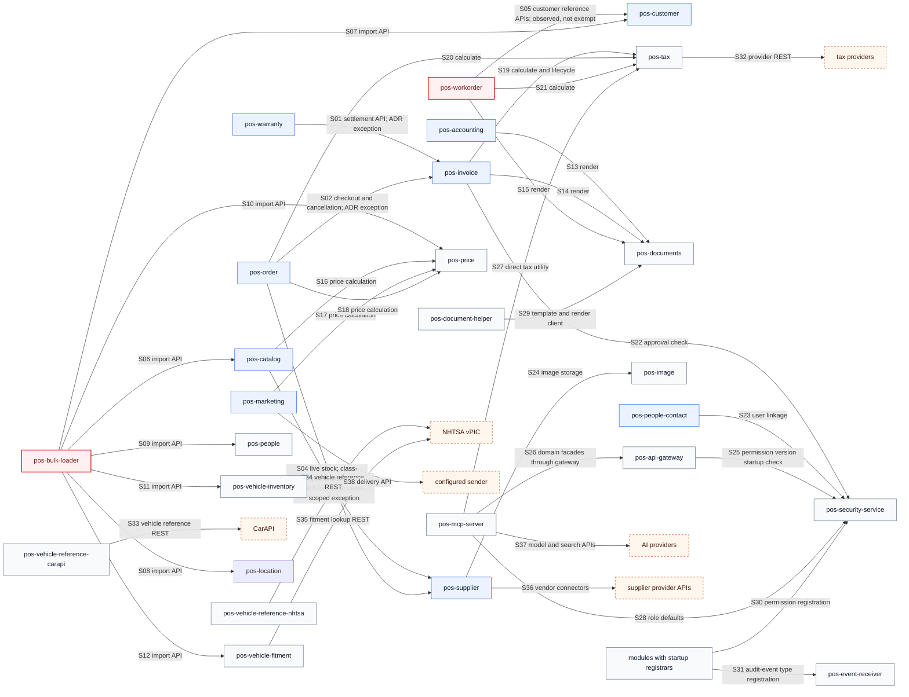
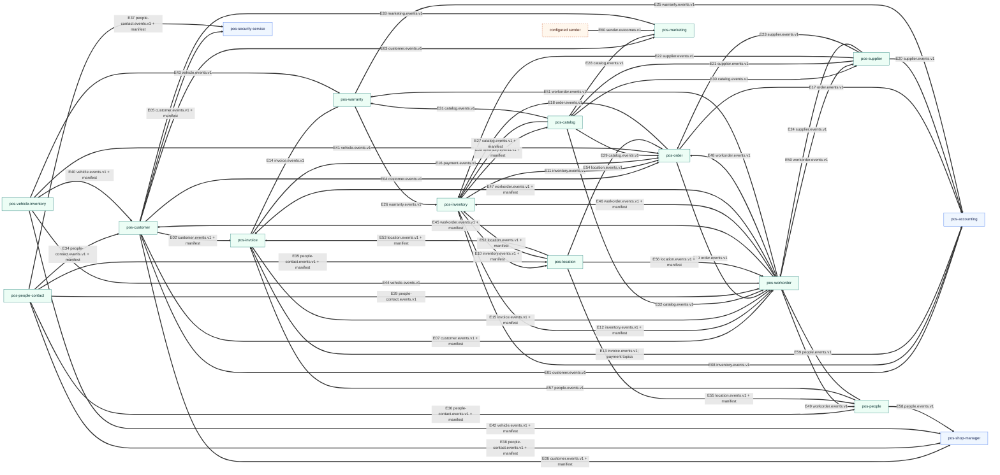
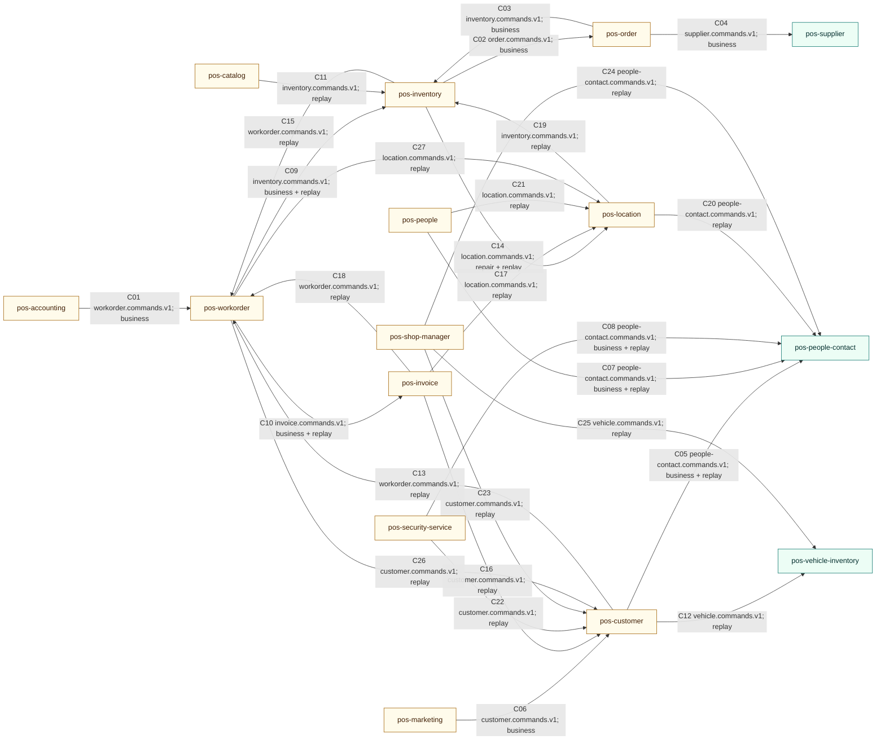

# Backend Domain Interaction Diagrams

> **Current version:** Source evidence captured 2026-08-27. This document
> supersedes the [2026-07-16 model](domain-interaction-diagrams-2026-07-16.md).

This document models communication implemented in the backend repository. It is
an observed topology, not a target architecture. ADR-0044 explains which
cross-domain transports are permitted; source and runtime configuration prove
which edges exist.

## Scope and Evidence

- Reactor membership comes from the root [`pom.xml`](../pom.xml).
- Synchronous targets come from production `RestClient` configuration and
  service-ID or base-URL properties.
- Kafka edges require an executable producer or topic owner and an executable
  `@KafkaListener` consumer. Manifest topics are included with their fact edge.
- ADR-0044 exception scope comes from
  [`DomainWallsTest`](../pos-archunit/src/test/java/com/positivity/archunit/DomainWallsTest.java).
- `@EmitEvent` registration with `pos-event-receiver` is audit/control-plane
  traffic, not domain data transport.
- Planned, target-state, test-only, comment-only, and shared-library dependency
  edges are excluded.

An absent edge means this scan found no qualifying implementation evidence; it
does not prove that communication is architecturally impossible.

## Legend

- Solid red arrow: synchronous HTTP.
- Solid gray arrow: startup registration or gateway/client context.
- Thick teal arrow: Kafka fact or reconciliation-manifest flow.
- Solid gold arrow: Kafka command flow.
- `events + manifest`: the consumer listens to both the fact topic and the
  owner's reconciliation manifest.
- Red domain nodes or edge notes identify observed synchronous domain calls that
  are not in the current ADR-0044 exception maps.

## Diagram 1: Synchronous Communication

### Synchronous Edge Catalog

| ID  | Origin                             | Target                 | Purpose                                             | Evidence                                                                                                                                                                                                                                                                                                    |
| --- | ---------------------------------- | ---------------------- | --------------------------------------------------- | ----------------------------------------------------------------------------------------------------------------------------------------------------------------------------------------------------------------------------------------------------------------------------------------------------------- |
| S01 | pos-warranty                       | pos-invoice            | Settlement writes and authoritative reconciliation  | [client](../pos-warranty/src/main/java/com/positivity/warranty/internal/client/InvoiceClientImpl.java), [exception](../pos-archunit/src/test/java/com/positivity/archunit/DomainWallsTest.java)                                                                                                             |
| S02 | pos-order                          | pos-invoice            | Checkout invoice creation and cancellation reversal | [client](../pos-order/src/main/java/com/positivity/order/internal/client/RestInvoicingPortAdapter.java), [configuration](../pos-order/src/main/java/com/positivity/order/internal/config/InvoiceClientConfig.java), [exception](../pos-archunit/src/test/java/com/positivity/archunit/DomainWallsTest.java) |
| S03 | pos-catalog                        | pos-supplier           | Live supplier stock                                 | [client](../pos-catalog/src/main/java/com/positivity/catalog/internal/client/SupplierStockClientImpl.java), [class-scoped exception](../pos-archunit/src/test/java/com/positivity/archunit/DomainWallsTest.java)                                                                                            |
| S04 | pos-order                          | pos-supplier           | Procurement-time live supplier stock                | [client](../pos-order/src/main/java/com/positivity/order/internal/client/SupplierStockClientImpl.java), [class-scoped exception](../pos-archunit/src/test/java/com/positivity/archunit/DomainWallsTest.java)                                                                                                |
| S05 | pos-workorder                      | pos-customer           | Customer and vehicle reference lookups              | [customer reference](../pos-workorder/src/main/java/com/positivity/workorder/internal/service/CustomerReferenceService.java), [vehicle reference](../pos-workorder/src/main/java/com/positivity/workorder/internal/service/VehicleReferenceService.java)                                                    |
| S06 | pos-bulk-loader                    | pos-catalog            | Catalog bulk import                                 | [batch clients](../pos-bulk-loader/src/main/java/com/positivity/bulkloader/internal/config/BatchConfiguration.java)                                                                                                                                                                                         |
| S07 | pos-bulk-loader                    | pos-customer           | Customer bulk import                                | [batch clients](../pos-bulk-loader/src/main/java/com/positivity/bulkloader/internal/config/BatchConfiguration.java)                                                                                                                                                                                         |
| S08 | pos-bulk-loader                    | pos-location           | Location bulk import                                | [batch clients](../pos-bulk-loader/src/main/java/com/positivity/bulkloader/internal/config/BatchConfiguration.java)                                                                                                                                                                                         |
| S09 | pos-bulk-loader                    | pos-people             | People bulk import                                  | [batch clients](../pos-bulk-loader/src/main/java/com/positivity/bulkloader/internal/config/BatchConfiguration.java)                                                                                                                                                                                         |
| S10 | pos-bulk-loader                    | pos-price              | Price bulk import                                   | [batch clients](../pos-bulk-loader/src/main/java/com/positivity/bulkloader/internal/config/BatchConfiguration.java)                                                                                                                                                                                         |
| S11 | pos-bulk-loader                    | pos-vehicle-inventory  | Vehicle bulk import                                 | [batch clients](../pos-bulk-loader/src/main/java/com/positivity/bulkloader/internal/config/BatchConfiguration.java)                                                                                                                                                                                         |
| S12 | pos-bulk-loader                    | pos-vehicle-fitment    | Fitment bulk import                                 | [batch clients](../pos-bulk-loader/src/main/java/com/positivity/bulkloader/internal/config/BatchConfiguration.java)                                                                                                                                                                                         |
| S13 | pos-accounting                     | pos-documents          | Report rendering                                    | [client](../pos-accounting/src/main/java/com/positivity/accounting/internal/client/DocumentRenderClient.java)                                                                                                                                                                                               |
| S14 | pos-invoice                        | pos-documents          | Invoice rendering                                   | [client](../pos-invoice/src/main/java/com/positivity/invoice/internal/client/DocumentRenderClient.java)                                                                                                                                                                                                     |
| S15 | pos-workorder                      | pos-documents          | Workorder rendering                                 | [configuration](../pos-workorder/src/main/java/com/positivity/workorder/internal/config/DocumentClientConfig.java), [client](../pos-workorder/src/main/java/com/positivity/workorder/internal/client/DocumentClient.java)                                                                                   |
| S16 | pos-catalog                        | pos-price              | Price calculation                                   | [client](../pos-catalog/src/main/java/com/positivity/catalog/internal/client/PricingClientImpl.java)                                                                                                                                                                                                        |
| S17 | pos-marketing                      | pos-price              | Campaign price lookup                               | [client](../pos-marketing/src/main/java/com/positivity/marketing/internal/client/PriceClient.java)                                                                                                                                                                                                          |
| S18 | pos-order                          | pos-price              | Order price calculation                             | [configuration](../pos-order/src/main/java/com/positivity/order/internal/config/PriceClientConfig.java)                                                                                                                                                                                                     |
| S19 | pos-invoice                        | pos-tax                | Tax calculation and provider-document lifecycle     | [calculation](../pos-invoice/src/main/java/com/positivity/invoice/internal/client/TaxServiceClient.java), [lifecycle](../pos-invoice/src/main/java/com/positivity/invoice/internal/client/TaxLifecycleClient.java)                                                                                          |
| S20 | pos-order                          | pos-tax                | Order tax calculation                               | [configuration](../pos-order/src/main/java/com/positivity/order/internal/config/TaxClientConfig.java), [adapter](../pos-order/src/main/java/com/positivity/order/internal/client/RestTaxPortAdapter.java)                                                                                                   |
| S21 | pos-workorder                      | pos-tax                | Workorder tax calculation                           | [configuration](../pos-workorder/src/main/java/com/positivity/workorder/internal/config/TaxClientConfig.java), [client](../pos-workorder/src/main/java/com/positivity/workorder/internal/client/TaxClient.java)                                                                                             |
| S22 | pos-invoice                        | pos-security-service   | Manager approval validation                         | [client](../pos-invoice/src/main/java/com/positivity/invoice/internal/client/ManagerApprovalClient.java)                                                                                                                                                                                                    |
| S23 | pos-people-contact                 | pos-security-service   | User/person linkage support                         | [client](../pos-people-contact/src/main/java/com/positivity/peoplecontact/internal/client/SecurityServiceClient.java)                                                                                                                                                                                       |
| S24 | pos-supplier                       | pos-image              | Supplier image storage                              | [client](../pos-supplier/src/main/java/com/positivity/supplier/internal/client/ImageStoreClient.java)                                                                                                                                                                                                       |
| S25 | pos-api-gateway                    | pos-security-service   | Permission catalog version check                    | [startup check](../pos-api-gateway/src/main/java/com/positivity/gateway/config/PermissionVersionStartupCheck.java)                                                                                                                                                                                          |
| S26 | pos-mcp-server                     | pos-api-gateway        | Domain facade routing                               | [facade configuration](../pos-mcp-server/src/main/resources/application.yml)                                                                                                                                                                                                                                |
| S27 | pos-mcp-server                     | pos-tax                | Direct internal tax utility                         | [tax facade](../pos-mcp-server/src/main/java/com/positivity/mcp/internal/orchestration/tools/TaxFacadeTool.java)                                                                                                                                                                                            |
| S28 | pos-mcp-server                     | pos-security-service   | Role default-permission lookup                      | [role client](../pos-mcp-server/src/main/java/com/positivity/mcp/internal/client/RoleDefaultPermissionsClient.java)                                                                                                                                                                                         |
| S29 | pos-document-helper                | pos-documents          | Shared template registration and render client      | [client](../pos-document-helper/src/main/java/com/positivity/documents/DocumentServiceClient.java)                                                                                                                                                                                                          |
| S30 | Modules with permission registrars | pos-security-service   | Best-effort startup permission registration         | [representative registrar](../pos-catalog/src/main/java/com/positivity/catalog/internal/config/PermissionRegistration.java), [R2 enforcement](../pos-archunit/src/test/java/com/positivity/archunit/DomainWallsTest.java)                                                                                   |
| S31 | Modules with event initializers    | pos-event-receiver     | Best-effort audit event-type registration           | [representative initializer](../pos-catalog/src/main/java/com/positivity/catalog/internal/config/EventTypeInitializer.java), [R2 enforcement](../pos-archunit/src/test/java/com/positivity/archunit/DomainWallsTest.java)                                                                                   |
| S32 | pos-tax                            | Tax providers          | Configured generic and AvaTax clients               | [configuration](../pos-tax/src/main/java/com/positivity/tax/internal/config/TaxConfiguration.java), [properties](../pos-tax/src/main/resources/application.yml)                                                                                                                                             |
| S33 | pos-vehicle-reference-carapi       | CarAPI                 | Vehicle reference lookup                            | [service](../pos-vehicle-reference-carapi/src/main/java/com/positivity/vehiclereferencecarapi/internal/service/VehicleReferenceService.java)                                                                                                                                                                |
| S34 | pos-vehicle-reference-nhtsa        | NHTSA vPIC             | Vehicle reference lookup                            | [configuration](../pos-vehicle-reference-nhtsa/src/main/java/com/positivity/nhtsa/internal/config/RestClientConfig.java)                                                                                                                                                                                    |
| S35 | pos-vehicle-fitment                | NHTSA vPIC             | Vehicle fitment lookup                              | [configuration](../pos-vehicle-fitment/src/main/java/com/positivity/vehiclefitment/internal/config/RestClientConfig.java)                                                                                                                                                                                   |
| S36 | pos-supplier                       | Supplier provider APIs | Configured vendor protocol clients                  | [HTTP client factory](../pos-supplier/src/main/java/com/positivity/supplier/internal/client/SupplierHttpClients.java), [base client](../pos-supplier/src/main/java/com/positivity/supplier/internal/client/SupplierBaseClient.java)                                                                         |
| S37 | pos-mcp-server                     | AI providers           | Exa search and configured model providers           | [Exa tool](../pos-mcp-server/src/main/java/com/positivity/mcp/internal/orchestration/tools/ExaWebSearchTool.java), [model configuration](../pos-mcp-server/src/main/resources/application.yml)                                                                                                              |
| S38 | pos-marketing                      | Configured sender      | Campaign delivery                                   | [client](../pos-marketing/src/main/java/com/positivity/marketing/internal/client/PlatformSenderClient.java)                                                                                                                                                                                                 |

S05 and S06-S12 are source-evidenced domain-to-domain calls not represented by
the current module-level or class-level exception maps in `DomainWallsTest`.
They are shown because this is a current implementation model, not a compliance
projection.

## Diagram 2: Domain Facts and Replicas

### Fact Producer Evidence

| Owner/topic                                  | Producer evidence                                                                                                                                                                                                                                                                                                                                                |
| -------------------------------------------- | ---------------------------------------------------------------------------------------------------------------------------------------------------------------------------------------------------------------------------------------------------------------------------------------------------------------------------------------------------------------- |
| catalog events and manifest                  | [fact publisher](../pos-catalog/src/main/java/com/positivity/catalog/internal/config/CatalogFactPublisher.java), [manifest publisher](../pos-catalog/src/main/java/com/positivity/catalog/internal/config/ManifestPublisher.java)                                                                                                                                |
| customer events and manifest                 | [fact publisher](../pos-customer/src/main/java/com/positivity/customer/internal/service/CustomerFactPublisher.java), [manifest publisher](../pos-customer/src/main/java/com/positivity/customer/internal/config/ManifestPublisher.java)                                                                                                                          |
| inventory events and manifest                | [fact publisher](../pos-inventory/src/main/java/com/positivity/inventory/internal/service/InventoryFactPublisher.java), [manifest publisher](../pos-inventory/src/main/java/com/positivity/inventory/internal/config/ManifestPublisher.java)                                                                                                                     |
| invoice and payment events; invoice manifest | [invoice publisher](../pos-invoice/src/main/java/com/positivity/invoice/internal/config/InvoiceEventPublisher.java), [settlement publisher](../pos-invoice/src/main/java/com/positivity/invoice/internal/config/SettlementEventPublisher.java), [manifest publisher](../pos-invoice/src/main/java/com/positivity/invoice/internal/config/ManifestPublisher.java) |
| location events and manifest                 | [fact publisher](../pos-location/src/main/java/com/positivity/location/internal/service/LocationFactPublisher.java), [manifest publisher](../pos-location/src/main/java/com/positivity/location/internal/config/ManifestPublisher.java)                                                                                                                          |
| marketing events                             | [fact publisher](../pos-marketing/src/main/java/com/positivity/marketing/internal/service/MarketingFactPublisher.java)                                                                                                                                                                                                                                           |
| order events                                 | [domain publisher](../pos-order/src/main/java/com/positivity/order/internal/config/OrderDomainEventPublisher.java), [purchase-order publisher](../pos-order/src/main/java/com/positivity/order/internal/service/PurchaseOrderFactPublisher.java)                                                                                                                 |
| people-contact events and manifest           | [event publisher](../pos-people-contact/src/main/java/com/positivity/peoplecontact/internal/service/PeopleContactEventPublisher.java), [manifest publisher](../pos-people-contact/src/main/java/com/positivity/peoplecontact/internal/config/ManifestPublisher.java)                                                                                             |
| people events and manifest                   | [event publisher](../pos-people/src/main/java/com/positivity/people/internal/config/PeopleEventPublisher.java), [manifest publisher](../pos-people/src/main/java/com/positivity/people/internal/config/ManifestPublisher.java)                                                                                                                                   |
| supplier events                              | [outbox publisher](../pos-supplier/src/main/java/com/positivity/supplier/internal/service/SupplierOutboxPublisher.java)                                                                                                                                                                                                                                          |
| vehicle events and manifest                  | [event publisher](../pos-vehicle-inventory/src/main/java/com/positivity/vehicle/internal/config/VehicleEventPublisher.java), [manifest publisher](../pos-vehicle-inventory/src/main/java/com/positivity/vehicle/internal/config/ManifestPublisher.java)                                                                                                          |
| warranty events                              | [outbox publisher](../pos-warranty/src/main/java/com/positivity/warranty/internal/config/OutboxPublisher.java)                                                                                                                                                                                                                                                   |
| workorder events and manifest                | [fact publisher](../pos-workorder/src/main/java/com/positivity/workorder/internal/service/WorkorderFactPublisher.java), [manifest publisher](../pos-workorder/src/main/java/com/positivity/workorder/internal/config/ManifestPublisher.java)                                                                                                                     |

### Fact Consumer Edge Catalog

Each row links the consumer. Producer ownership is established once in the table
above.

| ID  | Origin            | Target           | Transport/topic                                             | Consumer evidence                                                                                                                                                                                                                                                      |
| --- | ----------------- | ---------------- | ----------------------------------------------------------- | ---------------------------------------------------------------------------------------------------------------------------------------------------------------------------------------------------------------------------------------------------------------------- |
| E01 | customer          | accounting       | `customer.events.v1`                                        | [listener](../pos-accounting/src/main/java/com/positivity/accounting/internal/service/CustomerEventsListener.java)                                                                                                                                                     |
| E02 | customer          | invoice          | events + manifest                                           | [events](../pos-invoice/src/main/java/com/positivity/invoice/internal/service/CustomerEventsListener.java), [manifest](../pos-invoice/src/main/java/com/positivity/invoice/internal/service/CustomerManifestListener.java)                                             |
| E03 | customer          | marketing        | `customer.events.v1`                                        | [listener](../pos-marketing/src/main/java/com/positivity/marketing/internal/service/CustomerEventsListener.java)                                                                                                                                                       |
| E04 | customer          | order            | `customer.events.v1`                                        | [listener](../pos-order/src/main/java/com/positivity/order/internal/service/CustomerEventsListener.java)                                                                                                                                                               |
| E05 | customer          | security-service | events + manifest                                           | [events](../pos-security-service/src/main/java/com/positivity/securityservice/internal/service/CustomerEventsListener.java), [manifest](../pos-security-service/src/main/java/com/positivity/securityservice/internal/service/CustomerManifestListener.java)           |
| E06 | customer          | shop-manager     | events + manifest                                           | [events](../pos-shop-manager/src/main/java/com/positivity/shopmanager/internal/service/CustomerEventsListener.java), [manifest](../pos-shop-manager/src/main/java/com/positivity/shopmanager/internal/service/CustomerManifestListener.java)                           |
| E07 | customer          | workorder        | events + manifest                                           | [events](../pos-workorder/src/main/java/com/positivity/workorder/internal/service/CustomerEventsListener.java), [manifest](../pos-workorder/src/main/java/com/positivity/workorder/internal/service/CustomerManifestListener.java)                                     |
| E08 | inventory         | accounting       | `inventory.events.v1`                                       | [listener](../pos-accounting/src/main/java/com/positivity/accounting/internal/service/InventoryEventsListener.java)                                                                                                                                                    |
| E09 | inventory         | catalog          | events + manifest                                           | [events](../pos-catalog/src/main/java/com/positivity/catalog/internal/service/InventoryEventsListener.java), [manifest](../pos-catalog/src/main/java/com/positivity/catalog/internal/service/InventoryManifestListener.java)                                           |
| E10 | inventory         | location         | events + manifest                                           | [events](../pos-location/src/main/java/com/positivity/location/internal/service/InventoryEventsListener.java), [manifest](../pos-location/src/main/java/com/positivity/location/internal/service/InventoryManifestListener.java)                                       |
| E11 | inventory         | order            | `inventory.events.v1`                                       | [listener](../pos-order/src/main/java/com/positivity/order/internal/service/InventoryEventsListener.java)                                                                                                                                                              |
| E12 | inventory         | workorder        | events + manifest                                           | [events](../pos-workorder/src/main/java/com/positivity/workorder/internal/service/InventoryEventsListener.java), [manifest](../pos-workorder/src/main/java/com/positivity/workorder/internal/service/InventoryManifestListener.java)                                   |
| E13 | invoice           | accounting       | `invoice.events.v1`, `payment.events.v1`, settlement config | [invoice](../pos-accounting/src/main/java/com/positivity/accounting/internal/service/InvoiceEventsListener.java), [settlement](../pos-accounting/src/main/java/com/positivity/accounting/internal/service/SettlementEventsListener.java)                               |
| E14 | invoice           | warranty         | `invoice.events.v1`                                         | [listener](../pos-warranty/src/main/java/com/positivity/warranty/internal/service/InvoiceEventsListener.java)                                                                                                                                                          |
| E15 | invoice           | workorder        | events + manifest                                           | [events](../pos-workorder/src/main/java/com/positivity/workorder/internal/service/InvoiceEventsListener.java), [manifest](../pos-workorder/src/main/java/com/positivity/workorder/internal/service/InvoiceManifestListener.java)                                       |
| E16 | invoice           | order            | `payment.events.v1`                                         | [listener](../pos-order/src/main/java/com/positivity/order/internal/service/PaymentEventsListener.java)                                                                                                                                                                |
| E17 | order             | accounting       | `order.events.v1`                                           | [listener](../pos-accounting/src/main/java/com/positivity/accounting/internal/service/OrderEventsListener.java)                                                                                                                                                        |
| E18 | order             | inventory        | `order.events.v1`                                           | [listeners](../pos-inventory/src/main/java/com/positivity/inventory/internal/service/OrderEventsListener.java)                                                                                                                                                         |
| E19 | order             | workorder        | `order.events.v1`                                           | [listener](../pos-workorder/src/main/java/com/positivity/workorder/internal/service/OrderEventsListener.java)                                                                                                                                                          |
| E20 | supplier          | accounting       | `supplier.events.v1`                                        | [listener](../pos-accounting/src/main/java/com/positivity/accounting/internal/service/SupplierInvoiceEventsListener.java)                                                                                                                                              |
| E21 | supplier          | catalog          | `supplier.events.v1`                                        | [listener](../pos-catalog/src/main/java/com/positivity/catalog/internal/service/SupplierPriceCatalogEventsListener.java)                                                                                                                                               |
| E22 | supplier          | inventory        | `supplier.events.v1`                                        | [listener](../pos-inventory/src/main/java/com/positivity/inventory/internal/service/SupplierStockHintEventsListener.java)                                                                                                                                              |
| E23 | supplier          | order            | `supplier.events.v1`                                        | [listener](../pos-order/src/main/java/com/positivity/order/internal/service/SupplierOrderResultListener.java)                                                                                                                                                          |
| E24 | supplier          | workorder        | `supplier.events.v1`                                        | [listener](../pos-workorder/src/main/java/com/positivity/workorder/internal/service/SupplierFleetAuthEventsListener.java)                                                                                                                                              |
| E25 | warranty          | accounting       | `warranty.events.v1`                                        | [listener](../pos-accounting/src/main/java/com/positivity/accounting/internal/service/WarrantyEventsListener.java)                                                                                                                                                     |
| E26 | warranty          | inventory        | `warranty.events.v1`                                        | [listener](../pos-inventory/src/main/java/com/positivity/inventory/internal/service/WarrantyEventsListener.java)                                                                                                                                                       |
| E27 | catalog           | inventory        | events + manifest                                           | [events](../pos-inventory/src/main/java/com/positivity/inventory/internal/service/CatalogEventsListener.java), [manifest](../pos-inventory/src/main/java/com/positivity/inventory/internal/service/CatalogManifestListener.java)                                       |
| E28 | catalog           | marketing        | `catalog.events.v1`                                         | [listener](../pos-marketing/src/main/java/com/positivity/marketing/internal/service/CatalogEventsListener.java)                                                                                                                                                        |
| E29 | catalog           | order            | `catalog.events.v1`                                         | [listener](../pos-order/src/main/java/com/positivity/order/internal/service/ProductEventsListener.java)                                                                                                                                                                |
| E30 | catalog           | supplier         | `catalog.events.v1`                                         | [listener](../pos-supplier/src/main/java/com/positivity/supplier/internal/service/CatalogProductEventsListener.java)                                                                                                                                                   |
| E31 | catalog           | warranty         | `catalog.events.v1`                                         | [listener](../pos-warranty/src/main/java/com/positivity/warranty/internal/service/CatalogEventsListener.java)                                                                                                                                                          |
| E32 | catalog           | workorder        | `catalog.events.v1`                                         | [listener](../pos-workorder/src/main/java/com/positivity/workorder/internal/service/CatalogEventsListener.java)                                                                                                                                                        |
| E33 | marketing         | customer         | `marketing.events.v1`                                       | [listener](../pos-customer/src/main/java/com/positivity/customer/internal/service/MarketingEventsListener.java)                                                                                                                                                        |
| E34 | people-contact    | customer         | events + manifest                                           | [events](../pos-customer/src/main/java/com/positivity/customer/internal/service/PeopleContactEventsListener.java), [manifest](../pos-customer/src/main/java/com/positivity/customer/internal/service/PeopleContactManifestListener.java)                               |
| E35 | people-contact    | location         | events + manifest                                           | [events](../pos-location/src/main/java/com/positivity/location/internal/service/PeopleContactEventsListener.java), [manifest](../pos-location/src/main/java/com/positivity/location/internal/service/PeopleContactManifestListener.java)                               |
| E36 | people-contact    | people           | events + manifest                                           | [events](../pos-people/src/main/java/com/positivity/people/internal/service/PeopleContactEventsListener.java), [manifest](../pos-people/src/main/java/com/positivity/people/internal/service/PeopleContactManifestListener.java)                                       |
| E37 | people-contact    | security-service | events + manifest                                           | [events](../pos-security-service/src/main/java/com/positivity/securityservice/internal/service/PeopleContactEventsListener.java), [manifest](../pos-security-service/src/main/java/com/positivity/securityservice/internal/service/PeopleContactManifestListener.java) |
| E38 | people-contact    | shop-manager     | events + manifest                                           | [events](../pos-shop-manager/src/main/java/com/positivity/shopmanager/internal/service/PeopleContactEventsListener.java), [manifest](../pos-shop-manager/src/main/java/com/positivity/shopmanager/internal/service/PeopleContactManifestListener.java)                 |
| E39 | people-contact    | workorder        | `people-contact.events.v1`                                  | [listener](../pos-workorder/src/main/java/com/positivity/workorder/internal/service/PeopleReplicaEventsListener.java)                                                                                                                                                  |
| E40 | vehicle-inventory | customer         | events + manifest                                           | [events](../pos-customer/src/main/java/com/positivity/customer/internal/service/VehicleEventsListener.java), [manifest](../pos-customer/src/main/java/com/positivity/customer/internal/service/VehicleManifestListener.java)                                           |
| E41 | vehicle-inventory | order            | `vehicle.events.v1`                                         | [listener](../pos-order/src/main/java/com/positivity/order/internal/service/VehicleEventsListener.java)                                                                                                                                                                |
| E42 | vehicle-inventory | shop-manager     | events + manifest                                           | [events](../pos-shop-manager/src/main/java/com/positivity/shopmanager/internal/service/VehicleEventsListener.java), [manifest](../pos-shop-manager/src/main/java/com/positivity/shopmanager/internal/service/VehicleManifestListener.java)                             |
| E43 | vehicle-inventory | warranty         | `vehicle.events.v1`                                         | [listener](../pos-warranty/src/main/java/com/positivity/warranty/internal/service/VehicleEventsListener.java)                                                                                                                                                          |
| E44 | vehicle-inventory | workorder        | `vehicle.events.v1`                                         | [listener](../pos-workorder/src/main/java/com/positivity/workorder/internal/service/VehicleEventsListener.java)                                                                                                                                                        |
| E45 | workorder         | customer         | events + manifest                                           | [events](../pos-customer/src/main/java/com/positivity/customer/internal/service/WorkorderEventsListener.java), [manifest](../pos-customer/src/main/java/com/positivity/customer/internal/service/WorkorderManifestListener.java)                                       |
| E46 | workorder         | inventory        | events + manifest                                           | [events](../pos-inventory/src/main/java/com/positivity/inventory/internal/service/WorkorderEventsListener.java), [manifest](../pos-inventory/src/main/java/com/positivity/inventory/internal/service/WorkorderManifestListener.java)                                   |
| E47 | workorder         | invoice          | events + manifest                                           | [events](../pos-invoice/src/main/java/com/positivity/invoice/internal/service/WorkorderEventsListener.java), [manifest](../pos-invoice/src/main/java/com/positivity/invoice/internal/service/WorkorderManifestListener.java)                                           |
| E48 | workorder         | order            | `workorder.events.v1`                                       | [listener](../pos-order/src/main/java/com/positivity/order/internal/service/WorkorderEventsListener.java)                                                                                                                                                              |
| E49 | workorder         | people           | `workorder.events.v1`                                       | [listener](../pos-people/src/main/java/com/positivity/people/internal/service/WorkorderEventsListener.java)                                                                                                                                                            |
| E50 | workorder         | supplier         | `workorder.events.v1`                                       | [listener](../pos-supplier/src/main/java/com/positivity/supplier/internal/workorderauth/service/WorkorderCompletionEventsListener.java)                                                                                                                                |
| E51 | workorder         | warranty         | `workorder.events.v1`                                       | [listener](../pos-warranty/src/main/java/com/positivity/warranty/internal/service/WorkorderEventsListener.java)                                                                                                                                                        |
| E52 | location          | inventory        | events + manifest                                           | [events](../pos-inventory/src/main/java/com/positivity/inventory/internal/service/LocationEventsListener.java), [manifest](../pos-inventory/src/main/java/com/positivity/inventory/internal/service/LocationManifestListener.java)                                     |
| E53 | location          | invoice          | events + manifest                                           | [events](../pos-invoice/src/main/java/com/positivity/invoice/internal/service/LocationEventsListener.java), [manifest](../pos-invoice/src/main/java/com/positivity/invoice/internal/service/LocationManifestListener.java)                                             |
| E54 | location          | order            | `location.events.v1`                                        | [listener](../pos-order/src/main/java/com/positivity/order/internal/service/LocationEventsListener.java)                                                                                                                                                               |
| E55 | location          | people           | events + manifest                                           | [events](../pos-people/src/main/java/com/positivity/people/internal/service/LocationEventsListener.java), [manifest](../pos-people/src/main/java/com/positivity/people/internal/service/LocationManifestListener.java)                                                 |
| E56 | location          | workorder        | events + manifest                                           | [events](../pos-workorder/src/main/java/com/positivity/workorder/internal/service/LocationEventsListener.java), [manifest](../pos-workorder/src/main/java/com/positivity/workorder/internal/service/LocationManifestListener.java)                                     |
| E57 | people            | invoice          | `people.events.v1`                                          | [listener](../pos-invoice/src/main/java/com/positivity/invoice/internal/service/PeopleEventsListener.java)                                                                                                                                                             |
| E58 | people            | shop-manager     | `people.events.v1`                                          | [listener](../pos-shop-manager/src/main/java/com/positivity/shopmanager/internal/service/PeopleEventsListener.java)                                                                                                                                                    |
| E59 | people            | workorder        | `people.events.v1`                                          | [listener](../pos-workorder/src/main/java/com/positivity/workorder/internal/service/PeopleReplicaEventsListener.java)                                                                                                                                                  |
| E60 | configured sender | marketing        | `sender.outcomes.v1`                                        | [listener](../pos-marketing/src/main/java/com/positivity/marketing/internal/service/DeliveryOutcomeListener.java)                                                                                                                                                      |

## Diagram 3: Commands and Results

Command handlers publish result facts through the target owner's event topic.
Those return paths appear in Diagram 2 and are not duplicated here.

### Command Edge Catalog

| ID  | Origin           | Target            | Topic                        | Purpose and producer evidence                                                                                                                                                                                                                                                                                 |
| --- | ---------------- | ----------------- | ---------------------------- | ------------------------------------------------------------------------------------------------------------------------------------------------------------------------------------------------------------------------------------------------------------------------------------------------------------- |
| C01 | accounting       | workorder         | `workorder.commands.v1`      | Invoice regeneration: [publisher](../pos-accounting/src/main/java/com/positivity/accounting/internal/config/WorkorderCommandPublisher.java)                                                                                                                                                                   |
| C02 | inventory        | order             | `order.commands.v1`          | Purchase order request: [publisher](../pos-inventory/src/main/java/com/positivity/inventory/internal/service/PurchaseOrderCommandPublisher.java)                                                                                                                                                              |
| C03 | order            | inventory         | `inventory.commands.v1`      | Reservation request: [publisher](../pos-order/src/main/java/com/positivity/order/internal/config/InventoryCommandPublisher.java)                                                                                                                                                                              |
| C04 | order            | supplier          | `supplier.commands.v1`       | Supplier order transmission: [service](../pos-order/src/main/java/com/positivity/order/internal/service/PurchaseOrderTransmissionService.java)                                                                                                                                                                |
| C05 | customer         | people-contact    | `people-contact.commands.v1` | Person upsert and replay: [emitter](../pos-customer/src/main/java/com/positivity/customer/internal/service/PeopleContactCommandEmitter.java), [manifest listener](../pos-customer/src/main/java/com/positivity/customer/internal/service/PeopleContactManifestListener.java)                                  |
| C06 | marketing        | customer          | `customer.commands.v1`       | Segment resolution and suppression: [segment requester](../pos-marketing/src/main/java/com/positivity/marketing/internal/service/SegmentResolveRequester.java), [delivery listener](../pos-marketing/src/main/java/com/positivity/marketing/internal/service/DeliveryOutcomeListener.java)                    |
| C07 | people           | people-contact    | `people-contact.commands.v1` | Person upsert and replay: [publisher](../pos-people/src/main/java/com/positivity/people/internal/config/PeopleEventPublisher.java), [manifest listener](../pos-people/src/main/java/com/positivity/people/internal/service/PeopleContactManifestListener.java)                                                |
| C08 | security-service | people-contact    | `people-contact.commands.v1` | User/person link and replay: [emitter](../pos-security-service/src/main/java/com/positivity/securityservice/internal/service/PeopleContactCommandEmitter.java), [manifest listener](../pos-security-service/src/main/java/com/positivity/securityservice/internal/service/PeopleContactManifestListener.java) |
| C09 | workorder        | inventory         | `inventory.commands.v1`      | Pick/reservation workflows and replay: [publisher](../pos-workorder/src/main/java/com/positivity/workorder/internal/config/InventoryCommandPublisher.java), [manifest listener](../pos-workorder/src/main/java/com/positivity/workorder/internal/service/InventoryManifestListener.java)                      |
| C10 | workorder        | invoice           | `invoice.commands.v1`        | Invoice generation and replay: [publisher](../pos-workorder/src/main/java/com/positivity/workorder/internal/config/InvoiceCommandPublisher.java), [manifest listener](../pos-workorder/src/main/java/com/positivity/workorder/internal/service/InvoiceManifestListener.java)                                  |
| C11 | catalog          | inventory         | `inventory.commands.v1`      | Reconciliation replay: [manifest listener](../pos-catalog/src/main/java/com/positivity/catalog/internal/service/InventoryManifestListener.java)                                                                                                                                                               |
| C12 | customer         | vehicle-inventory | `vehicle.commands.v1`        | Reconciliation replay: [manifest listener](../pos-customer/src/main/java/com/positivity/customer/internal/service/VehicleManifestListener.java)                                                                                                                                                               |
| C13 | customer         | workorder         | `workorder.commands.v1`      | Reconciliation replay: [manifest listener](../pos-customer/src/main/java/com/positivity/customer/internal/service/WorkorderManifestListener.java)                                                                                                                                                             |
| C14 | inventory        | location          | `location.commands.v1`       | Administrative repair and reconciliation: [sync service](../pos-inventory/src/main/java/com/positivity/inventory/internal/service/LocationSyncServiceImpl.java), [manifest listener](../pos-inventory/src/main/java/com/positivity/inventory/internal/service/LocationManifestListener.java)                  |
| C15 | inventory        | workorder         | `workorder.commands.v1`      | Reconciliation replay: [manifest listener](../pos-inventory/src/main/java/com/positivity/inventory/internal/service/WorkorderManifestListener.java)                                                                                                                                                           |
| C16 | invoice          | customer          | `customer.commands.v1`       | Reconciliation replay: [manifest listener](../pos-invoice/src/main/java/com/positivity/invoice/internal/service/CustomerManifestListener.java)                                                                                                                                                                |
| C17 | invoice          | location          | `location.commands.v1`       | Reconciliation replay: [manifest listener](../pos-invoice/src/main/java/com/positivity/invoice/internal/service/LocationManifestListener.java)                                                                                                                                                                |
| C18 | invoice          | workorder         | `workorder.commands.v1`      | Reconciliation replay: [manifest listener](../pos-invoice/src/main/java/com/positivity/invoice/internal/service/WorkorderManifestListener.java)                                                                                                                                                               |
| C19 | location         | inventory         | `inventory.commands.v1`      | Reconciliation replay: [manifest listener](../pos-location/src/main/java/com/positivity/location/internal/service/InventoryManifestListener.java)                                                                                                                                                             |
| C20 | location         | people-contact    | `people-contact.commands.v1` | Reconciliation replay: [manifest listener](../pos-location/src/main/java/com/positivity/location/internal/service/PeopleContactManifestListener.java)                                                                                                                                                         |
| C21 | people           | location          | `location.commands.v1`       | Reconciliation replay: [manifest listener](../pos-people/src/main/java/com/positivity/people/internal/service/LocationManifestListener.java)                                                                                                                                                                  |
| C22 | security-service | customer          | `customer.commands.v1`       | Reconciliation replay: [manifest listener](../pos-security-service/src/main/java/com/positivity/securityservice/internal/service/CustomerManifestListener.java)                                                                                                                                               |
| C23 | shop-manager     | customer          | `customer.commands.v1`       | Reconciliation replay: [manifest listener](../pos-shop-manager/src/main/java/com/positivity/shopmanager/internal/service/CustomerManifestListener.java)                                                                                                                                                       |
| C24 | shop-manager     | people-contact    | `people-contact.commands.v1` | Reconciliation replay: [manifest listener](../pos-shop-manager/src/main/java/com/positivity/shopmanager/internal/service/PeopleContactManifestListener.java)                                                                                                                                                  |
| C25 | shop-manager     | vehicle-inventory | `vehicle.commands.v1`        | Reconciliation replay: [manifest listener](../pos-shop-manager/src/main/java/com/positivity/shopmanager/internal/service/VehicleManifestListener.java)                                                                                                                                                        |
| C26 | workorder        | customer          | `customer.commands.v1`       | Reconciliation replay: [manifest listener](../pos-workorder/src/main/java/com/positivity/workorder/internal/service/CustomerManifestListener.java)                                                                                                                                                            |
| C27 | workorder        | location          | `location.commands.v1`       | Reconciliation replay: [manifest listener](../pos-workorder/src/main/java/com/positivity/workorder/internal/service/LocationManifestListener.java)                                                                                                                                                            |

The target command listeners are:

- [customer](../pos-customer/src/main/java/com/positivity/customer/internal/config/CustomerCommandListener.java)
- [inventory](../pos-inventory/src/main/java/com/positivity/inventory/internal/config/InventoryCommandListener.java)
- [invoice](../pos-invoice/src/main/java/com/positivity/invoice/internal/config/InvoiceCommandListener.java)
- [location](../pos-location/src/main/java/com/positivity/location/internal/config/LocationCommandListener.java)
- [order](../pos-order/src/main/java/com/positivity/order/internal/service/PurchaseOrderCommandListener.java)
- [people-contact](../pos-people-contact/src/main/java/com/positivity/peoplecontact/internal/config/PeopleContactCommandListener.java)
- [supplier](../pos-supplier/src/main/java/com/positivity/supplier/internal/command/service/SupplierCommandListener.java)
- [vehicle-inventory](../pos-vehicle-inventory/src/main/java/com/positivity/vehicle/internal/config/VehicleCommandListener.java)
- [workorder](../pos-workorder/src/main/java/com/positivity/workorder/internal/config/KafkaCommandListener.java)

## Caveats

- `payment.cleared.v1` has an accounting listener, but no qualifying producer
  was found in this repository. It is not drawn as a module-to-module edge.
- `sender.outcomes.v1` is drawn from an external sender because the consumer and
  configured sender client exist here, while the sender implementation does not.
- The customer module contains a second workorder listener whose topic is
  configured without a source-code default. E45 uses the explicit
  `workorder.events.v1` listener and does not draw a duplicate edge.
- Startup registration edges S30-S31 are grouped. The specific registrars are
  discoverable by `PermissionRegistration`, `PermissionInitializer`, and
  `EventTypeInitializer` class names across modules.
- Profile or environment overrides can change hosts and topic names. Labels show
  the production source defaults captured on the evidence date.
- DLQ routing is operational error handling attached to listeners. It is not a
  module ownership edge and is therefore not drawn.
