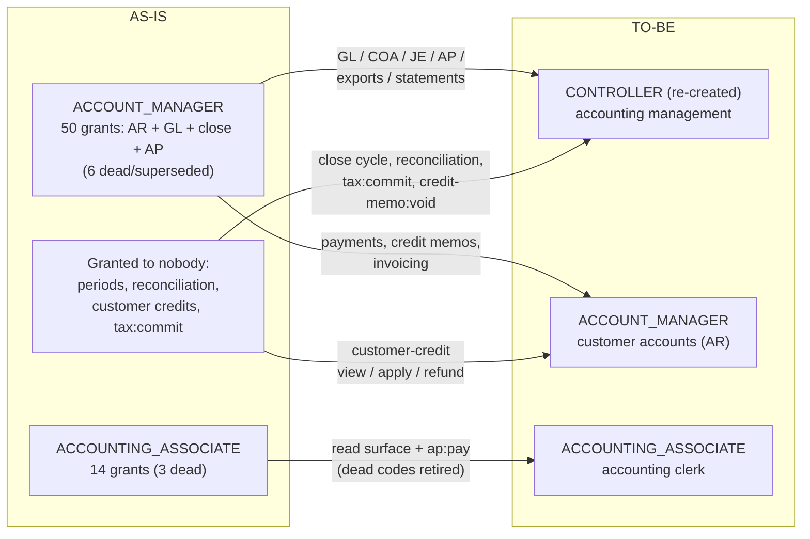

# RBAC Permission / Role Audit — August 2026

Status: **partially executed — tasks 1a, 2, 3, 9 and 10 are implemented on this branch**
(migrations V24–V27 plus code/seed changes; see the §7 status column). Headline drift
after execution: required-but-ungranted 112 → 2, granted-but-unenforced 77 → 64,
unreachable contract operations 229 → 0, roles 16 → 17 (CONTROLLER). Waves 2 and 3
(the §2 decisions and the accepted recommended-grants matrix) are seed-only — purely
additive, no revocation migration needed. The two remaining required-but-ungranted
entries are unwirable as-is: `workorder:financials:view` (no PermissionCode bit — needs
a catalog entry before any grant can reach a JWT) and `people:timeEntry:` (a parser
artifact of dynamic string construction, not a real code). The +14 in dead bits is
the retired codes keeping their permanent bit indexes, as designed. (The audit script
now excludes the `AUTHENTICATED` sentinel from its required-set computations — Copilot
review on PR #1515; the pre-execution counts in the tables below predate that and
include it as one entry in required-but-ungranted / unregistered / no-bit.)
One product decision was recorded and mapped in §6: **ACCOUNT_MANAGER becomes
a customer-accounts (AR-facing) role, and a re-created CONTROLLER role takes all
accounting management permissions**, including the loose (currently ungranted) ones.
Audited commit: `09d7eef` (main). Companion issues: #1499 (granted-but-unenforced sweep),
#1512 (required-but-ungranted sweep), with #1494 as the originating defect shape and
ADR-0057 / #1497 as prior art.

Reproduce with `python3 scripts/audit-rbac.py audit.json` from the repo root — no build,
no database, runs in seconds. The script cross-references five sources of truth:

| Source | Location | Distinct codes |
| --- | --- | ---: |
| A. Granted | `R__seed_role_permissions.sql` (role → permission rows) | 346 |
| B. Contract | `x-required-permissions` across all 26 `pos-*/openapi.yaml` | 346 |
| C. Code | `@PreAuthorize`/`@PostAuthorize` + non-annotation checks (`SecurityContextHelper.hasAuthority`, `authorities.contains(...)`, constants resolved) | 377 |
| D. Registry | per-module `src/main/resources/permissions.yaml` manifests (23 modules) | 436 |
| E. Bit catalog | `PermissionCode` enum (permanent JWT bit indexes) | 464 |

"Required" below means the union of B and C (381 codes). Headline disagreements:

| Finding | Count |
| --- | ---: |
| Required by an operation, granted to **no role** (#1512) | **112** |
| Contract operations reachable by **no seeded role** | **229 of 999** |
| Granted in the seed, required **nowhere** (#1499) | **77** (23 beyond ADMIN) |
| Registered in a manifest, required nowhere | 68 |
| Required but in no manifest (never registered) | 13 |
| Required but **no bit index** → physically unreachable | 6 |
| Bit assigned, neither granted nor required (dead bits) | 12 |
| Operations with no `x-required-permissions` at all | 149 of 999 |

These numbers differ slightly from the issues (#1499 said 88, #1512 said 94/72) because
(a) main has moved since both were filed, and (b) this audit also resolves constant
references in non-annotation checks, which removes several of #1499's predicted
false positives (`invoice:finalize:override`, `timekeeping:overlap_override`,
`inventory:adjustment:override`, `inventory:goods_receipt:override`,
`order:line:enter_manual_price`, `product:lifecycle:override_discontinued` are all
genuinely enforced — just not by `@PreAuthorize`).

---

## 1. Permissions required by endpoints but granted to no role (#1512)

112 permission codes are required by at least one operation and granted to **no role in
the seed — ADMIN included**. 229 contract operations have no granted alternate at all.

> **Discrepancy with #1512 worth confirming:** the issue says `SecurityBootstrap` grants
> SYSTEM_ADMINISTRATOR every registered permission at runtime on alpha. **No such class
> exists in this repository.** `RoleAuthorityServiceImpl` resolves authorities solely
> from `role_permissions`, and the seed explicitly makes SYSTEM_ADMINISTRATOR *not* a
> superuser (34 grants). If alpha behaves as described, that bootstrap lives outside
> this repo (ops tooling or environment SQL) and should be located and documented —
> otherwise these 229 operations are unreachable by *everyone*, admin included, on a
> fresh database.

### 1a. Whole feature areas with zero role wiring

Unreachable operations per module: customer 41, supplier 39, warranty 36, inventory 33,
accounting 24, order 23, marketing 18, tax 6, people-contact 3, workorder 3,
catalog/image/people 1 each.

| Domain | Codes | Contents |
| --- | ---: | --- |
| warranty | 17 | the entire module: providers, policies, registrations, claims (create/submit/decide/settle/cancel/close), part returns, reimbursements |
| crm (engagement side) | 16 | interactions, inquiries, follow-ups, consent, suppression, tags, segments — the whole `pos-customer` engagement surface (party/person/vehicle onboarding **is** wired) |
| inventory (operations side) | 15 | transfers (create/dispatch/receive/short_close/view), scrap (create/approve/view), valuation (view/adjust), replenishment, lot management, cycle-count tolerances, location sync, supplier stock hints |
| order (POS flow) | 11 | till sessions (open/close/view/cash_movement), checkout, quote, discount, void, returns (create/approve/view) |
| supplier | 12 | the entire module: profiles, price catalogs, transmissions, stock inquiry, work-order auth |
| accounting (close cycle) | 9 | periods (view/close/reopen/hard_lock), reconciliation (view/adjust), customer credits (view/apply/refund), credit-memo void, tax-snapshot freeze |
| marketing | 9 | the entire module: campaigns, templates, stats |
| tax | 3 | `tax:commit`, exemption certificates (view/manage) |
| workorder | 3 | fleet authorization (request/resolve), `workorder:labor:add_on_behalf` |
| people-contact | 2 | organization postal address (view/edit) |
| misc | 3 | `catalog:item_cost:update`, `image:image:store`, `people:compliance:view` |

The practical consequence is #1512's: no technician, advisor, manager, or even seeded
admin can open a till, create a warranty claim, raise a transfer, close a period, or
approve a return under their own login.

### 1b. Escape hatches enforced in service code, held by nobody

These are checked at runtime (not via `@PreAuthorize`, so contracts don't show them) and
granted to no role, so the guarded path is dead:

| Permission | Enforced at | Dead behavior |
| --- | --- | --- |
| `order:order:charge_on_account` | `SalesOrderServiceImpl.java:593` | ON_ACCOUNT tender is impossible for everyone |
| `order:session:approve_variance` | `RegisterSessionServiceImpl.java:190` | till close with over/short beyond the limit is impossible |
| `accounting:period:override` | `AccountingPeriodGate.java:192` | posting into a CLOSED period is impossible |
| `workorder:events:replay` | `OutboxAdminController.java:33` | outbox replay admin endpoint unreachable |

### 1c. Required codes that physically cannot work (no bit index)

`JwtServiceImpl` (line ~310) filters authorities through `PermissionCode.fromCode(...)`
before encoding `perm_bits` — **an authority with no catalog bit is silently dropped from
the JWT even if granted**. These required codes have no bit, so no grant could ever make
them work:

- `people:time:export:read` — dead *alternate*; its endpoints are reachable via
  `accounting:time:export` (`PeopleReportsController`), which has a bit but is itself
  granted to no role.
- `workorder:financials:view` — capability flag in `WorkorderDetailServiceImpl.java:124`;
  permanently false for everyone.
- `ACCOUNTING_ADMIN`, `AR_MANAGER` — **role names used as authorities** in
  `PaymentApplicationController.java:251` (`hasAnyAuthority(...)`). Neither role exists —
  no migration creates either name. Dead alternates —
  `accounting:payment:reverse` is the live path and ACCOUNT_MANAGER holds it.
- `AUTHENTICATED` — not a defect: the sentinel `RequiredPermissionsOpenApiAutoConfiguration`
  emits for isAuthenticated-only operations. (`scripts/audit-rbac.py` now excludes it
  from the required set entirely, so it no longer appears in these lists on re-runs.)
- `people:timeEntry:` — artifact of dynamic construction at `TimeEntryServiceImpl.java:74`
  (`"people:timeEntry:" + action`); the concrete codes exist and are granted. Note the
  same line also accepts a literal `"admin"` authority that nothing issues — dead code or
  a mistake, either way worth removing.

---

## 2. Roles missing permissions they need for their documented jobs

This is the role-centric view of §1, plus mismatches found between what a role holds and
what its workflows enforce. **Every row is a product decision** — the audit can say what
is unreachable, not who ought to reach it. Recommendations below are starting points
based on each role's documented job function in the seed header.

### Confirmed role-level defects (the #1494 shape — hold X, code enforces Y)

1. **TECHNICIAN / LOCATION_MANAGER — `workorder:start` split-brain.** The start endpoint
   (`OperationalContextController.java:108`) enforces `workorder:start` (bit 284), which
   they hold. But the detail-response capability flag
   (`WorkorderDetailServiceImpl.java:119`) checks `workorder:workorder:start` (bit 180),
   which only ADMIN holds. A technician can start a workorder while the UI is told they
   can't. One of the two codes must win (recommendation: `workorder:workorder:start`,
   matching the `domain:resource:action` convention; re-point the endpoint and grants,
   deprecate `workorder:start`).
2. **DISPATCHER / SERVICE_ADVISOR / SHOP_MANAGER / LOCATION_MANAGER — dead `shop:*`
   grants, missing `location:*` grants.** They hold `shop:location:view`, `shop:bay:view`
   (+ LOCATION_MANAGER: create/edit) — codes **no endpoint enforces**. The live families
   are `location:read`/`location:write`/`location:bay:manage`... (pos-location) — held
   **only by ADMIN**. Roles that plausibly need to read locations/bays (all four) cannot.
3. **ACCOUNT_MANAGER / ACCOUNTING_ASSOCIATE — dead `accounting:mapping:*` and
   `accounting:ap:approve/reject` grants.** They hold `accounting:mapping:view/create/
   edit/deactivate` but pos-accounting enforces `accounting:gl-mapping:*`,
   `accounting:mapping-key:*`, `accounting:default-mapping:*` (which ACCOUNT_MANAGER
   does hold). `accounting:ap:approve`/`reject` are enforced nowhere (`accounting:ap:pay`
   is the enforced code). Dead grants — misleading but not blocking.

### Recommended grants (decision needed on each block)

| Role | Missing (recommended additions) |
| --- | --- |
| SERVICE_ADVISOR | `order:session:open/close/view`, `order:session:cash_movement`, `order:order:checkout/quote/discount`, `order:return:create/view`; `warranty:claim:view/create/submit`, `warranty:registration:view`, `warranty:policy:view`, `warranty:provider:view`; `crm:interaction:view/manage`, `crm:followup:view/manage`, `crm:inquiry:view/manage`, `crm:consent:view`; `workorder:fleet_auth:request`; `tax:exemption:view`; `location:read` |
| TECHNICIAN | `workorder:workorder:start` (fix 1 above); possibly `image:image:store` if techs attach photos — verify the caller of pos-image |
| LOCATION_MANAGER / GENERAL_MANAGER / MANAGER | `order:order:void`, `order:return:approve`, `order:session:approve_variance`; `warranty:claim:decide/cancel/close`, `warranty:part-return:*`, `warranty:reimbursement:view`; `crm:tag:*`, `crm:suppression:view`, `crm:segment:view`; `workorder:fleet_auth:resolve`, `workorder:labor:add_on_behalf`; `location:read/write`, `location:bay:manage`; `inventory:scrap:approve` (or keep to inventory roles); `tax:exemption:manage` |
| INVENTORY_LEAD | `inventory:transfer:create/view/receive`, `inventory:scrap:create/view`, `inventory:supplier_stock_hint:view`, `supplier:stock:inquire`, `supplier:profile:read` |
| INVENTORY_MANAGER / INVENTORY_CONTROLLER | `inventory:transfer:dispatch/short_close`, `inventory:replenishment:manage`, `inventory:lot:manage`, `inventory:cycle_count_tolerance:manage`, `inventory:valuation:view` (+ `:adjust` for CONTROLLER only), `inventory:location:sync`, `catalog:item_cost:update` |
| ACCOUNT_MANAGER | **superseded by the §6 TO-BE model** — becomes the customer-accounts role: gains `accounting:customer-credit:view/apply/refund`; sheds GL/close-cycle authority to CONTROLLER |
| CONTROLLER (new — see §6) | all accounting management, including the loose codes: `accounting:period:*` (incl. `override`, `hard_lock`), `accounting:reconciliation:view/adjust`, `accounting:credit-memo:void`, `accounting:tax-snapshot:freeze`, `accounting:time:export`, `tax:commit` |
| ACCOUNTING_ASSOCIATE | `accounting:period:view`, `accounting:reconciliation:view`, `accounting:customer-credit:view` (clerk tier under CONTROLLER — §6) |
| ADMIN | all 112 §1 codes it lacks (ADMIN is documented as "the all-domain role" yet holds none of them) |
| SYSTEM_ADMINISTRATOR | `workorder:events:replay`, `people:compliance:view`, `supplier:audit:read`, `supplier:transmission:read/resolve` |
| *nobody obvious* | `order:order:charge_on_account`, `inventory:valuation:adjust`, `marketing:*`, `supplier:*` imports — see decisions below (`accounting:period:hard_lock`/`override` are now CONTROLLER's, per §6) |

### Decisions needed (decisions 1–5 recorded 2026-08-25; 1, 2, 3 and 5 implemented in the seed)

1. ~~**Marketing**~~ — **decided**: the marketing surface (all 9 codes: campaigns,
   templates, stats) belongs to **ACCOUNT_MANAGER**, consistent with its §6
   customer-accounts identity. No new MARKETING role. ADMIN gains the codes too
   (strict-superset rule).
2. ~~**Supplier imports**~~ — **decided**: the supplier module belongs to the
   **inventory-control roles — INVENTORY_MANAGER and INVENTORY_CONTROLLER** (which
   hold identical sets by design, #1373; scope differentiates them). All 12 supplier
   codes go to both, plus ADMIN. The once-open sub-question is resolved by the
   accepted §2 matrix: INVENTORY_LEAD also holds the read-only pair
   (`supplier:stock:inquire`, `supplier:profile:read`).
3. ~~**`image:image:store`**~~ — **decided**: image upload belongs to **both admin
   roles — ADMIN and SYSTEM_ADMINISTRATOR**.
4. ~~**Period close discipline**~~ — **decided**: a re-created CONTROLLER role owns the
   close cycle and all accounting management; ACCOUNT_MANAGER becomes the
   customer-accounts role. Full mapping in §6; its sub-decisions a–f are also
   resolved. Implemented in V24/V25 (PR #1515).
5. ~~**Money-movement tier**~~ — **decided**: `order:order:charge_on_account` and
   `order:session:approve_variance` go to **LOCATION_MANAGER, GENERAL_MANAGER and
   ADMIN**, mirroring the `accounting:customer-credit:refund` holder set (§6
   decision b) and the `invoice:finalize:override` precedent.
6. **`invoice:finalize:override` precedent** applies to everything above: several of
   these codes are deliberate elevation caps — wide grants would defeat their purpose.

**The recommended-grants matrix above was accepted and implemented 2026-08-25**
(seed-only, additive). Tie-breaks for codes the matrix left unassigned, recorded in the
seed's POLICY header: warranty settlement and reimbursement management to
ACCOUNT_MANAGER (customer-accounts money); warranty policy/provider configuration to
GENERAL_MANAGER; crm segment/suppression management to ACCOUNT_MANAGER (with its
marketing ownership); `inventory:transfer:view` added to the approver pair so dispatch
is usable; `inventory:valuation:adjust` CONTROLLER-only, mirroring the
adjustment-override precedent. Skipped as unwirable: `workorder:financials:view`
(no bit) and the `people:timeEntry:` artifact.

---

## 3. Superseded permissions never removed

Confirmed supersession pairs/families still present in seed, manifests, or the bit
catalog. None are marked deprecated anywhere — the `PermissionCode` javadoc prescribes
`@Deprecated` for retirement, and **zero enum constants carry it today**.

| Superseded (bit) | Superseded by | Evidence | Still granted to |
| --- | --- | --- | --- |
| `inventory:on_hand:search` (65) | `inventory:availability:read` | ADR-0057, #1497, #1499 | ADMIN, INVENTORY_LEAD |
| `inventory:purchase_order:create/view/approve/receive` (71–74) | `order:purchase_order:*` | seed header, tracked on #1438 | ADMIN |
| `shop:location:view/create/edit/deactivate`, `shop:bay:view/create/edit` | `location:read/write`, `location:bay:manage` (pos-location); scheduling stayed as `shop:schedule:*`/`shop:bay:assign` | pos-shop-manager contract enforces none of them; pos-location enforces the new family | ADMIN, DISPATCHER, SERVICE_ADVISOR, SHOP_MANAGER, LOCATION_MANAGER |
| `crm:vehicle:edit` (45), `crm:vehicle:deactivate` (46) | `vehicle-inventory:registry:update/delete` | ADR-0044 §6; `CrmPermissionRegistry.java:59` comment says "retired" | nobody (dead bits only) |
| `people:userLink:view/write` (237–238) | `people-contact:userLink:view/write` (358–359) | module split | nobody (dead bits only) |
| `people:person:view/create/edit/delete` (233–236) | `people:employee:*` (116–119) | pos-people manifest registers only `employee` | nobody (dead bits only) |
| `people:role:view/assign/revoke` (120–122) | security-service role management (`security:*`) | no people-module role endpoints exist | nobody (dead bits only) |
| `inventory:shortages:resolve` (81) | `inventory:shortage:resolve/view` (258–259) | singular rename; only the singular family is enforced/granted | nobody (dead bit only) |
| `workorder:start` (284) *or* `workorder:workorder:start` (180) | one another — split-brain, see §2 fix 1 | both enforced in different places | start: ADMIN, LOCATION_MANAGER, TECHNICIAN; workorder:start: ADMIN |
| `people:time:export:read` (no bit) | `accounting:time:export` | dead alternate in `PeopleReportsController` | nobody |
| `ACCOUNTING_ADMIN`, `AR_MANAGER` (role-name authorities) | `accounting:payment:reverse` | `PaymentApplicationController.java:251` | n/a |
| `accounting:ap:approve/reject` | `accounting:ap:pay` (only enforced AP action) | nothing enforces approve/reject | ADMIN, ACCOUNTING_ASSOCIATE, ACCOUNT_MANAGER |
| `accounting:mapping:view/create/edit/deactivate` | `accounting:gl-mapping:*` / `mapping-key:*` / `default-mapping:*` | nothing enforces the old family | ADMIN, ACCOUNT_MANAGER (+ASSOCIATE view) |
| `AUTHENTICATED` floor for MCP domains | explicit domain codes | seed §3 note: only domains lacking a real code remain on the floor | n/a (sentinel) |

The remaining ~55 ADMIN-only granted-but-unenforced codes (full list in the script
output: `catalog:*` CRUD, `pricing:*` CRUD, `crm:contact*`/`vehicle_*` views,
`vehicle-fitment:*`, `vehicle-inventory:*`, `people:skill:*`, `order:line:view`,
`workorder:wip:view_all_locations`, putaway overrides, `inventory:override:part-match`)
are **not** confirmed superseded — they are the #1494 shape: defined and granted, waiting
for enforcement that never got wired, in modules with large `x-required-permissions`
gaps (see §5). Triage each as *enforce it* or *retire it*; `catalog:product:view` is a
verified true positive (#1499: no product-view constant exists in pos-catalog at all).

---

## 4. Can we mark superseded permissions without breaking perm bits? Yes.

**The design already supports exactly this; two small gaps prevent using it.**

How the bits work (why removal is dangerous and marking is safe):

- `PermissionCode` assigns each code an **explicit, permanent** bit index; the enum
  javadoc already states: *"Bit indexes are permanent and MUST never be reused or
  reassigned. To retire a permission, mark it `@Deprecated` — never remove or renumber."*
- JWTs carry `perm_bits` (Base64URL bitset) + `perm_ver` (`CATALOG_VERSION`, currently
  59). `PermissionBitsetCodec.decodeToPermissions` **rejects any token whose version
  mismatches**, which is why catalog changes are fleet-coordinated deploys
  (`scripts/generate-permissions.sh --sync` keeps `PermissionCode`,
  `GatewayPermissionCatalog`, and `DownstreamPermissionCatalog` identical; CI job
  *Validate Permission Catalog* enforces the sync).
- Removing an enum entry doesn't shift other bits (indexes are explicit), but it changes
  the catalog (version bump → fleet deploy) and frees a bit that must never be re-issued.
  Keeping the entry forever is free: bits are cheap, and a set bit for a code nothing
  enforces grants nothing.
- The `permissions` table already has a **`deprecated` boolean** (`Permission.java:48`),
  surfaced in `PermissionDto`.

The two gaps:

1. **Registration clobbers the flag.** `PermissionServiceImpl.registerPermissions`
   unconditionally does `permission.setDeprecated(false)` on every upsert
   (`PermissionServiceImpl.java:50`), and every service re-registers its manifest at
   startup — so a deprecated mark cannot survive a restart. The manifest schema
   (`permissions.yaml`) has no `deprecated` field to carry the truth.
2. **Nothing consumes the flag.** No API sets it, no seed/tooling reads it, and no
   `PermissionCode` constant is `@Deprecated`.

**Recommended retirement convention** (applies to every §3 row):

1. Add `deprecated: true` (optionally `supersededBy: <code>`) to the manifest schema;
   propagate through `PermissionRegistrationSupport` → registration API → entity, and
   make the upsert honor it instead of hardcoding false.
2. Annotate the enum constant `@Deprecated` with a javadoc pointer to the successor.
   Keep the constant and bit forever. No renumbering ⇒ no `CATALOG_VERSION` bump needed
   for deprecation alone (verify `generate-permissions.py` doesn't bump on annotation
   changes).
3. Remove the *grants* via a **versioned** migration (the repeatable seed is additive by
   design — `ON CONFLICT DO NOTHING` never deletes; the V23 candidate-role cleanup is
   the precedent), and delete the rows from the seed file. Old JWTs still carrying the
   bit lose nothing: no endpoint enforces the retired code.
4. Have the *Validate Permission Catalog* CI job (or a new check built on
   `scripts/audit-rbac.py`) fail when: a non-deprecated permission is granted but
   required nowhere; a required permission is granted to no role; a required permission
   has no bit index. That makes #1494/#1499/#1512 a class of bug that cannot recur
   silently.
5. Optionally expose `PATCH /v1/permissions/{id}` deprecation in pos-security-service so
   ops can mark without redeploying — low priority once manifests carry the flag.

---

## 5. Confounds that cap what this audit can see

1. **149 of 999 operations declare no `x-required-permissions`**: pos-security-service
   88/88, pos-catalog 47/70, pos-event-receiver 12/12 (legitimate — shared-secret auth),
   pos-customer 1, pos-invoice 1, pos-vehicle-inventory 1. Until security-service and
   catalog emit the extension, "required nowhere" is an upper bound in those domains.
2. **Enforcement outside `@PreAuthorize` is common** — `SecurityContextHelper.hasAuthority`,
   `authorities.contains(...)`, capability flags in DTOs. The script now resolves
   constant references in these calls, but dynamically built strings
   (`"people:timeEntry:" + action`) and the literal `"admin"` check at
   `TimeEntryServiceImpl.java:74` show the pattern is fragile. Consider an ArchUnit rule
   or a `RequirePermission` helper so all enforcement is statically discoverable.
3. **Alternates are modeled as OR** (mirrors `hasAnyAuthority`). Complex expressions
   would be misread; none were found that change conclusions.
4. **Live-registry drift** (#1512's marketing/supplier 503s on alpha) is a deployment
   question this repo-only audit cannot settle — worth one `curl` per §1's reproduction
   once the services are up.

---

## 6. TO-BE role model — ACCOUNT_MANAGER / CONTROLLER split (decided 2026-08-25)

**Decision:** ACCOUNT_MANAGER is a **customer-accounts** role (receivables-facing:
customer payments, credits, credit memos, billing/invoicing), *not* an accounting role.
All **accounting management** authority — GL configuration, journal entries, chart of
accounts, the close cycle, reconciliation, AP, exports, financial statements — moves to
**CONTROLLER**, a role the retired hardcoded switch used to expand but which was
suppressed when roles moved to the database (seed header: "ACCOUNTANT, AP_CLERK,
CONTROLLER, CSR, FLEET_MANAGER and GL_ANALYST … are NOT reproduced here"). The loose
(currently ungranted) accounting codes from §1 also land on CONTROLLER.

References to §2's ACCOUNT_MANAGER/ACCOUNTING_ASSOCIATE recommendations are superseded
by this section.

### Prerequisites to implement

1. **Create the CONTROLLER role** — versioned migration inserting into `roles` (the
   pattern of `V8__seed_self_service_customer_role.sql`), since no migration currently
   creates it and `user_roles`/`role_assignments` are FK'd to `roles(id)`.
2. Add CONTROLLER to the seed's **section 3 assistant baseline** (`mcp:chat:execute`,
   `mcp:chat:stream`, `nlti:request:submit`, `nlti:request:read`) — the seed states new
   roles get nothing implicitly.
3. **Revoking ACCOUNT_MANAGER's moved grants needs a versioned migration** — the
   repeatable seed is additive (`ON CONFLICT DO NOTHING`) and never deletes; V23 is the
   precedent. Seed rows move in the same change so re-runs don't re-grant.
4. ADMIN stays the strict superset: every code CONTROLLER gains, ADMIN gains too
   (consistent with §1's finding that ADMIN currently lacks all of them).

### TO-BE chart — accounting-adjacent roles

Legend: **keep** = stays where it is · **move** = leaves ACCOUNT_MANAGER for CONTROLLER ·
**new** = currently granted to *no* role (§1's loose codes) · **retire** = superseded
code, do not carry into the TO-BE model (deprecate per §4).

| Permission | AS-IS | TO-BE | Change |
| --- | --- | --- | --- |
| **Customer accounts (AR) — ACCOUNT_MANAGER** | | | |
| `accounting:payment:apply` | ACCOUNT_MANAGER | ACCOUNT_MANAGER | keep |
| `accounting:payment:reverse` | ACCOUNT_MANAGER | ACCOUNT_MANAGER, CONTROLLER | keep + CONTROLLER (decision a) |
| `accounting:credit-memo:create` | ACCOUNT_MANAGER | ACCOUNT_MANAGER | keep |
| `accounting:credit-memo:read` | ACCOUNT_MANAGER | ACCOUNT_MANAGER, CONTROLLER | keep + CONTROLLER view |
| `accounting:customer-credit:view` | *nobody* | ACCOUNT_MANAGER, CONTROLLER, ACCOUNTING_ASSOCIATE | **new** |
| `accounting:customer-credit:apply` | *nobody* | ACCOUNT_MANAGER | **new** |
| `accounting:customer-credit:refund` | *nobody* | ACCOUNT_MANAGER, CONTROLLER, LOCATION_MANAGER, GENERAL_MANAGER | **new** (money-out; wide-but-senior holder set — decision b) |
| `invoice:manage` | ACCOUNT_MANAGER, SERVICE_ADVISOR | unchanged | keep |
| `invoice:billing-rules` | ACCOUNT_MANAGER | ACCOUNT_MANAGER, CONTROLLER | keep + CONTROLLER (decision c: both — customer billing config and financial config) |
| `invoice:finalize:override` | ACCOUNT_MANAGER + manager roles | unchanged | keep (#1374 decision stands) |
| `tax:exemption:view` / `tax:exemption:manage` | *nobody* | ACCOUNT_MANAGER, LOCATION_MANAGER (+ SERVICE_ADVISOR view only) | **new** (decision d) |
| **Accounting management — CONTROLLER** | | | |
| `accounting:coa:view/create/edit/deactivate` | ACCOUNT_MANAGER | CONTROLLER | move |
| `accounting:je:view/create/post/reverse` | ACCOUNT_MANAGER | CONTROLLER | move |
| `accounting:gl-mapping:create/resolve` | ACCOUNT_MANAGER | CONTROLLER | move |
| `accounting:mapping-key:view/create/edit/deactivate` | ACCOUNT_MANAGER | CONTROLLER | move |
| `accounting:default-mapping:view/create/edit/delete` | ACCOUNT_MANAGER | CONTROLLER | move |
| `accounting:posting-category:view/create/edit/deactivate` | ACCOUNT_MANAGER | CONTROLLER | move |
| `accounting:posting_rules:view/create/publish` | ACCOUNT_MANAGER | CONTROLLER | move |
| `accounting:events:view/submit/retry/reprocess` | ACCOUNT_MANAGER | CONTROLLER | move |
| `accounting:export:view` | ACCOUNT_MANAGER, ACCOUNTING_ASSOCIATE | CONTROLLER, ACCOUNTING_ASSOCIATE | move (AM out) |
| `accounting:ap:view` | ACCOUNT_MANAGER, ACCOUNTING_ASSOCIATE | CONTROLLER, ACCOUNTING_ASSOCIATE | move (AM out) |
| `accounting:ap:pay` | ACCOUNT_MANAGER, ACCOUNTING_ASSOCIATE | CONTROLLER, ACCOUNTING_ASSOCIATE | move (AM out; decision e: both CONTROLLER and the associate hold it) |
| `reporting:view:financial-statements` | ACCOUNT_MANAGER, ADMIN | ACCOUNT_MANAGER, ADMIN, CONTROLLER, GENERAL_MANAGER | keep + add (decision f: current holders retain; CONTROLLER and GENERAL_MANAGER added) |
| `accounting:period:view` | *nobody* | CONTROLLER, ACCOUNTING_ASSOCIATE | **new** |
| `accounting:period:close` / `reopen` | *nobody* | CONTROLLER | **new** |
| `accounting:period:hard_lock` | *nobody* | CONTROLLER | **new** |
| `accounting:period:override` | *nobody* (enforced at `AccountingPeriodGate.java:192`) | CONTROLLER | **new** — closed-period posting escape hatch, CONTROLLER only |
| `accounting:reconciliation:view` | *nobody* | CONTROLLER, ACCOUNTING_ASSOCIATE | **new** |
| `accounting:reconciliation:adjust` | *nobody* | CONTROLLER | **new** |
| `accounting:credit-memo:void` | *nobody* | CONTROLLER | **new** — destructive elevation stays above AR |
| `accounting:tax-snapshot:freeze` | *nobody* | CONTROLLER | **new** |
| `accounting:time:export` | *nobody* | CONTROLLER | **new** (payroll export; the `people:time:export:read` alternate retires per §3) |
| `tax:commit` | *nobody* | CONTROLLER | **new** |
| **Retired — carried by neither role** | | | |
| `accounting:ap:approve` / `accounting:ap:reject` | ACCOUNT_MANAGER, ACCOUNTING_ASSOCIATE | — | retire (enforced nowhere; `accounting:ap:pay` is the live code — §3) |
| `accounting:mapping:view/create/edit/deactivate` | ACCOUNT_MANAGER (+ ASSOCIATE view) | — | retire (superseded by `gl-mapping`/`mapping-key`/`default-mapping` — §3) |
| **Unchanged tiers** | | | |
| assistant baseline (`mcp:chat:*`, `nlti:request:*`) | all seeded roles | + CONTROLLER | per seed §3 policy |
| ACCOUNTING_ASSOCIATE views (`coa:view`, `je:view`, `events:view`, `posting_rules:view`) | ACCOUNTING_ASSOCIATE | ACCOUNTING_ASSOCIATE | keep — clerk tier now reports into CONTROLLER's domain |

### Resulting role shapes

| Role | TO-BE identity | Grant count (approx.) |
| --- | --- | --- |
| CONTROLLER | accounting management: GL config, JE, COA, close cycle, reconciliation, AP, exports, statements, tax commit; shares payment reversal, customer-credit refund and billing rules with the AR side | ~52 (33 moved + 12 new + 3 shared per decisions a–c + 4 baseline) |
| ACCOUNT_MANAGER | customer accounts: payments, customer credits, credit memos, invoicing/billing, tax exemptions, financial-statements read | ~17 (down from 50) |
| ACCOUNTING_ASSOCIATE | accounting clerk: read surface + AP pay + period/reconciliation view | ~14 (net: −3 retired, +3 new views) |
| LOCATION_MANAGER / GENERAL_MANAGER | unchanged identity; gain `accounting:customer-credit:refund` (both), `tax:exemption:view/manage` (LOCATION_MANAGER), `reporting:view:financial-statements` (GENERAL_MANAGER) | +2–3 each |

### Sub-decisions a–f — resolved 2026-08-25

All six flags are decided; the chart above reflects them:

| Flag | Decision |
| --- | --- |
| a. `accounting:payment:reverse` | CONTROLLER holds it **in addition to** ACCOUNT_MANAGER |
| b. `accounting:customer-credit:refund` | ACCOUNT_MANAGER **plus CONTROLLER, LOCATION_MANAGER and GENERAL_MANAGER** |
| c. `invoice:billing-rules` | **Both** ACCOUNT_MANAGER and CONTROLLER |
| d. Tax exemption certificates | ACCOUNT_MANAGER view+manage, SERVICE_ADVISOR view, **plus LOCATION_MANAGER view+manage** |
| e. `accounting:ap:pay` | **Both** — CONTROLLER and ACCOUNTING_ASSOCIATE (clerk keeps payment runs) |
| f. `reporting:view:financial-statements` | Current holders (ACCOUNT_MANAGER, ADMIN) **retain**; add CONTROLLER and GENERAL_MANAGER |

## 7. Summary of recommendations

| # | Action | Effort | Blocked on decision? |
| --- | --- | --- | --- |
| 1 | Wire role grants for the required-but-ungranted codes | medium | **DONE** — §6 split (1a), §2 decisions 1–3/5, and the accepted §2 matrix; only `workorder:financials:view` (needs a bit) and the `people:timeEntry:` artifact remain |
| 1a | Implement the §6 ACCOUNT_MANAGER / CONTROLLER split | medium | **DONE** — V24 (CONTROLLER role), V25 (rescope + retire dead accounting codes), seed + guard-fixture updates |
| 2 | Fix `workorder:start` vs `workorder:workorder:start` split-brain | small | **DONE** — `workorder:workorder:start` wins; endpoint + capability flag aligned, V26 migrates grants |
| 3 | Re-point `shop:location/bay` holders to `location:*` family | small | **DONE** — faithful-mirror grants added, seven dead codes revoked (V27) |
| 4 | Deprecation convention (manifest flag + honor it + `@Deprecated` enum entries) and apply to every §3 row; retire grants via versioned migration | medium | convention sign-off |
| 5 | Triage remaining ~55 ADMIN-only unenforced codes: enforce or retire | medium | per-code |
| 6 | Close the `x-required-permissions` gap (security-service, catalog) | medium | no |
| 7 | CI check on `scripts/audit-rbac.py` output (fail on new drift) | small | thresholds |
| 8 | Locate/confirm the alpha "SecurityBootstrap" superuser behavior; document or remove | small | no |
| 9 | Remove dead authorities: literal `"admin"` check, `ACCOUNTING_ADMIN`/`AR_MANAGER` alternates, `people:time:export:read` alternate | small | **DONE** — pos-people, pos-people-contact and pos-accounting code, contracts and tests cleaned |
| 10 | Seed dummy users for the roles that currently have none (see below) so every persona is exercisable under its own login | small | **DONE** — 8 users seeded (…012–…019); felicia.grant's LOCATION-scoped assignment deferred until a location fixture exists; customer-persona flag still open |

### Task 10 — dummy users for unrepresented roles

`R__seed_security_operational_data.sql` seeds 17 employees covering 8 roles;
`R__seed_reference_security.sql` adds `admin.alpha` (ADMIN, GLOBAL scope). That leaves
**7 of the 16 seeded roles with no user at all** — their grants (and every §6 change
touching them) cannot be exercised under a real login, which is exactly how #1494 and
#1512 stayed invisible. Proposed additions, continuing the existing UUID sequence and
dev password hash:

| User id (suffix) | Username | Role |
| --- | --- | --- |
| `…012` | `victor.hale` | GENERAL_MANAGER |
| `…013` | `nina.alvarez` | MANAGER |
| `…014` | `doug.freeman` | SHOP_MANAGER |
| `…015` | `felicia.grant` | INVENTORY_MANAGER |
| `…016` | `raymond.chu` | INVENTORY_CONTROLLER |
| `…017` | `walter.simmons` | CUSTOMER |
| `…018` | `lena.fischer` | SELF_SERVICE_CUSTOMER |
| `…019` | `margaret.olsen` | CONTROLLER (once the §6 migration creates the role) |

Implementation notes:

- Same pattern as the existing block: `users` insert + name-resolved `user_roles`
  insert, `ON CONFLICT` idempotent; update the file's "17 employees across 8 roles"
  header comment.
- INVENTORY_MANAGER vs INVENTORY_CONTROLLER hold identical permission sets by design
  (#1373) — location vs global reach lives in `role_assignments.scope_type`. To make the
  distinction testable, give `felicia.grant` a location-scoped `role_assignments` row
  and `raymond.chu` a GLOBAL one, mirroring how `admin.alpha` is assigned.
- **Open mechanic (the one flag):** `walter.simmons` / `lena.fischer` are
  external-facing personas. Seeding them as plain `users` rows exercises the RBAC path,
  but the real customer flow may go through self-registration /
  `ExtCustomerPersonIdentity`; decide whether plain seeded users are representative
  enough for the integration suite or whether these two should be created through the
  self-registration flow instead.
- Per ADR-0043/#714, users without a `person_id` get no `personId` claim; the existing
  17 operational users are seeded without one, so follow that precedent unless a
  persona's flow needs it (timekeeping flows for MANAGER-tier roles may).
