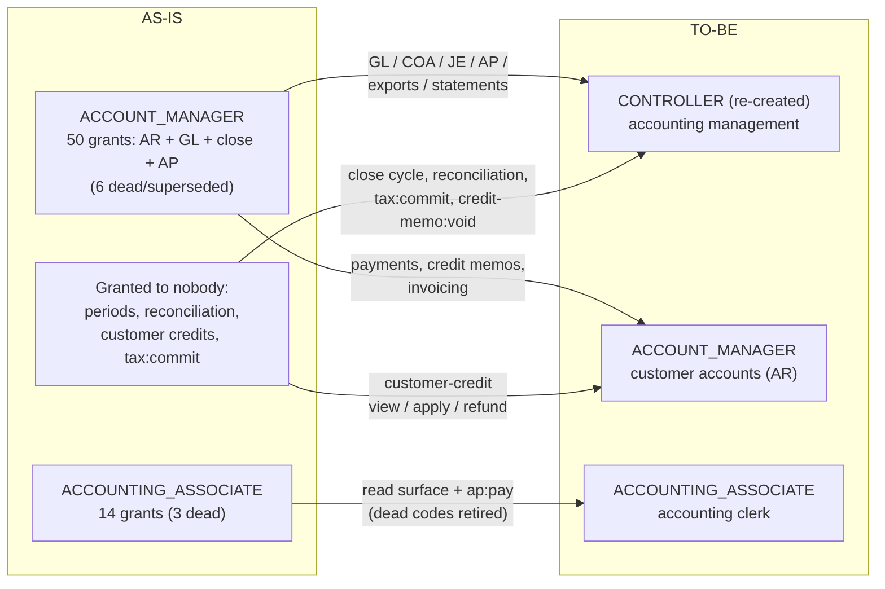

# RBAC Permission / Role Audit — August 2026

Status: **partially executed — tasks 1a, 2, 3, 5 (retirement wave + enforcement wave),
9 and 10 are implemented on this branch** (migrations V24–V28 plus code/seed changes;
see the §7 status column). Headline drift after execution: required-but-ungranted
112 → 2, granted-but-unenforced 77 → 64 → 27 → 12 (V28's task-5 retirement wave revokes
the grants for 34 confirmed-unenforced codes; the task-5 enforcement wave then landed
live `@PreAuthorize` gates on 15 of the remaining 27 in pos-catalog/pos-price/
pos-vehicle-inventory/pos-vehicle-fitment and paired the role grants those gates need —
seed-only, no versioned migration, ADMIN already held every one so the code-level
count moved but no operation went unreachable; see §3), unreachable contract
operations 229 → 0, roles 16 → 17 (CONTROLLER), dead bits (bit assigned, neither
granted nor required) 12 → 26 → 60 — the +34 is exactly V28's retired codes landing
there, as designed: their permission-definition rows and `PermissionCode` bit indexes
stay forever, only the grants retire. Waves 2 and 3 (the §2 decisions and the accepted
recommended-grants matrix) are seed-only — purely additive, no revocation migration
needed. The last real gap is closed: `workorder:financials:view` received
PermissionCode bit 471
(CATALOG_VERSION 59 → 60 — **a fleet-coordinated deploy**: the strict `perm_ver` check
means every service must carry the new catalog before tokens minted at 60 circulate) and
is granted to the manager trio, CONTROLLER and ADMIN. The only remaining
required-but-ungranted entry is `people:timeEntry:`, a parser artifact of dynamic string
construction, not a real code. (The audit script now excludes the `AUTHENTICATED`
sentinel from its required-set computations — Copilot review on PR #1515; the
pre-execution counts in the tables below predate that and include it as one entry in
required-but-ungranted / unregistered / no-bit.) `scripts/audit-rbac.py` also gained two
enforcement-detection patterns for task 5 (§3): it now resolves a permission constant
compared directly against a `GrantedAuthority` (`X.equals(a.getAuthority())`, as seen in
`WipController`) and calls to any permission-typed private helper (any `\w*(?:Permission|
Authority)\w*(...)` call, not just the fixed `hasAuthority`/`hasPermission`/... list),
which reclassifies `workorder:wip:view_all_locations` and the two
`inventory:putaway:override_*` codes from granted-but-unenforced to genuinely enforced —
they are not part of the retirement wave. A third fix reads each
`@PreAuthorize`/`@PostAuthorize` argument with balanced-paren matching instead of a
fixed 600-character window: the window swept in whatever followed the annotation, so an
ALL-CAPS token in an `@EmitEvent` id or javadoc line was scored as enforcement whenever
it matched a permission-constant name elsewhere in the repo. That is how
`VehicleSearchController`'s `@EmitEvent(id = "VEHICLE_SEARCH")` made the retired
`crm:vehicle:search` look required-but-ungranted; the endpoints are gated on
`vehicle-inventory:search:view` throughout.
One product decision was recorded and mapped in §6: **ACCOUNT_MANAGER becomes
a customer-accounts (AR-facing) role, and a re-created CONTROLLER role takes all
accounting management permissions**, including the loose (currently ungranted) ones.
Audited commit: `09d7eef` (main). Companion issues: #1499 (granted-but-unenforced sweep),
#1512 (required-but-ungranted sweep), with #1494 as the originating defect shape and
ADR-0057 / #1497 as prior art.

Reproduce with `python3 scripts/audit-rbac.py audit.json` from the repo root — no build,
no database, runs in seconds. The script cross-references five sources of truth:

| Source | Location | Distinct codes |
| --- | --- | ---: |
| A. Granted | `R__seed_role_permissions.sql` (role → permission rows) | 346 |
| B. Contract | `x-required-permissions` across all 26 `pos-*/openapi.yaml` | 346 |
| C. Code | `@PreAuthorize`/`@PostAuthorize` + non-annotation checks (`SecurityContextHelper.hasAuthority`, `authorities.contains(...)`, constants resolved) | 377 |
| D. Registry | per-module `src/main/resources/permissions.yaml` manifests (23 modules) | 436 |
| E. Bit catalog | `PermissionCode` enum (permanent JWT bit indexes) | 464 |

"Required" below means the union of B and C (381 codes). Headline disagreements:

| Finding | Count |
| --- | ---: |
| Required by an operation, granted to **no role** (#1512) | **112** |
| Contract operations reachable by **no seeded role** | **229 of 999** |
| Granted in the seed, required **nowhere** (#1499) | **77** (23 beyond ADMIN) |
| Registered in a manifest, required nowhere | 68 |
| Required but in no manifest (never registered) | 13 |
| Required but **no bit index** → physically unreachable | 6 |
| Bit assigned, neither granted nor required (dead bits) | 12 |
| Operations with no `x-required-permissions` at all | 149 of 999 |

These numbers differ slightly from the issues (#1499 said 88, #1512 said 94/72) because
(a) main has moved since both were filed, and (b) this audit also resolves constant
references in non-annotation checks, which removes several of #1499's predicted
false positives (`invoice:finalize:override`, `timekeeping:overlap_override`,
`inventory:adjustment:override`, `inventory:goods_receipt:override`,
`order:line:enter_manual_price`, `product:lifecycle:override_discontinued` are all
genuinely enforced — just not by `@PreAuthorize`).

---

## 1. Permissions required by endpoints but granted to no role (#1512)

112 permission codes are required by at least one operation and granted to **no role in
the seed — ADMIN included**. 229 contract operations have no granted alternate at all.

> **Discrepancy with #1512 — resolved, see Task 8:** the issue says `SecurityBootstrap`
> grants SYSTEM_ADMINISTRATOR every registered permission at runtime on alpha. **No such
> class exists in this repository**, and this audit first read that absence as evidence
> against the claim. It was the opposite: the claim held and the absence *was* the
> finding. `RoleAuthorityServiceImpl` resolves authorities solely from
> `role_permissions`, the seed makes SYSTEM_ADMINISTRATOR deliberately *not* a superuser
> (40 grants), and alpha nonetheless carried 398 — every row then in the `permissions`
> table, granted out of band and outside version control. So on a fresh database these
> 229 operations really were unreachable by *everyone*, admin included; alpha only looked
> healthy because of a grant no reviewer ever saw.

### 1a. Whole feature areas with zero role wiring

Unreachable operations per module: customer 41, supplier 39, warranty 36, inventory 33,
accounting 24, order 23, marketing 18, tax 6, people-contact 3, workorder 3,
catalog/image/people 1 each.

| Domain | Codes | Contents |
| --- | ---: | --- |
| warranty | 17 | the entire module: providers, policies, registrations, claims (create/submit/decide/settle/cancel/close), part returns, reimbursements |
| crm (engagement side) | 16 | interactions, inquiries, follow-ups, consent, suppression, tags, segments — the whole `pos-customer` engagement surface (party/person/vehicle onboarding **is** wired) |
| inventory (operations side) | 15 | transfers (create/dispatch/receive/short_close/view), scrap (create/approve/view), valuation (view/adjust), replenishment, lot management, cycle-count tolerances, location sync, supplier stock hints |
| order (POS flow) | 11 | till sessions (open/close/view/cash_movement), checkout, quote, discount, void, returns (create/approve/view) |
| supplier | 12 | the entire module: profiles, price catalogs, transmissions, stock inquiry, work-order auth |
| accounting (close cycle) | 9 | periods (view/close/reopen/hard_lock), reconciliation (view/adjust), customer credits (view/apply/refund), credit-memo void, tax-snapshot freeze |
| marketing | 9 | the entire module: campaigns, templates, stats |
| tax | 3 | `tax:commit`, exemption certificates (view/manage) |
| workorder | 3 | fleet authorization (request/resolve), `workorder:labor:add_on_behalf` |
| people-contact | 2 | organization postal address (view/edit) |
| misc | 3 | `catalog:item_cost:update`, `image:image:store`, `people:compliance:view` |

The practical consequence is #1512's: no technician, advisor, manager, or even seeded
admin can open a till, create a warranty claim, raise a transfer, close a period, or
approve a return under their own login.

### 1b. Escape hatches enforced in service code, held by nobody

These are checked at runtime (not via `@PreAuthorize`, so contracts don't show them) and
granted to no role, so the guarded path is dead:

| Permission | Enforced at | Dead behavior |
| --- | --- | --- |
| `order:order:charge_on_account` | `SalesOrderServiceImpl.java:593` | ON_ACCOUNT tender is impossible for everyone |
| `order:session:approve_variance` | `RegisterSessionServiceImpl.java:190` | till close with over/short beyond the limit is impossible |
| `accounting:period:override` | `AccountingPeriodGate.java:192` | posting into a CLOSED period is impossible |
| `workorder:events:replay` | `OutboxAdminController.java:33` | outbox replay admin endpoint unreachable |

### 1c. Required codes that physically cannot work (no bit index)

`JwtServiceImpl` (line ~310) filters authorities through `PermissionCode.fromCode(...)`
before encoding `perm_bits` — **an authority with no catalog bit is silently dropped from
the JWT even if granted**. These required codes have no bit, so no grant could ever make
them work:

- `people:time:export:read` — dead *alternate*; its endpoints are reachable via
  `accounting:time:export` (`PeopleReportsController`), which has a bit but is itself
  granted to no role.
- `workorder:financials:view` — capability flag in `WorkorderDetailServiceImpl.java:124`;
  permanently false for everyone. *(Fixed post-audit: bit 471 assigned, catalog v60,
  granted to LOCATION_MANAGER, GENERAL_MANAGER, MANAGER, CONTROLLER, ADMIN.)*
- `ACCOUNTING_ADMIN`, `AR_MANAGER` — **role names used as authorities** in
  `PaymentApplicationController.java:251` (`hasAnyAuthority(...)`). Neither role exists —
  no migration creates either name. Dead alternates —
  `accounting:payment:reverse` is the live path and ACCOUNT_MANAGER holds it.
- `AUTHENTICATED` — not a defect: the sentinel `RequiredPermissionsOpenApiAutoConfiguration`
  emits for isAuthenticated-only operations. (`scripts/audit-rbac.py` now excludes it
  from the required set entirely, so it no longer appears in these lists on re-runs.)
- `people:timeEntry:` — artifact of dynamic construction at `TimeEntryServiceImpl.java:74`
  (`"people:timeEntry:" + action`); the concrete codes exist and are granted. Note the
  same line also accepts a literal `"admin"` authority that nothing issues — dead code or
  a mistake, either way worth removing.

---

## 2. Roles missing permissions they need for their documented jobs

This is the role-centric view of §1, plus mismatches found between what a role holds and
what its workflows enforce. **Every row is a product decision** — the audit can say what
is unreachable, not who ought to reach it. Recommendations below are starting points
based on each role's documented job function in the seed header.

### Confirmed role-level defects (the #1494 shape — hold X, code enforces Y)

1. **TECHNICIAN / LOCATION_MANAGER — `workorder:start` split-brain.** The start endpoint
   (`OperationalContextController.java:108`) enforces `workorder:start` (bit 284), which
   they hold. But the detail-response capability flag
   (`WorkorderDetailServiceImpl.java:119`) checks `workorder:workorder:start` (bit 180),
   which only ADMIN holds. A technician can start a workorder while the UI is told they
   can't. One of the two codes must win (recommendation: `workorder:workorder:start`,
   matching the `domain:resource:action` convention; re-point the endpoint and grants,
   deprecate `workorder:start`).
2. **DISPATCHER / SERVICE_ADVISOR / SHOP_MANAGER / LOCATION_MANAGER — dead `shop:*`
   grants, missing `location:*` grants.** They hold `shop:location:view`, `shop:bay:view`
   (+ LOCATION_MANAGER: create/edit) — codes **no endpoint enforces**. The live families
   are `location:read`/`location:write`/`location:bay:manage`... (pos-location) — held
   **only by ADMIN**. Roles that plausibly need to read locations/bays (all four) cannot.
3. **ACCOUNT_MANAGER / ACCOUNTING_ASSOCIATE — dead `accounting:mapping:*` and
   `accounting:ap:approve/reject` grants.** They hold `accounting:mapping:view/create/
   edit/deactivate` but pos-accounting enforces `accounting:gl-mapping:*`,
   `accounting:mapping-key:*`, `accounting:default-mapping:*` (which ACCOUNT_MANAGER
   does hold). `accounting:ap:approve`/`reject` are enforced nowhere (`accounting:ap:pay`
   is the enforced code). Dead grants — misleading but not blocking.

### Recommended grants (decision needed on each block)

| Role | Missing (recommended additions) |
| --- | --- |
| SERVICE_ADVISOR | `order:session:open/close/view`, `order:session:cash_movement`, `order:order:checkout/quote/discount`, `order:return:create/view`; `warranty:claim:view/create/submit`, `warranty:registration:view`, `warranty:policy:view`, `warranty:provider:view`; `crm:interaction:view/manage`, `crm:followup:view/manage`, `crm:inquiry:view/manage`, `crm:consent:view`; `workorder:fleet_auth:request`; `tax:exemption:view`; `location:read` |
| TECHNICIAN | `workorder:workorder:start` (fix 1 above); possibly `image:image:store` if techs attach photos — verify the caller of pos-image |
| LOCATION_MANAGER / GENERAL_MANAGER / MANAGER | `order:order:void`, `order:return:approve`, `order:session:approve_variance`; `warranty:claim:decide/cancel/close`, `warranty:part-return:*`, `warranty:reimbursement:view`; `crm:tag:*`, `crm:suppression:view`, `crm:segment:view`; `workorder:fleet_auth:resolve`, `workorder:labor:add_on_behalf`; `location:read/write`, `location:bay:manage`; `inventory:scrap:approve` (or keep to inventory roles); `tax:exemption:manage` |
| INVENTORY_LEAD | `inventory:transfer:create/view/receive`, `inventory:scrap:create/view`, `inventory:supplier_stock_hint:view`, `supplier:stock:inquire`, `supplier:profile:read` |
| INVENTORY_MANAGER / INVENTORY_CONTROLLER | `inventory:transfer:dispatch/short_close`, `inventory:replenishment:manage`, `inventory:lot:manage`, `inventory:cycle_count_tolerance:manage`, `inventory:valuation:view` (+ `:adjust` for CONTROLLER only), `inventory:location:sync`, `catalog:item_cost:update` |
| ACCOUNT_MANAGER | **superseded by the §6 TO-BE model** — becomes the customer-accounts role: gains `accounting:customer-credit:view/apply/refund`; sheds GL/close-cycle authority to CONTROLLER |
| CONTROLLER (new — see §6) | all accounting management, including the loose codes: `accounting:period:*` (incl. `override`, `hard_lock`), `accounting:reconciliation:view/adjust`, `accounting:credit-memo:void`, `accounting:tax-snapshot:freeze`, `accounting:time:export`, `tax:commit` |
| ACCOUNTING_ASSOCIATE | `accounting:period:view`, `accounting:reconciliation:view`, `accounting:customer-credit:view` (clerk tier under CONTROLLER — §6) |
| ADMIN | all 112 §1 codes it lacks (ADMIN is documented as "the all-domain role" yet holds none of them) |
| SYSTEM_ADMINISTRATOR | `workorder:events:replay`, `people:compliance:view`, `supplier:audit:read`, `supplier:transmission:read/resolve` |
| *nobody obvious* | `order:order:charge_on_account`, `inventory:valuation:adjust`, `marketing:*`, `supplier:*` imports — see decisions below (`accounting:period:hard_lock`/`override` are now CONTROLLER's, per §6) |

### Decisions needed (decisions 1–5 recorded 2026-08-25; 1, 2, 3 and 5 implemented in the seed)

1. ~~**Marketing**~~ — **decided**: the marketing surface (all 9 codes: campaigns,
   templates, stats) belongs to **ACCOUNT_MANAGER**, consistent with its §6
   customer-accounts identity. No new MARKETING role. ADMIN gains the codes too
   (strict-superset rule).
2. ~~**Supplier imports**~~ — **decided**: the supplier module belongs to the
   **inventory-control roles — INVENTORY_MANAGER and INVENTORY_CONTROLLER** (which
   hold identical sets by design, #1373; scope differentiates them). All 12 supplier
   codes go to both, plus ADMIN. The once-open sub-question is resolved by the
   accepted §2 matrix: INVENTORY_LEAD also holds the read-only pair
   (`supplier:stock:inquire`, `supplier:profile:read`).
3. ~~**`image:image:store`**~~ — **decided**: image upload belongs to **both admin
   roles — ADMIN and SYSTEM_ADMINISTRATOR**.
4. ~~**Period close discipline**~~ — **decided**: a re-created CONTROLLER role owns the
   close cycle and all accounting management; ACCOUNT_MANAGER becomes the
   customer-accounts role. Full mapping in §6; its sub-decisions a–f are also
   resolved. Implemented in V24/V25 (PR #1515).
5. ~~**Money-movement tier**~~ — **decided**: `order:order:charge_on_account` and
   `order:session:approve_variance` go to **LOCATION_MANAGER, GENERAL_MANAGER and
   ADMIN**, mirroring the `accounting:customer-credit:refund` holder set (§6
   decision b) and the `invoice:finalize:override` precedent.
6. **`invoice:finalize:override` precedent** applies to everything above: several of
   these codes are deliberate elevation caps — wide grants would defeat their purpose.

**The recommended-grants matrix above was accepted and implemented 2026-08-25**
(seed-only, additive). Tie-breaks for codes the matrix left unassigned, recorded in the
seed's POLICY header: warranty settlement and reimbursement management to
ACCOUNT_MANAGER (customer-accounts money); warranty policy/provider configuration to
GENERAL_MANAGER; crm segment/suppression management to ACCOUNT_MANAGER (with its
marketing ownership); `inventory:transfer:view` added to the approver pair so dispatch
is usable; `inventory:valuation:adjust` CONTROLLER-only, mirroring the
adjustment-override precedent. Skipped as unwirable: `workorder:financials:view`
(no bit) and the `people:timeEntry:` artifact.

---

## 3. Superseded permissions never removed

Confirmed supersession pairs/families still present in seed, manifests, or the bit
catalog. None are marked deprecated anywhere — the `PermissionCode` javadoc prescribes
`@Deprecated` for retirement, and **zero enum constants carry it today**.

| Superseded (bit) | Superseded by | Evidence | Still granted to |
| --- | --- | --- | --- |
| `inventory:on_hand:search` (65) | `inventory:availability:read` | ADR-0057, #1497, #1499 | nobody (grants retired by V28, task 5) |
| `inventory:purchase_order:create/view/approve` (71, 72, 73) | `order:purchase_order:*` | seed header, tracked on #1438 | nobody (grants retired by V28, task 5) |
| `inventory:purchase_order:receive` (74) | `inventory:goods_receipt:create` / `inventory:receiving:complete` | **correction (task 5):** not `order:purchase_order:*` like its create/view/approve siblings — receipt confirmation lives in the goods-receipt/receiving surface, not the PO surface | nobody (grants retired by V28, task 5) |
| `shop:location:view/create/edit/deactivate`, `shop:bay:view/create/edit` | `location:read/write`, `location:bay:manage` (pos-location); scheduling stayed as `shop:schedule:*`/`shop:bay:assign` | pos-shop-manager contract enforces none of them; pos-location enforces the new family | ADMIN, DISPATCHER, SERVICE_ADVISOR, SHOP_MANAGER, LOCATION_MANAGER |
| `crm:vehicle:edit` (45), `crm:vehicle:deactivate` (46) | `vehicle-inventory:registry:update/delete` | ADR-0044 §6; `CrmPermissionRegistry.java:59` comment says "retired" | nobody (dead bits only) |
| `crm:contact:create/edit/delete` (34–36) | `people-contact:person:edit` | contact points live in pos-people-contact, not pos-customer | nobody (grants retired by V28, task 5) |
| `crm:contact_role:view/revoke` (37, 39) | `crm:contact:view` (roles are inline on the contact) / `crm:contact_role:assign` (revocation is a full-set replace, not a separate revoke endpoint) | no separate role-view or role-revoke endpoint exists | nobody (grants retired by V28, task 5) |
| `crm:vehicle:search` (43) | vehicle-inventory search (`pos-vehicle-inventory` `VehicleSearchController`) | ADR-0044 §6; enforcement on the new side is itself still pending | nobody (grants retired by V28, task 5) |
| `crm:vehicle_party_association:view/create/edit` (47–49) | event-driven only (`VehicleEventsListener`) | ADR-0044 §6; no API for this family, by design | nobody (grants retired by V28, task 5) |
| `crm:vehicle_preference:view/edit` (50–51) | `vehicle-inventory:preferences:manage` | ADR-0044 §6 | nobody (grants retired by V28, task 5) |
| `workorder:invoice:create` (208) | `workorder:workorder:generate_invoice` | pos-workorder contract | nobody (grants retired by V28, task 5) |
| `order:line:view` (107) | `order:order:view` | lines are embedded in the order response; there is no separate line-view endpoint | nobody (grants retired by V28, task 5) |
| `catalog:category:*` (17–20), `catalog:variant:*` (24–26) | no such resource exists | Category is internal validation data with no CRUD endpoints; variants/tread designs are Kafka-written, not API-mutated | nobody (grants retired by V28, task 5) |
| `catalog:supplier_cost:write` (228) | Kafka-ingest only | the read side `catalog:supplier_cost:read` stays enforced and stays granted | nobody (grants retired by V28, task 5) |
| `pricing:price_book:*` (126–129) | no such resource exists | no PriceBook resource exists in pos-price | nobody (grants retired by V28, task 5) |
| `pricing:rule:create/delete` (135, 137), `pricing:restrictions:edit` (133) | `pricing:restriction:manage` (singular resource name) | pos-price contract | nobody (grants retired by V28, task 5) |
| `pricing:rule:edit` (136) | none | no edit endpoint exists for pricing rules at all | nobody (grants retired by V28, task 5) |
| `people:userLink:view/write` (237–238) | `people-contact:userLink:view/write` (358–359) | module split | nobody (dead bits only) |
| `people:person:view/create/edit/delete` (233–236) | `people:employee:*` (116–119) | pos-people manifest registers only `employee` | nobody (dead bits only) |
| `people:role:view/assign/revoke` (120–122) | security-service role management (`security:*`) | no people-module role endpoints exist | nobody (dead bits only) |
| `inventory:shortages:resolve` (81) | `inventory:shortage:resolve/view` (258–259) | singular rename; only the singular family is enforced/granted | nobody (dead bit only) |
| `workorder:start` (284) *or* `workorder:workorder:start` (180) | one another — split-brain, see §2 fix 1 | both enforced in different places | start: ADMIN, LOCATION_MANAGER, TECHNICIAN; workorder:start: ADMIN |
| `people:time:export:read` (no bit) | `accounting:time:export` | dead alternate in `PeopleReportsController` | nobody |
| `ACCOUNTING_ADMIN`, `AR_MANAGER` (role-name authorities) | `accounting:payment:reverse` | `PaymentApplicationController.java:251` | n/a |
| `accounting:ap:approve/reject` | `accounting:ap:pay` (only enforced AP action) | nothing enforces approve/reject | ADMIN, ACCOUNTING_ASSOCIATE, ACCOUNT_MANAGER |
| `accounting:mapping:view/create/edit/deactivate` | `accounting:gl-mapping:*` / `mapping-key:*` / `default-mapping:*` | nothing enforces the old family | ADMIN, ACCOUNT_MANAGER (+ASSOCIATE view) |
| `AUTHENTICATED` floor for MCP domains | explicit domain codes | seed §3 note: only domains lacking a real code remain on the floor | n/a (sentinel) |

**Task 5 retirement wave (V28) update:** of the ~55 remaining ADMIN-only(-ish)
granted-but-unenforced codes this section originally pointed at, 34 are confirmed
supersessions or dead-resource codes and are retired above. Two more —
`workorder:wip:view_all_locations` and the two `inventory:putaway:override_*`
codes — turn out to be genuinely enforced: `scripts/audit-rbac.py` missed them because
(a) `WipController.java` compares a permission constant against a `GrantedAuthority`
directly (`.noneMatch(a -> WIP_VIEW_ALL_LOCATIONS.equals(a.getAuthority()))`) rather than
calling `hasAuthority`/`.contains`, and (b) `PutawayValidationServiceImpl` enforces the two
override codes through a private helper, `enforceOverridePermission(...)`, whose name the
script's capability-flag call list never included. Both gaps are fixed (see the
paragraph below); these three codes are **not** part of the retirement wave and keep
their grants unchanged.

**Task 5 enforcement wave update:** of the 27 codes named in the previous paragraph's
snapshot, 15 now carry live `@PreAuthorize` gates — landed in pos-catalog
(`catalog:product:view`, `catalog:service_type:view`), pos-price
(`pricing:restrictions:view`, `pricing:normalization:edit`; `pricing:rule:view` was
already correctly gated and held its holder set unchanged), pos-vehicle-inventory
(`vehicle-inventory:registry:view/create/update/delete`,
`vehicle-inventory:search:view`, `vehicle-inventory:preferences:manage`) and
pos-vehicle-fitment (`vehicle-fitment:catalog:view`, `vehicle-fitment:hint:view/create/
update/delete`) — with the paired role grants added to the seed so the personas that
already used these endpoints (SERVICE_ADVISOR, TECHNICIAN, the manager/inventory
roles) don't 403 under the new gates; `catalog:product:delete`,
`vehicle-inventory:registry:delete` and `pricing:normalization:edit` stay ADMIN-only
elevation caps, unchanged. `inventory:override:part-match` also dropped off this list —
it was always enforced (`SecurityContextHelper.hasAuthority`, matching the script's
existing detection patterns), it just hadn't been reclassified in this doc's snapshot
until this fresh audit run.

The remaining 12 granted-but-unenforced codes (matches `scripts/audit-rbac.py`'s
`granted_unrequired` output exactly, 2026-08-26 run): `catalog:service_type:create`,
`catalog:service_type:edit`, `crm:integration:audit`, `crm:processing_log:view`,
`crm:suspense:view`, `nlti:request:read`, `people:skill:assign`, `people:skill:edit`,
`people:skill:view`, `pricing:normalization:view`, `workorder:estimate_item:view`,
`workorder:estimate_snapshot:view`. These are **not** confirmed superseded — they are
the #1494 shape: defined and granted, waiting for enforcement that never got wired, in
modules with large `x-required-permissions` gaps (see §5). Triage each as *enforce it*
or *retire it* — deferred, no decision yet (§7).

---

## 4. Can we mark superseded permissions without breaking perm bits? Yes.

**The design already supports exactly this; two small gaps prevent using it.**

How the bits work (why removal is dangerous and marking is safe):

- `PermissionCode` assigns each code an **explicit, permanent** bit index; the enum
  javadoc already states: *"Bit indexes are permanent and MUST never be reused or
  reassigned. To retire a permission, mark it `@Deprecated` — never remove or renumber."*
- JWTs carry `perm_bits` (Base64URL bitset) + `perm_ver` (`CATALOG_VERSION`, currently
  59). `PermissionBitsetCodec.decodeToPermissions` **rejects any token whose version
  mismatches**, which is why catalog changes are fleet-coordinated deploys
  (`scripts/generate-permissions.sh --sync` keeps `PermissionCode`,
  `GatewayPermissionCatalog`, and `DownstreamPermissionCatalog` identical; CI job
  *Validate Permission Catalog* enforces the sync).
- Removing an enum entry doesn't shift other bits (indexes are explicit), but it changes
  the catalog (version bump → fleet deploy) and frees a bit that must never be re-issued.
  Keeping the entry forever is free: bits are cheap, and a set bit for a code nothing
  enforces grants nothing.
- The `permissions` table already has a **`deprecated` boolean** (`Permission.java:48`),
  surfaced in `PermissionDto`.

The two gaps:

1. **Registration clobbers the flag.** `PermissionServiceImpl.registerPermissions`
   unconditionally does `permission.setDeprecated(false)` on every upsert
   (`PermissionServiceImpl.java:50`), and every service re-registers its manifest at
   startup — so a deprecated mark cannot survive a restart. The manifest schema
   (`permissions.yaml`) has no `deprecated` field to carry the truth.
2. **Nothing consumes the flag.** No API sets it, no seed/tooling reads it, and no
   `PermissionCode` constant is `@Deprecated`.

**Status (2026-08-26): implemented.** Steps 1 and 2 are done — the manifest schema,
registration chain, entity column (V29) and both registration paths now carry
`deprecated`/`supersededBy` (a second clobber was found in
`PermissionRegistryServiceImpl`, whose update path compared only the description and so
never propagated the flag either), and all 60 retired codes are annotated `@Deprecated`
with 38 manifest entries marked. Step 3's grant revocations already shipped as V25–V28.

**Deferred: database marking for the 22 placeholder-only codes.** Those codes appear in
no `permissions.yaml`, so no service re-registers them and the registration channel
never fires. Their rows come from two places — 15 from `R__seed_reference_security.sql`
(machine-generated by `durion/scripts/seed-generator`; **never hand-edit, a
regeneration would silently revert it**) and 7 only from the fallback bulk INSERT in
`R__seed_role_permissions.sql` — and both insert with bare `ON CONFLICT DO NOTHING`,
so the rows land at the `deprecated=false` default permanently. The obvious fix is
wrong in both directions: a versioned `V30 UPDATE` matches zero rows on a fresh
database, because Flyway runs repeatable seeds *after* versioned migrations and the
rows do not exist yet; while baking the flag into the row-creation VALUES fixes only
fresh databases, since `DO NOTHING` no-ops where the row already exists.
Recommended instead: append one narrow, unconditional
`UPDATE permissions SET deprecated = true, superseded_by = ... WHERE name IN (…)`
to the **end of `R__seed_role_permissions.sql`**. It runs after both origin points,
plain UPDATEs are idempotent, and a checksum change re-runs the whole file — so it
fixes fresh and already-migrated databases alike, without turning the existing
`ON CONFLICT DO NOTHING` into `DO UPDATE` (which would risk clobbering legitimately
registered rows' live descriptions and flags on every service restart).

**Recommended retirement convention** (applies to every §3 row):

1. Add `deprecated: true` (optionally `supersededBy: <code>`) to the manifest schema;
   propagate through `PermissionRegistrationSupport` → registration API → entity, and
   make the upsert honor it instead of hardcoding false.
2. Annotate the enum constant `@Deprecated` with a javadoc pointer to the successor.
   Keep the constant and bit forever. No renumbering ⇒ no `CATALOG_VERSION` bump needed
   for deprecation alone (verify `generate-permissions.py` doesn't bump on annotation
   changes).
3. Remove the *grants* via a **versioned** migration (the repeatable seed is additive by
   design — `ON CONFLICT DO NOTHING` never deletes; the V23 candidate-role cleanup is
   the precedent), and delete the rows from the seed file. Old JWTs still carrying the
   bit lose nothing: no endpoint enforces the retired code.
4. Have the *Validate Permission Catalog* CI job (or a new check built on
   `scripts/audit-rbac.py`) fail when: a non-deprecated permission is granted but
   required nowhere; a required permission is granted to no role; a required permission
   has no bit index. That makes #1494/#1499/#1512 a class of bug that cannot recur
   silently.
5. Optionally expose `PATCH /v1/permissions/{id}` deprecation in pos-security-service so
   ops can mark without redeploying — low priority once manifests carry the flag.

---

## 5. Confounds that cap what this audit can see

1. **22 of 999 operations declare no `x-required-permissions`** (was 139 before task 6):
   pos-event-receiver 12/12, pos-security-service 6/88, pos-catalog 2/70, pos-customer 1,
   pos-invoice 1, pos-vehicle-inventory 1. These were three unrelated causes, not one gap
   — see Task 6 below for the decomposition and per-case verdicts. Every one of the
   remaining 22 is now accounted for: shared-secret auth, `permitAll()` public endpoints,
   or the two type-generic catalog operations still blocked on the endpoint-split
   decision. The "required nowhere" upper-bound caveat no longer applies to
   security-service or catalog.
2. **Enforcement outside `@PreAuthorize` is common** — `SecurityContextHelper.hasAuthority`,
   `authorities.contains(...)`, capability flags in DTOs. The script now resolves
   constant references in these calls, but dynamically built strings
   (`"people:timeEntry:" + action`) and the literal `"admin"` check at
   `TimeEntryServiceImpl.java:74` show the pattern is fragile. Consider an ArchUnit rule
   or a `RequirePermission` helper so all enforcement is statically discoverable.
3. **Alternates are modeled as OR** (mirrors `hasAnyAuthority`). Complex expressions
   would be misread; none were found that change conclusions.
4. **Live-registry drift** (#1512's marketing/supplier 503s on alpha) is a deployment
   question this repo-only audit cannot settle — worth one `curl` per §1's reproduction
   once the services are up.

### Task 6 — what the `x-required-permissions` gap actually is

**Mechanism.** `RequiredPermissionsOpenApiAutoConfiguration` (`pos-security-common`)
*derives* the extension from `@PreAuthorize`; it never states permissions independently.
It reads class- and method-level `@PreAuthorize`, extracts every quoted
`hasAuthority`/`hasAnyAuthority` argument, and, only when there is no matching call, falls
back to the `AUTHENTICATED` sentinel — but only for `isAuthenticated()` or a genuinely
absent `@PreAuthorize`. `hasRole`/`hasAnyRole` arguments are read but discarded, and
`permitAll()` short-circuits to nothing at all (not even `AUTHENTICATED`): the code
comment cites the #1102 review — emitting a role name into `x-required-permissions`
would grant the operation a code that matches no real permission, making it look
gateable and silently unselectable forever. So "declares nothing" has three distinct
causes, not one:

| Cause | Count when task 6 began | Now | What it means |
| --- | --- | --- | --- |
| Module never runs the customizer | 88 (pos-security-service) | **0** | tooling gap — code enforced, contract was mute. Fixed by adding the `pos-security-common` dependency. |
| `hasRole`/`hasAnyRole` gate, ignored by design | 37 (pos-catalog) + 1 (pos-vehicle-inventory) | **2 + 1** | real gap in catalog (phantom roles, ADMIN-only by accident) — 39 converted to real codes; the 2 left are the type-generic create/update, blocked. pos-vehicle-inventory's is a genuine `ROLE_ADMIN` gate, off-convention but enforced. |
| `permitAll()` — deliberately public | 6 (pos-security-service) + 2 (pos-customer, pos-invoice) | **8** | correct silence — login/refresh/register/validate-token, a feature-flagged public form, and a signed-token download |
| No `@PreAuthorize` applies to any user permission | 12 (pos-event-receiver) | **12** | correct silence — shared-secret auth |

The `permitAll()` row was invisible when this section was first written: pos-security-service
emitted nothing at all, so its 6 public endpoints were hidden inside the 88.

**1. pos-security-service (was 88/88, now 6/88) — tooling gap, FIXED.** The module did
not depend on `pos-security-common`, so the auto-configured `OperationCustomizer` bean
was never on its classpath and the extension never fired for *any* of its 88 operations
— an all-or-nothing module-level miss, not 88 individually-unannotated endpoints. The
code already enforced: 55 handlers carry permission-based `@PreAuthorize`. Adding the
dependency was verified safe rather than assumed: pos-security-common registers only
`RequiredPermissionsOpenApiAutoConfiguration` in its `AutoConfiguration.imports`, while
`GatewaySecurityConfig` and `GatewayAuthoritiesFilter` are plain `@Configuration`
requiring an explicit `@Import` that this service's component scan never reaches — so
the token issuer's own filter chain is untouched. 82 of 88 operations now declare their
codes; the 6 that do not are the `permitAll()` public endpoints. Every newly declared
code was already granted to some role, so nothing became unreachable.

**2. pos-catalog (was 37/70, now 2/70) — real gap, FIXED except the blocked pair.** These
operations were gated on `hasRole('CATALOG_VIEW'/'CATALOG_EDIT'/'CATALOG_DELETE')` — role
names that appear in no migration. Unlike a granted role, a role nobody is ever assigned
satisfies `hasRole` for no one, so the endpoints were reachable only via the
`hasRole('ADMIN')` alternate: ADMIN-only by accident, with the `catalog:*` codes granted
to five roles enforcing nothing. The customizer's silence was accidentally hiding a
defect, not correctly reporting one.

39 of the 41 gates are now converted. Seven reused codes that already existed — including
`catalog:product:edit`, which had a bit and a grant but had never been wired to any
enforcement site. The other 32 needed **16 new codes** (bits 472–487, `CATALOG_VERSION`
60 → 61, a fleet-coordinated deploy) for resources that had none: guardrail policies,
location price overrides, non-inventory products, substitution groups, catalog groupings,
UoM conversions, product UoMs, item-cost reads, tread designs, and fact replay. All 16 are
granted to ADMIN and nobody else — a faithful mirror of the access the phantom gates
already permitted, chosen so that enforcing a code granted to no one could not turn an
accidentally-ADMIN-only endpoint into one reachable by nobody. Widening any of them (the
UoM, tread-design and non-inventory *reads* being the plausible candidates) is an open
product decision.

The 2 that remain are `CatalogItemController`'s type-generic create and update
(`POST|PUT /{type}/{catalogId}`), still blocked on the per-type endpoint-split decision —
the same question raised by the `deleteCatalogItem` type-conditional, and the same one
that blocks `catalog:service_type:create/edit`.

**3. pos-event-receiver (12/12) — expected, not a defect.** Verified directly: zero
`@PreAuthorize` annotations anywhere in the module. Auth is `EventsApiSecurityFilter`
(`@Order(1)` `OncePerRequestFilter`), a shared-secret check — **not** the
`X-Pos-Events-Secret` header CLAUDE.md's shorthand implies; the actual header constant
(`EventsApiConstants.SECRET_HEADER`) is **`X-Events-Api-Secret`**, matched against
`pos.events.api-secret` / `POS_EVENTS_API_SECRET` with `MessageDigest.isEqual`. It only
gates `POST`/`PUT`/`DELETE` under `/v1/events/*` and `/v1/eventTypes/*` (5 of the 12
operations: `EmitEventController`'s emit, `EventTypeController`'s create/update-by-code/
update-by-id/delete); the other 7 — all GETs, across `EventSummaryController` and
`EventTypeController` — and `/actuator/*` skip the filter entirely and take no auth at
all. If `pos.events.api-secret` is unset the filter self-disables (`securityEnabled=false`)
and lets every request through, logging only a startup warning — a deploy-config risk,
not a `x-required-permissions` one. None of this is JWT/permission-bitset authorization,
so there is nothing for `@PreAuthorize` to say and nothing for the extension to derive:
the silence is correct. The nuance worth keeping precise: this is **not** network
isolation. The module is gateway-routed (`Path=/event-receiver/**`,
`pos-api-gateway/src/main/resources/application.yml:130-135`, `StripPrefix=1`) and its
spec is in the aggregated Swagger UI (`url: /event-receiver/v3/api-docs`, same file
line 232) — externally reachable like any other domain service. It is the *auth model*
(a shared secret, not a user's JWT authorities) that makes user permissions inapplicable,
not the network path.

**The 3 stragglers — verified individually, not fixed here (out of scope):**

- **pos-customer** — `POST /v1/crm/public/inquiries`
  (`PublicInquiryController.submit`) — `@PreAuthorize("permitAll()")`. **Legitimate.**
  Deliberately the module's only unauthenticated write surface (Story #1154), off by
  default behind `pos.customer.inquiry.public.enabled`, with the class javadoc recording
  the three external preconditions (edge captcha, a conscious gateway bypass, edge rate
  limiting) that must hold before it's turned on. No user permission applies to an
  anonymous submitter; the silence is correct, and matches the class's own comment
  reasoning, not an oversight.
- **pos-invoice** — `GET /v1/invoices/{invoiceId}/artifacts/{artifactRefId}/download`
  (`InvoiceArtifactDownloadController.download`) — `@PreAuthorize("permitAll()")`.
  **Legitimate.** A public PDF download link a browser can't attach an `Authorization`
  header to; the real guard is a short-lived signed token (minted by
  `InvoiceArtifactController`, verified in the service layer), not Spring Security. The
  `permitAll()` and the comment above it are deliberate. Correct silence.
- **pos-vehicle-inventory** — `POST /v1/vehicle-registry/facts/replay`
  (`VehicleRegistryController.replayVehicleFacts`) — `@PreAuthorize("hasRole('ADMIN')")`.
  **Enforced, but not the pos-catalog failure mode — and not user-permission-shaped
  either.** Traced the whole path: `RoleAuthorityServiceImpl.expandRolesToAuthorities`
  adds `ROLE_<name>` for every role a user actually holds (unconditionally, not gated on
  that role having grants); `JwtServiceImpl` carries role names in a separate `roles`
  claim rather than folding them into `perm_bits` (which only holds `PermissionCode`-shaped
  strings and would silently drop `ROLE_ADMIN`); the gateway forwards that claim as
  `X-Roles`; `GatewayAuthoritiesFilter` (`pos-security-common`) concatenates it straight
  onto the granted-authorities list downstream. So `ROLE_ADMIN` is real and
  `hasRole('ADMIN')` resolves correctly for genuine admins — unlike pos-catalog's
  `CATALOG_VIEW`/`CATALOG_EDIT`/`CATALOG_DELETE`, which match a role no migration ever
  creates. This is the same "hasRole ignored by design" mechanism as pos-catalog producing
  contract silence, but sitting on a working gate restricting an admin-only replica-repair
  operation. Not a security gap; is a convention gap worth a follow-up — the platform's
  own model is code-first `domain:resource:action` permissions, and a role check here is
  the one place vehicle-inventory departs from it. Migrating to a granted, ADMIN-only
  permission code (e.g. `vehicle:registry:replay`) would make it contract-visible and
  auditable by this same script, for visibility only, not because it is currently
  insecure.

---

## 6. TO-BE role model — ACCOUNT_MANAGER / CONTROLLER split (decided 2026-08-25)

**Decision:** ACCOUNT_MANAGER is a **customer-accounts** role (receivables-facing:
customer payments, credits, credit memos, billing/invoicing), *not* an accounting role.
All **accounting management** authority — GL configuration, journal entries, chart of
accounts, the close cycle, reconciliation, AP, exports, financial statements — moves to
**CONTROLLER**, a role the retired hardcoded switch used to expand but which was
suppressed when roles moved to the database (seed header: "ACCOUNTANT, AP_CLERK,
CONTROLLER, CSR, FLEET_MANAGER and GL_ANALYST … are NOT reproduced here"). The loose
(currently ungranted) accounting codes from §1 also land on CONTROLLER.

References to §2's ACCOUNT_MANAGER/ACCOUNTING_ASSOCIATE recommendations are superseded
by this section.

### Prerequisites to implement

1. **Create the CONTROLLER role** — versioned migration inserting into `roles` (the
   pattern of `V8__seed_self_service_customer_role.sql`), since no migration currently
   creates it and `user_roles`/`role_assignments` are FK'd to `roles(id)`.
2. Add CONTROLLER to the seed's **section 3 assistant baseline** (`mcp:chat:execute`,
   `mcp:chat:stream`, `nlti:request:submit`, `nlti:request:read`) — the seed states new
   roles get nothing implicitly.
3. **Revoking ACCOUNT_MANAGER's moved grants needs a versioned migration** — the
   repeatable seed is additive (`ON CONFLICT DO NOTHING`) and never deletes; V23 is the
   precedent. Seed rows move in the same change so re-runs don't re-grant.
4. ADMIN stays the strict superset: every code CONTROLLER gains, ADMIN gains too
   (consistent with §1's finding that ADMIN currently lacks all of them).

### TO-BE chart — accounting-adjacent roles

Legend: **keep** = stays where it is · **move** = leaves ACCOUNT_MANAGER for CONTROLLER ·
**new** = currently granted to *no* role (§1's loose codes) · **retire** = superseded
code, do not carry into the TO-BE model (deprecate per §4).

| Permission | AS-IS | TO-BE | Change |
| --- | --- | --- | --- |
| **Customer accounts (AR) — ACCOUNT_MANAGER** | | | |
| `accounting:payment:apply` | ACCOUNT_MANAGER | ACCOUNT_MANAGER | keep |
| `accounting:payment:reverse` | ACCOUNT_MANAGER | ACCOUNT_MANAGER, CONTROLLER | keep + CONTROLLER (decision a) |
| `accounting:credit-memo:create` | ACCOUNT_MANAGER | ACCOUNT_MANAGER | keep |
| `accounting:credit-memo:read` | ACCOUNT_MANAGER | ACCOUNT_MANAGER, CONTROLLER | keep + CONTROLLER view |
| `accounting:customer-credit:view` | *nobody* | ACCOUNT_MANAGER, CONTROLLER, ACCOUNTING_ASSOCIATE | **new** |
| `accounting:customer-credit:apply` | *nobody* | ACCOUNT_MANAGER | **new** |
| `accounting:customer-credit:refund` | *nobody* | ACCOUNT_MANAGER, CONTROLLER, LOCATION_MANAGER, GENERAL_MANAGER | **new** (money-out; wide-but-senior holder set — decision b) |
| `invoice:manage` | ACCOUNT_MANAGER, SERVICE_ADVISOR | unchanged | keep |
| `invoice:billing-rules` | ACCOUNT_MANAGER | ACCOUNT_MANAGER, CONTROLLER | keep + CONTROLLER (decision c: both — customer billing config and financial config) |
| `invoice:finalize:override` | ACCOUNT_MANAGER + manager roles | unchanged | keep (#1374 decision stands) |
| `tax:exemption:view` / `tax:exemption:manage` | *nobody* | ACCOUNT_MANAGER, LOCATION_MANAGER (+ SERVICE_ADVISOR view only) | **new** (decision d) |
| **Accounting management — CONTROLLER** | | | |
| `accounting:coa:view/create/edit/deactivate` | ACCOUNT_MANAGER | CONTROLLER | move |
| `accounting:je:view/create/post/reverse` | ACCOUNT_MANAGER | CONTROLLER | move |
| `accounting:gl-mapping:create/resolve` | ACCOUNT_MANAGER | CONTROLLER | move |
| `accounting:mapping-key:view/create/edit/deactivate` | ACCOUNT_MANAGER | CONTROLLER | move |
| `accounting:default-mapping:view/create/edit/delete` | ACCOUNT_MANAGER | CONTROLLER | move |
| `accounting:posting-category:view/create/edit/deactivate` | ACCOUNT_MANAGER | CONTROLLER | move |
| `accounting:posting_rules:view/create/publish` | ACCOUNT_MANAGER | CONTROLLER | move |
| `accounting:events:view/submit/retry/reprocess` | ACCOUNT_MANAGER | CONTROLLER | move |
| `accounting:export:view` | ACCOUNT_MANAGER, ACCOUNTING_ASSOCIATE | CONTROLLER, ACCOUNTING_ASSOCIATE | move (AM out) |
| `accounting:ap:view` | ACCOUNT_MANAGER, ACCOUNTING_ASSOCIATE | CONTROLLER, ACCOUNTING_ASSOCIATE | move (AM out) |
| `accounting:ap:pay` | ACCOUNT_MANAGER, ACCOUNTING_ASSOCIATE | CONTROLLER, ACCOUNTING_ASSOCIATE | move (AM out; decision e: both CONTROLLER and the associate hold it) |
| `reporting:view:financial-statements` | ACCOUNT_MANAGER, ADMIN | ACCOUNT_MANAGER, ADMIN, CONTROLLER, GENERAL_MANAGER | keep + add (decision f: current holders retain; CONTROLLER and GENERAL_MANAGER added) |
| `accounting:period:view` | *nobody* | CONTROLLER, ACCOUNTING_ASSOCIATE | **new** |
| `accounting:period:close` / `reopen` | *nobody* | CONTROLLER | **new** |
| `accounting:period:hard_lock` | *nobody* | CONTROLLER | **new** |
| `accounting:period:override` | *nobody* (enforced at `AccountingPeriodGate.java:192`) | CONTROLLER | **new** — closed-period posting escape hatch, CONTROLLER only |
| `accounting:reconciliation:view` | *nobody* | CONTROLLER, ACCOUNTING_ASSOCIATE | **new** |
| `accounting:reconciliation:adjust` | *nobody* | CONTROLLER | **new** |
| `accounting:credit-memo:void` | *nobody* | CONTROLLER | **new** — destructive elevation stays above AR |
| `accounting:tax-snapshot:freeze` | *nobody* | CONTROLLER | **new** |
| `accounting:time:export` | *nobody* | CONTROLLER | **new** (payroll export; the `people:time:export:read` alternate retires per §3) |
| `tax:commit` | *nobody* | CONTROLLER | **new** |
| **Retired — carried by neither role** | | | |
| `accounting:ap:approve` / `accounting:ap:reject` | ACCOUNT_MANAGER, ACCOUNTING_ASSOCIATE | — | retire (enforced nowhere; `accounting:ap:pay` is the live code — §3) |
| `accounting:mapping:view/create/edit/deactivate` | ACCOUNT_MANAGER (+ ASSOCIATE view) | — | retire (superseded by `gl-mapping`/`mapping-key`/`default-mapping` — §3) |
| **Unchanged tiers** | | | |
| assistant baseline (`mcp:chat:*`, `nlti:request:*`) | all seeded roles | + CONTROLLER | per seed §3 policy |
| ACCOUNTING_ASSOCIATE views (`coa:view`, `je:view`, `events:view`, `posting_rules:view`) | ACCOUNTING_ASSOCIATE | ACCOUNTING_ASSOCIATE | keep — clerk tier now reports into CONTROLLER's domain |

### Resulting role shapes

| Role | TO-BE identity | Grant count (approx.) |
| --- | --- | --- |
| CONTROLLER | accounting management: GL config, JE, COA, close cycle, reconciliation, AP, exports, statements, tax commit; shares payment reversal, customer-credit refund and billing rules with the AR side | ~52 (33 moved + 12 new + 3 shared per decisions a–c + 4 baseline) |
| ACCOUNT_MANAGER | customer accounts: payments, customer credits, credit memos, invoicing/billing, tax exemptions, financial-statements read | ~17 (down from 50) |
| ACCOUNTING_ASSOCIATE | accounting clerk: read surface + AP pay + period/reconciliation view | ~14 (net: −3 retired, +3 new views) |
| LOCATION_MANAGER / GENERAL_MANAGER | unchanged identity; gain `accounting:customer-credit:refund` (both), `tax:exemption:view/manage` (LOCATION_MANAGER), `reporting:view:financial-statements` (GENERAL_MANAGER) | +2–3 each |

### Sub-decisions a–f — resolved 2026-08-25

All six flags are decided; the chart above reflects them:

| Flag | Decision |
| --- | --- |
| a. `accounting:payment:reverse` | CONTROLLER holds it **in addition to** ACCOUNT_MANAGER |
| b. `accounting:customer-credit:refund` | ACCOUNT_MANAGER **plus CONTROLLER, LOCATION_MANAGER and GENERAL_MANAGER** |
| c. `invoice:billing-rules` | **Both** ACCOUNT_MANAGER and CONTROLLER |
| d. Tax exemption certificates | ACCOUNT_MANAGER view+manage, SERVICE_ADVISOR view, **plus LOCATION_MANAGER view+manage** |
| e. `accounting:ap:pay` | **Both** — CONTROLLER and ACCOUNTING_ASSOCIATE (clerk keeps payment runs) |
| f. `reporting:view:financial-statements` | Current holders (ACCOUNT_MANAGER, ADMIN) **retain**; add CONTROLLER and GENERAL_MANAGER |

## 7. Summary of recommendations

| # | Action | Effort | Blocked on decision? |
| --- | --- | --- | --- |
| 1 | Wire role grants for the required-but-ungranted codes | medium | **DONE** — §6 split (1a), §2 decisions 1–3/5, and the accepted §2 matrix; only `workorder:financials:view` (needs a bit) and the `people:timeEntry:` artifact remain |
| 1a | Implement the §6 ACCOUNT_MANAGER / CONTROLLER split | medium | **DONE** — V24 (CONTROLLER role), V25 (rescope + retire dead accounting codes), seed + guard-fixture updates |
| 2 | Fix `workorder:start` vs `workorder:workorder:start` split-brain | small | **DONE** — `workorder:workorder:start` wins; endpoint + capability flag aligned, V26 migrates grants |
| 3 | Re-point `shop:location/bay` holders to `location:*` family | small | **DONE** — faithful-mirror grants added, seven dead codes revoked (V27) |
| 4 | Deprecation convention (manifest flag + honor it + `@Deprecated` enum entries) and apply to every §3 row; retire grants via versioned migration | medium | **DONE** — manifest schema + registration/entity chain honour `deprecated`/`supersededBy` (both clobber points fixed), 60 retired `PermissionCode` constants annotated `@Deprecated`; DB marking for the 22 placeholder-only codes deferred, recommended approach recorded in §4 |
| 5 | Triage remaining ~55 ADMIN-only unenforced codes: enforce or retire | medium | **IN PROGRESS** — retirement wave DONE (34 codes, V28); enforcement wave DONE for 15 codes gated across pos-catalog/pos-price/pos-vehicle-inventory/pos-vehicle-fitment, grants paired (seed-only, no migration); 12 codes still deferred (feature not built: crm integration-audit/processing-log/suspense reads, workorder estimate-item/snapshot GETs, people:skill:* feature (3 codes), nlti:request:read status endpoint, catalog:service_type:create/edit endpoint split, pricing:normalization:view) |
| 6 | Close the `x-required-permissions` gap | medium | **IN PROGRESS** — decomposed into 3 causes (§5 Task 6): pos-security-service (88, tooling gap) and pos-catalog (37, real phantom-role gap) each being fixed by a concurrent effort; pos-event-receiver (12) and the 3 stragglers (pos-customer, pos-invoice, pos-vehicle-inventory) verified as correct silence — no fix needed, one convention note left on vehicle-inventory's `hasRole('ADMIN')` |
| 7 | CI check on `scripts/audit-rbac.py` output (fail on new drift) | small | **DONE** — `--check` mode + `scripts/rbac-audit-baseline.json`, wired into the `validate-permissions` job; see subsection below |
| 8 | Locate/confirm the alpha "SecurityBootstrap" superuser behavior; document or remove | small | **DONE for the policy half** — confirmed real (398 grants vs the seed's 40), decided unchanged and enforced by `V31__revoke_system_administrator_out_of_band_grants.sql`; the actor is still unnamed and needs alpha ops logs — see the subsection below |
| 9 | Remove dead authorities: literal `"admin"` check, `ACCOUNTING_ADMIN`/`AR_MANAGER` alternates, `people:time:export:read` alternate | small | **DONE** — pos-people, pos-people-contact and pos-accounting code, contracts and tests cleaned |
| 10 | Seed dummy users for the roles that currently have none (see below) so every persona is exercisable under its own login | small | **DONE** — 8 users seeded (…012–…019); felicia.grant's LOCATION-scoped assignment deferred until a location fixture exists; customer-persona flag still open |

### Task 7 — CI gate on `scripts/audit-rbac.py`

Implements §4 step 4: fail CI when a *new* instance of the #1494/#1499/#1512 defect
class appears, without re-litigating the already-triaged backlog every PR.

**Two detector fixes landed with the gate**, because a gate is only as good as the
scanner under it:

1. **Comments are now stripped before scanning.** Enforcement is found by regex, and
   javadoc quotes annotations for illustration — `SecurityContextHelper`'s class javadoc
   contains `hasAuthority("catalog:product:edit")` as a usage EXAMPLE, and
   `TaxServiceClient` has a `//` comment describing pos-tax's gate. Both were being
   scored as real enforcement. This is the same false-positive class as the
   `@EmitEvent`-id bug found on PR #1516, from a different direction.
2. **SpEL single-quoted literals are now read.** A code written inline —
   `hasAnyAuthority('workorder:parts:add', 'workorder:workorder:edit')` in
   `SubstituteLinkController`, or the deliberate cross-module literal in
   `PurchaseSuggestionController` — sits in single quotes *inside* the Java string, so
   the double-quoted scan never saw it. Three codes were enforced-but-invisible.

**The comment fix exposed a 13th unenforced code**: `catalog:product:edit` is granted to
ADMIN, declared in pos-catalog's manifest, and holds bit 13 — but its only "enforcement"
was that javadoc example. The real endpoint, `CatalogItemController.updateCatalogItem`
(`PUT /{type}/{catalogId}`), is still gated on the dead `hasRole('CATALOG_EDIT')`
phantom role, so nothing actually guards a product edit. It is baselined in the same
deferred bucket as `catalog:service_type:create/edit`: gating the type-generic
create/update endpoint per type needs the endpoint-split decision (§7 task 5), which is
the same open question the `deleteCatalogItem` type-conditional flagged.

- **Run it**: `python3 scripts/audit-rbac.py --check` (wired into the existing
  `validate-permissions` job in `.github/workflows/pr-checks.yml`, after the permission
  catalog sync check — same concern, Python setup already paid for). Exits `1` on new
  drift or a stale baseline entry, `0` when clean. `scripts/audit-rbac.py [out.json]`
  (no `--check`) still just writes the full report, unchanged.
- **Gates the build** — any of these codes not already listed in
  `scripts/rbac-audit-baseline.json` fails the run, naming the code and where it was
  seen:
  - `required_ungranted` — required by an endpoint/code check, granted to no role
    (#1512: a feature nobody can reach).
  - `granted_unrequired` — granted to a role, enforced nowhere (#1499: a false claim
    about what a role can do).
  - `required_no_bit` — required but missing from `PermissionCode`, so
    `JwtServiceImpl` silently drops it from every token (the
    `workorder:financials:view` class).
  - `granted_no_bit` — granted but missing a bit index; same trap, other side.
  - `unreachable_op_count` — contract operations no seeded role can reach. Never
    baselined: any value above 0 fails, full stop.
  - A **stale baseline entry** (listed but no longer actually drifting) also fails,
    under a "delete these lines" heading — the baseline is meant to shrink, not
    accumulate.
- **Informational only, never gates**: `required_unregistered` (legitimately includes
  cross-domain enforcement — a module enforcing a code another module owns — so gating
  it would be noise) and `catalog_dead`. Both are printed as counts at the end.
- **The baseline** (`scripts/rbac-audit-baseline.json`) holds today's known backlog:
  the `people:timeEntry:` dynamic-string artifact (§5 point 2) and the 12 unbuilt-feature
  codes from task 5. Each entry is `code -> reason string`, not a bare list, so adding
  one is a reviewable act with a stated justification.
- **To legitimately add an entry**: either fix the drift (grant it, enforce it, add the
  bit, or retire the code per §4's convention), or — if it's a genuine, currently-accepted
  gap — add it to the baseline with a one-line reason and say why in the PR description.
  Silently widening the baseline to make a PR pass without a stated reason defeats the
  point of the gate.

### Task 10 — dummy users for unrepresented roles

`R__seed_security_operational_data.sql` seeds 17 employees covering 8 roles;
`R__seed_reference_security.sql` adds `admin.alpha` (ADMIN, GLOBAL scope). That leaves
**7 of the 16 seeded roles with no user at all** — their grants (and every §6 change
touching them) cannot be exercised under a real login, which is exactly how #1494 and
#1512 stayed invisible. Proposed additions, continuing the existing UUID sequence and
dev password hash:

| User id (suffix) | Username | Role |
| --- | --- | --- |
| `…012` | `victor.hale` | GENERAL_MANAGER |
| `…013` | `nina.alvarez` | MANAGER |
| `…014` | `doug.freeman` | SHOP_MANAGER |
| `…015` | `felicia.grant` | INVENTORY_MANAGER |
| `…016` | `raymond.chu` | INVENTORY_CONTROLLER |
| `…017` | `walter.simmons` | CUSTOMER |
| `…018` | `lena.fischer` | SELF_SERVICE_CUSTOMER |
| `…019` | `margaret.olsen` | CONTROLLER (once the §6 migration creates the role) |

Implementation notes:

- Same pattern as the existing block: `users` insert + name-resolved `user_roles`
  insert, `ON CONFLICT` idempotent; update the file's "17 employees across 8 roles"
  header comment.
- INVENTORY_MANAGER vs INVENTORY_CONTROLLER hold identical permission sets by design
  (#1373) — location vs global reach lives in `role_assignments.scope_type`. To make the
  distinction testable, give `felicia.grant` a location-scoped `role_assignments` row
  and `raymond.chu` a GLOBAL one, mirroring how `admin.alpha` is assigned.
- **Open mechanic (the one flag):** `walter.simmons` / `lena.fischer` are
  external-facing personas. Seeding them as plain `users` rows exercises the RBAC path,
  but the real customer flow may go through self-registration /
  `ExtCustomerPersonIdentity`; decide whether plain seeded users are representative
  enough for the integration suite or whether these two should be created through the
  self-registration flow instead.
- Per ADR-0043/#714, users without a `person_id` get no `personId` claim; the existing
  17 operational users are seeded without one, so follow that precedent unless a
  persona's flow needs it (timekeeping flows for MANAGER-tier roles may).

### Task 8 — the alpha SYSTEM_ADMINISTRATOR grant

**Confirmed, decided and enforced. One thread is still open and it is not in this repository.**

#### What was measured

| | Count |
| --- | ---: |
| alpha SYSTEM_ADMINISTRATOR | **398** |
| seed SYSTEM_ADMINISTRATOR | 40 |
| seed ADMIN | 420 |
| registered in `PermissionCode` | 481 |

The 83-row gap between 481 and 398 decomposes with no remainder: 48 revoked
role-agnostically by V25/V26/V27/V28, 35 registered after the grant ran. `481 − 48 − 35 =
398`. All 48 role-agnostic revokes land inside the gap and none outside it, which is what
makes the set look curated when it is not — those four migrations delete by
`permission_id` with no `role_id` filter, so they stripped 48 grants off a role none of
them mentions.

Ruled out, each by name: **seed drift** (ADMIN reads exactly 420, matching the seed; SA
never exceeds 40 across all 25 seed commits on all branches), **the durion seed-generator**
(`scripts/seed-generator/src/emitters/001-security.js` emits no role/permission mapping at
all — verified at source, one commit, never emitted a grant), and **a bootstrap running at
startup** (Flyway runs at boot, V28 installed 2026-08-26 10:56:51 on the most recent boot,
and SA still read 398 rather than climbing to 481).

Twelve of the grants are codes **no version of the seed has ever given to any role** —
`crm:vehicle:edit`/`deactivate` (retired by ADR-0044 §6), the `people:person:*` family
(superseded by `people:employee:*`), `people:role:*`, `people:userLink:*` and
`inventory:shortages:resolve`. They cannot have arrived through role grants at any point in
the seed's history. Registration timestamps date the run to **between 2026-08-24 and
2026-08-25 23:38** — during the week of this audit, not old residue.

#### The decision

**SYSTEM_ADMINISTRATOR is not a superuser.** That is what #1373 settled and what the seed's
policy header states; the environment drifted from the model, the model did not change. The
grants were never in version control, so there was nothing in the seed to revise —
`V31__revoke_system_administrator_out_of_band_grants.sql` deletes the role's grants that
`R__seed_role_permissions.sql` does not make, and nothing else.

Three properties the migration is built around:

- **Role-scoped on purpose.** The `DELETE` names SYSTEM_ADMINISTRATOR in its `WHERE`
  clause. This is the deliberate opposite of the V25–V28 shape, and
  `SystemAdministratorRevokeIT#leavesEveryOtherRoleUntouched` fails if it ever stops being
  true. A revoke that means one role should say so.
- **The keep list is guarded, not trusted.** SQL cannot read a repeatable migration in
  another file, so V31 carries a copy of the seed's 40 SYSTEM_ADMINISTRATOR rows.
  `RolePermissionBaselineTest#v31KeepListMatchesTheSeededSystemAdministratorGrants` asserts
  the two copies are equal in both directions — a name missing from V31 revokes authority
  the seed deliberately grants, and a name V31 keeps that the seed no longer grants
  outlives the migration written to remove it.
- **Safe on a fresh database.** Flyway runs versioned migrations before repeatable ones, so
  V31 executes against an unseeded table, finds no grants, and returns. The repeatable seed
  arrives afterwards — which on an existing environment also means the baseline is
  re-asserted immediately after the revoke.

#### Still open

- **The actor.** `role_permissions` had no provenance columns until V30, so the database
  cannot say who did this. Alpha deploy and ops logs for 2026-08-24 and 2026-08-25 should
  name it. This needs access outside the repository. Now that V30 is in place, the same
  question about a *future* grant is a single `SELECT`.
- **An environment-aware check.** `scripts/audit-rbac.py --check` proves the *seed* is
  self-consistent. It cannot see a running environment, and reported green throughout the
  window in which alpha carried 358 grants the seed never made. Proving a deployed database
  matches its seed is a different check, and this is the argument for having one. V31
  corrects the environment once; it does not detect the next drift.
- **Role-agnostic revokes as a convention.** V25–V28 reaching past the roles they name is
  what made this set legible, so it worked out here. It is still a footgun: future revoke
  migrations should scope to the roles they mean, or state in the header that they are
  intentionally global.

---

## §9 — MCP facade reachability and the reference-data grants (#1612, 2026-08-31)

Live grants on alpha showed every role blocked from most MCP facade tools by **exactly one**
missing permission, never two or more. The gate was not structurally wrong: each role was short a
single reference-data read. A facade has to resolve a location, customer or order id before it can
do anything useful, so a role holding the *functional* permission still got nothing.

The matrix behind this is now reproducible offline —
`python3 scripts/mcp-facade-reachability.py` — rather than reconstructed by querying alpha. It
reads the facade permission groups from `pos-mcp-server`'s migrations and the grants from the
bulk-load baseline, and reproduced the live alpha figures exactly for all ten roles the issue
scored. `docs/mcp-facade-reachability-1612.md` holds the before/after and the reasoning for what
is still blocked.

### Dispositions, per code group

| Group | Codes | Disposition |
|---|---|---|
| Reference-data reads | `catalog:product:view`, `crm:party:view`, `vehicle-inventory:registry:view`, `people:employee:view`, `order:order:view`, `inventory:availability:read`, `inventory:on_hand:view`, `location:read`, `workorder:workorder:view` | **Granted** to every role blocked by exactly that code, in the bulk-load baseline. Read-only id/name lookups; granting them fixes both halves (the tool becomes selectable *and* the downstream call succeeds), where relaxing the endpoint guard would have made the data readable by every authenticated caller for the same benefit. |
| Invoice reads | `invoice:manage` on six GET routes | **Endpoint fixed, not granted.** New `invoice:invoice:view` (bit 494, catalog v66); `invoice:manage` no longer required for a read. Granting `manage` to seven more roles would have handed out write authority to solve a read problem. |
| Own permissions | `security:permission:view` on `GET /v1/users/{userId}/permissions` | **Endpoint fixed, not granted.** The guard is now "`security:permission:view` OR self". Reading someone else's set still needs the code. |
| Admin facade | `security:user:view` | **No action.** See the correction below. |
| Business policy | `accounting:coa:view`, `tax:calculate`, `reporting:view:financial-statements` beyond the finance roles | **Deferred.** Whether a `SHOP_MANAGER` or `TECHNICIAN` should see tax and accounting data is a business decision. `reporting:view:financial-statements` was granted to `ACCOUNTING_ASSOCIATE` only — an accounting role that cannot read financial statements was a mis-grant, and it was why that role reached 1 of 15 facades. |

### Two corrections to the issue's analysis

**`security:audit:view` does not gate `AdminFacadeTool`.** `V40:436-441` gives that tool four
single-code groups — `listUsers`, `getUserPermissions`, `getMyPermissions`, `getAuditLog` — and
reachability is OR across groups, so the cheapest unlock was `security:user:view`, not the audit
code. Nothing was granted for it. Making `getMyPermissions` an `AUTHENTICATED` group would have
reached the tool without exposing the audit log, but that is the #1115 defect: a facade mixing the
sentinel with privileged codes passes the gate for every authenticated caller. So the endpoint fix
lets any caller read their own permissions through the API, while the MCP tool keeps its admin
gate. Reaching the tool and reaching the endpoint are separate questions, and only the second was
a defect.

**`SYSTEM_ADMINISTRATOR` at 1 of 15 facades is the policy working, not drift.** It looks like the
sharpest mis-grant in the matrix and is not one.
`RolePermissionBaselineTest#systemAdministrator_isSecurityScopedNotSuperuser` states a rule rather
than a list: the role may hold `security:*`, `mcp:*`, `nlti:*` and a named carve-out set **only**,
never a broader domain authority. It was excluded from the reference-data grants for that reason.

### Follow-ups this opened

- **`audit-rbac.py` read the wrong half of the grant model.** Source A was
  `R__seed_role_permissions.sql` alone, which #1613 (D8) had reduced to the six-role bootstrap
  floor. It still reported green because `ADMIN` carries almost the whole catalog there and the
  gated checks ask "is this code granted to *any* role" — but it was wrong for every per-role
  question, and would have gone quietly wrong the first time a code was granted only to an
  operational role. It now reads both sources. **Fixed here.**
- **Eval fixtures asserted an unreachable gate.** Thirty of the 101 tool-selection fixtures
  expected a tool their own actor could not be offered, and several actors held permissions their
  role was never granted, so #1606's `hit@5` was measuring the fixture set as much as the
  retrieval. Rebuilt from real grants, with `EvalFixtureSatisfiabilityTest` as the guard.
  **Fixed here.**
- **`LOCATION_MANAGER` does not hold `inventory:on_hand:view`.** Surfaced while rebuilding the
  fixtures, which had assumed it did. It was not granted here because no facade was blocked on it
  for that role, so it fell outside this issue's decisions — but a location manager who cannot read
  on-hand stock at their own location is worth a second look.
- **No pre-merge gate covers Testcontainers ITs.** `ci.yml` runs pull requests as
  `test -DskipITs` and only reaches `verify` on push to `main`, so a seed-affecting change cannot
  be caught before it lands. Unrelated to this issue's subject, but it is how the
  `RolePermissionSeedIT` break from #1613 reached `main`.
